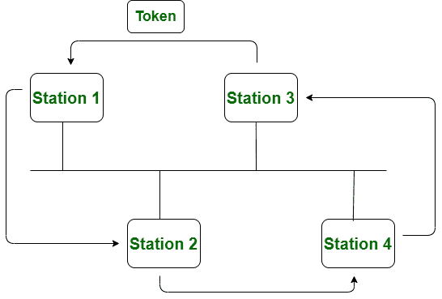
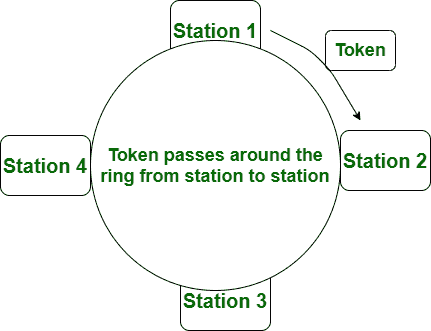

# 令牌总线和令牌环网的区别

> 原文：[https://www.geeksforgeeks.org/difference-between-token-bus-and-token-ring-network/](https://www.geeksforgeeks.org/difference-between-token-bus-and-token-ring-network/)

[令牌总线](https://www.geeksforgeeks.org/token-bus-ieee-802-4/)：
令牌总线网络是令牌沿`虚拟环`传递的标准。在令牌总线网络中，`总线拓扑`被用作物理介质。

在这种情况下，`虚拟环`是用站创建的，因此令牌随后在该`虚拟环`的序列期间从站传递。`令牌总线`网络中的每个站或节点都知道它的前一站和后一站的地址。当且仅当节点（站）具有令牌时，它才能传输数据。它的工作原理类似于`令牌环网`。

[令牌环](http://geeksforgeeks.org/efficiency-of-token-ring/)：
由 `IEEE 802.5` 标准定义。在`令牌环`网络中，令牌通过`物理环`而不是`虚拟环`传递。

在这种情况下，令牌是一种特殊的帧，只有当站点拥有令牌时，它才能传输数据帧。并且令牌在成功接收到数据帧时被发放。

我们来看看`令牌总线`和`令牌环`的区别：

| S.NO | 令牌总线网络 | 令牌环网 |
| --- | --- | --- |
| 1. | 在`令牌总线`网络中，令牌沿着`虚拟环`传递。 | 在`令牌环`网络中，令牌通过`物理环`传递。 |
| 2. | `令牌总线`网络只是为大型工厂设计的。 | 而`令牌环`网是为办公室设计的。 |
| 3. | `令牌总线`网络由 `IEEE 802.4` 标准定义。 | 而`令牌环`网是由 `IEEE 802.5` 标准定义的。 |
| 4. | `令牌总线`网络提供了更好的带宽。 | 而`令牌环`网与`令牌总线`相比没有提供更好的带宽。 |
| 5. | 在`令牌总线`网络中，使用`总线拓扑`。 | 而在`令牌环`网中，则采用`星型拓扑`。 |
| 6. | 无法计算到达`令牌总线`网络中最后一站所需的最长时间。 | 同时可以计算到达`令牌环`网中最后一站的最大时间。 |