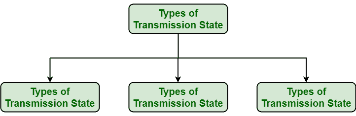
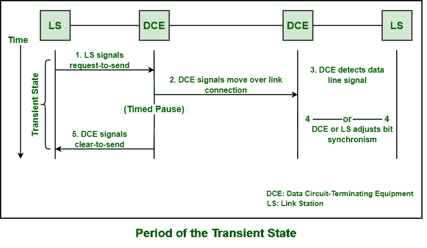
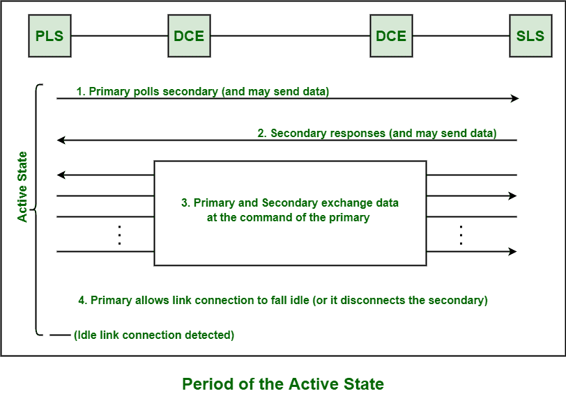

# SDLC 的不同传输状态

> 原文：[https://www.geeksforgeeks.org/different-transmission-states-of-sdlc/](https://www.geeksforgeeks.org/different-transmission-states-of-sdlc/)

[同步数据链路控制(SDLC)](https://www.geeksforgeeks.org/sdlc-types-and-topologies/) 通常是数据通信信道上逐位串行信息传输的规程。无论是交换的还是非交换的，一旦建立或发展了物理通信信道，它总是被认为是不变的。这个转换通道上的通信通道基本上被认为不是永久性的。在这个通信信道上，基本上有三种不同类型的传输状态可以存在或存在。

如下所示，`SDLC` 可能存在于这些传输状态之一：

让我们详细了解一下：

## 1. 瞬态（Transient State）

此状态通常在站点准备传输但尚未达到稳定状态时出现。此状态也跟随次站的轮询（poll）之后，并在实际的控制数据或信息传输之前出现。此状态也存在于初始传输之前和之后，以及每次线路方向转换（line turnaround）之后。

## 2. 空闲（Idle State）

当次站接收到 15 个或更多连续的逻辑 1 时，电路基本上被认为处于空闲状态。在此状态期间，也不传输控制信息或数据。所使用的链路连接配置需要确定和识别此状态下特定链路站的操作，如下所示：

| 链路连接 | 主链路站 | 次链路站 |
| :--- | :--- | :--- |
| 半双工点对点 | 载波关闭 | 载波关闭 |
| 双工点对点 | 所有 1 个 | 所有 1 个 |
| 半双工多点 | 载波关闭 | 载波关闭 |
| 双工多点 | 所有 1 个 | 载波关闭 |

## 3. 活动（Active State）

这是一个非空闲、非瞬态的状态。在此状态下，有可能传输控制信息和数据。此状态基本上表示主站或其中一个次站正在传输信息或控制信号。在下图中，可以清楚地看到没有信息或数据交换，但线路保持在此状态。

