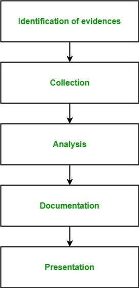

# 信息安全中的数字取证

> 原文：[https://www.geeksforgeeks.org/digital-forensics-in-information-security/](https://www.geeksforgeeks.org/digital-forensics-in-information-security/)

**数字取证**是法医学的一个分支，包括识别、收集、分析和报告与计算机犯罪相关的数字设备中的任何有价值的数字信息，作为调查的一部分。

简而言之，数字取证是识别、保存、分析和呈现数字证据的过程。1978 年《佛罗里达计算机法案》承认了第一批计算机犯罪，此后，数字取证领域在 20 世纪 80-90 年代末发展迅速。它包括存储介质、硬件、操作系统、网络和应用程序等分析领域。

它由 5 个高级步骤组成：

1.  **证据识别：**
    包括识别存储介质、硬件、操作系统、网络和/或应用程序中与数字犯罪相关的证据。这是最重要和最基本的步骤。
2.  **收集：**
    包括保存在第一步中识别出的数字证据，以防止它们随时间降解或消失。保存数字证据非常重要和关键。
3.  **分析：**
    包括分析所收集的已实施计算机犯罪的数字证据，以追踪罪犯和可能用于侵入系统的路径。
4.  **记录：**
    包括对整个数字调查、数字证据、受攻击系统的漏洞等进行适当记录，以便将来也可以研究和分析案件，并能以适当的格式在法庭上呈现。
5.  **出示：**
    包括在法庭上出示所有数字证据和文件，以证明所实施的数字犯罪并识别罪犯。

## 数字取证分支机构

*   **媒体取证：**
    它是数字取证的一个分支，包括在调查过程中对音频、视频和图像证据的识别、收集、分析和呈现。
*   **网络取证：**
    它是数字取证的一个分支，包括在调查网络犯罪过程中对数字证据的识别、收集、分析和呈现。
*   **移动设备取证：**
    它是数字取证的一个分支，包括在调查通过移动设备（如手机、GPS设备、平板电脑、笔记本电脑）实施的犯罪过程中对数字证据的识别、收集、分析和呈现。
*   **软件取证：**
    它是数字取证的一个分支，仅在与软件相关的犯罪调查过程中包括数字证据的识别、收集、分析和呈现。