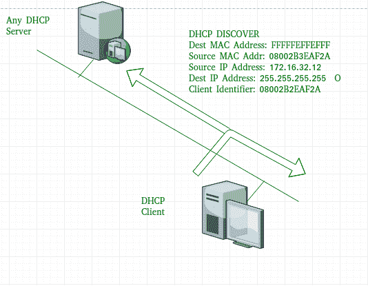
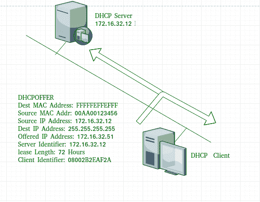
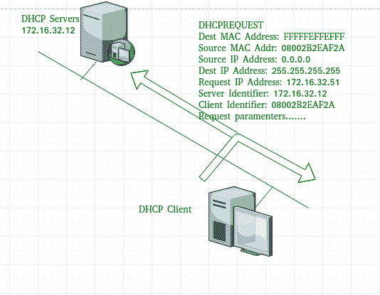
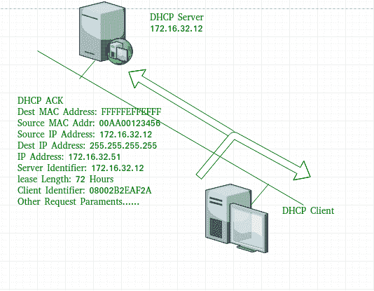

# 动态主机配置协议 (DHCP)

> 原文: [https://www.geeksforgeeks.org/dynamic-host-configuration-protocol-dhcp/](https://www.geeksforgeeks.org/dynamic-host-configuration-protocol-dhcp/)

先决条件 – [应用层协议](https://www.geeksforgeeks.org/protocols-application-layer/)

## 概述

**动态主机配置协议 (DHCP)** 是一种应用层协议，用于提供：

1.  子网掩码 (选项 1 – 例如 `255.255.255.0`)
2.  路由器地址 (选项 3 – 例如 `192.168.1.1`)
3.  域名系统地址 (选项 6 – 例如 `8.8.8.8`)
4.  供应商类别标识符 (选项 43 – 例如，`"unifi" = 192.168.1.9` # 其中 `unifi` = 控制器)

DHCP 基于客户机-服务器模型，并基于发现、提供、请求和确认。

服务器的 DHCP `端口号` 为 `67`，客户端为 `68`。这是一个使用 `UDP` 服务的客户端服务器协议。`IP` 地址是从地址池中分配的。在 `DHCP` 中，客户端和服务器主要交换 4 条 `DHCP` 消息以建立连接，也称为 `DORA` 过程，但过程中有 8 条 `DHCP` 消息。

## DORA 过程与消息类型

这些信息如下所示：

### 1. DHCP discover message –
这是服务器和客户端之间通信过程中生成的第一条消息。此消息由客户端主机生成，用于发现网络中是否存在任何 `DHCP` 服务器。此消息广播到网络中的所有设备以查找 `DHCP` 服务器。此消息长度为 `342` 或 `576` 字节。

如图所示，源 `MAC` 地址 (客户端 `PC`) 为 `08002B2EAF2A`，目的 `MAC` 地址 (服务器) 为 `FFFFFFFFFFFF`，源 `IP` 地址为 `0.0.0.0` (因为 `PC` 到现在还没有 `IP` 地址)，目的 `IP` 地址为 `255.255.255.255` (用于广播的 `IP` 地址)。由于发现消息被广播以找出网络中的一个或多个 `DHCP` 服务器，因此使用广播 `IP` 地址和 `MAC` 地址。

### 2. DHCP offer message –
服务器将在此消息中响应主机，指定未租用的 `IP` 地址和其他 `TCP` 配置信息。此消息由服务器广播。消息大小为 `342` 字节。如果网络中存在多个 `DHCP` 服务器，则客户端主机将接受它收到的第一个 `DHCP OFFER` 消息。数据包中还指定了服务器 `ID` 以标识服务器。

现在，对于 `offer` 消息，源 `IP` 地址为 `172.16.32.12` (示例中的服务器 `IP` 地址)，目的 `IP` 地址为 `255.255.255.255` (广播 `IP` 地址)，源 `MAC` 地址为 `00AA00123456`，目的 `MAC` 地址为 `ffffffffffffffff`。这里，要约消息由 `DHCP` 服务器广播，因此目的地 `IP` 地址是广播 `IP` 地址，目的地 `MAC` 地址是 `FFFFFFFFFFFF`，并且源 `IP` 地址是服务器 `IP` 地址，而 `MAC` 地址是服务器 `MAC` 地址。

此外，服务器还提供了提供的 `IP` 地址 `192.16.32.51` 和 `72` 小时的租赁时间 (此后，主机条目将自动从服务器中删除)。客户端标识符也是所有消息的个人电脑媒体访问控制地址 (`08002B2EAF2A`)。

### 3. DHCP request message –
当客户端收到 `offer` 消息时，它通过广播 `DHCP request` 消息进行响应。客户端将产生一个免费 `ARP` 以查找网络中是否存在具有相同 `IP` 地址的其他主机。如果没有其他主机回复，则网络中没有具有相同 `TCP` 配置的主机，并且消息被广播到服务器，显示接受 `IP` 地址。此消息中还添加了客户端 `ID`。

现在，请求消息由客户端 `PC` 广播，因此源 `IP` 地址为 `0.0.0.0` (因为客户端现在没有 `IP`)，目的 `IP` 地址为 `255.255.255.255` (广播 `IP` 地址)，源 `MAC` 地址为 `08002B2EAF2A` (`PC MAC` 地址)，目的 `MAC` 地址为 `ffffffffffffff`。

**注意 –** 此消息在电脑广播 `ARP` 请求后广播，以查明是否有任何其他主机没有使用该提供的 `IP`。如果没有回复，则客户端主机向服务器广播 `DHCP` 请求消息，显示接受 `IP` 地址和其他 `TCP/IP` 配置。

### 4. DHCP acknowledgement message –
为响应收到的请求消息，服务器将使用指定的客户端 `ID` 创建一个条目，并将提供的 `IP` 地址与租用时间绑定。现在，客户端将拥有服务器提供的 `IP` 地址。

现在，服务器将输入提供的 `IP` 地址和租用时间。服务器不会将此 `IP` 地址提供给任何其他主机。目的 `MAC` 地址为 `FFFFFFFFFFFF`，目的 `IP` 地址为 `255.255.255.255`，源 `IP` 地址为 `172.16.32.12`，源 `MAC` 地址为 `00AA00123456` (服务器 `MAC` 地址)。

### 5. DHCP 否定确认消息 –
每当 `DHCP` 服务器收到根据配置的作用域无效的 `IP` 地址请求时，它都会向客户端发送 `DHCP Nak` 消息。例如，当服务器没有未使用的 `IP` 地址或池为空时，服务器会将此消息发送给客户端。

### 6. DHCP 拒绝 –
如果 `DHCP` 客户端确定提供的配置参数不同或无效，它会向服务器发送 `DHCP` 拒绝消息。当客户端收到任何主机对免费 `ARP` 的回复时，客户端会向服务器发送 `DHCP` 拒绝消息，显示所提供的 `IP` 地址已被使用。

### 7. DHCP 释放 –
`DHCP` 客户端向服务器发送 `DHCP` 释放包，释放 `IP` 地址并取消任何剩余的租用时间。

### 8. DHCP 通知 –
如果客户端地址手动获取了 `IP` 地址，则客户端使用 `DHCP` 通知来获取其他本地配置参数，如域名。响应于 `dhcp` 通知消息，`DHCP` 服务器生成具有适合客户端的本地配置的 `DHCP ack` 消息，而不分配新的 `IP` 地址。该 `DHCP` 确认消息被单播到客户端。

**注意 –** 如果服务器位于不同的网络中，所有消息也可以由 `dhcp` 中继代理单播。

## 优势与缺点

### 优势 –
使用 `DHCP` 的优势包括：

*   `IP` 地址的集中管理
*   向网络添加新客户端的便利性
*   `IP` 地址的重用减少了所需的 `IP` 地址总数
*   简单地重新配置 `DHCP` 服务器上的 `IP` 地址空间，无需重新配置每个客户端

`DHCP` 协议为网络管理员提供了一种从集中区域配置网络的方法。在 `DHCP` 的帮助下，可以实现新用户的轻松处理和 `IP` 地址的重用。

### 缺点 –
使用 `DHCP` 的缺点是：

*   可能会发生知识产权冲突

## 参考资料 –
*   [DHCP – help.ubnt](https://help.ubnt.com/hc/en-us/articles/115005987748-Intro-to-Networking-Dynamic-Host-Configuration-Protocol-DHCP-)
*   [DHCP – docs.Oracle](https://docs.oracle.com/cd/E37670_01/E41138/html/ol_about_netaddr.html)