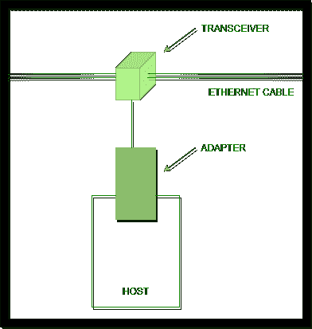
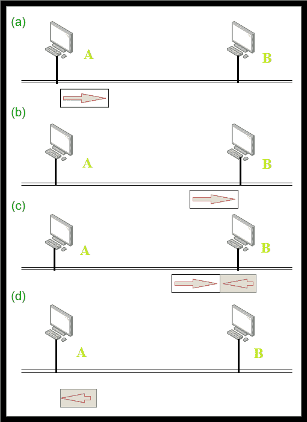

# 以太网发射机算法

> 原文：[https://www.geeksforgeeks.org/ethernet-transmitter-algorithm/](https://www.geeksforgeeks.org/ethernet-transmitter-algorithm/)

先决条件 – [以太网](https://www.geeksforgeeks.org/local-area-network-lan-technologies/) 和 [以太网帧格式](https://www.geeksforgeeks.org/ethernet-frame-format/)

`以太网适配器`或`网络接口卡(NIC)`是硬件设备/组件，使您能够向计算机发送数据和从计算机接收数据。它将通过有线或无线连接连接到网络。

假设我们有一台主机，它有以太网适配器。以太网电缆（一种用于将计算设备直接连接在一起的电缆）通过收发器连接到当前的以太网适配器（网卡），该适配器是主机的一部分，同时充当发送器和接收器。

我们可以将以太网电缆插入以太网适配器（网卡）的端口。但是，为了将以太网电缆连接到以太网适配器（网卡）的端口，我们需要 `RJ45` 插座（8 针 – 铜缆连接器上的标准有线以太网）。

## 以太网接入协议

1.  算法通常称为`以太网媒体访问控制(MAC)`，在以太网适配器（NIC）上以硬件实现。
2.  以太网的接入方式为`CSMA/CD`（带冲突检测的载波侦听多路接入）。
3.  编码方式为`曼彻斯特编码技术`将数据位转换为信号。

采用曼彻斯特编码技术的原因 – 以太网电缆通过端口连接到以太网适配器。因此，应用层数据被提供给传输层，并被转发到网络层，然后到达数据链路层（现在有网卡）。

因此，主机创建的帧需要放在以太网电缆上（通道上）。当主机想要将数据/信息放在信道上时，我们想要使用一些编码技术。

编码对于将主机产生的特定数据/帧转换成信号至关重要，因为以太网电缆（例如，以电信号形式传输数据的铜缆）只会传输信号。

## 以太网发射机算法

1.  当适配器（主机）包含要发送的帧，并且线路（信道）空闲时，它立即传输帧。
2.  消息中 `1500` 字节（以太网帧中数据或有效负载的最大大小）的上限意味着适配器可以占用固定长度的线路。
3.  当适配器包含要发送的帧，并且线路（信道）繁忙时，它等待线路空闲并立即传输。
4.  以太网被称为 `CSMA-1` 持久协议，因为每当繁忙线路空闲时，适配器都会发送帧，传输概率为 `1`。
5.  由于以太网没有极化/集中控制，两个（或更多）以太网适配器可能同时开始传输帧，要么因为两者都发现路径/线路空闲，要么两者都一直在监视繁忙线路变为空闲。示例 – 假设有 2 台主机计算机，连接到以太网电缆。当两者都发现线路空闲时，它们在同一时间放置它们的帧，这会导致冲突。

当帧相互碰撞时，以太网没有集中控制，该算法（以太网发送器算法）将告知主机发生了碰撞。这就是为什么以太网接入方式被命名为 `CSMA/CD` 的原因。

6.  当两个以太网适配器同时开始传输帧时，帧往往会在网络上发生冲突。
7.  因为以太网支持冲突检测，所以每个发送者都能够看到冲突正在进行。
8.  当适配器检测到其帧与另一个帧冲突时，它会立即发送 `32` 位干扰序列（以便其他主机知道发生了冲突），因此主机计算机立即停止传输。

**注意 –**
干扰序列是工具在以太网上发送的信号，表示网络上发生了冲突。`32` 位长度是必需的，并且足够长以遍历整个冲突域，以便所有发射站能够检测冲突。

9.  因此，在发生冲突的情况下，发送方将至少发送 `96` 位。`64` 位前导码 + `32` 位干扰序列。

**注意 –**
前导码用于位同步，例如 `8` 字节的前导码和帧的开始创建 `64` 位的模式。

主机需要发送 `96` 位的原因：主机应该发送 `32` 位的干扰序列，点对点冲突继续，仅仅 `32` 位是不够的。因此，它必须附加 `64` 位前导码。

## Runt Frame

我们知道以太网不会创建任何小于最小长度 `64` 字节的帧。可以看出，短帧通常是由冲突引起的。当两帧碰撞时，导致碰撞，产生“欠帧”。

欠帧的其他原因有：

1.  网卡/NIC 故障。
2.  缓冲区欠载运行（当缓冲区习惯于两个设备之间的通信，或者进程以比从中读取的数据/信息更慢的速度获得数据时，就会出现这种状态）。
3.  双工不匹配（线路一端以半双工模式运行，另一端以全双工模式运行）/软件问题。

## 以太网发射机算法 – 最坏情况场景

1.  `A`（主机）在时间 `t1` 发送帧。
2.  `A` 的帧在时间 `t1 + D1` 到达 `B`（目的计算机）。（`D1`：传输或传播延迟）。
3.  `B` 在时间 `t1 + d1` 开始传输，并与 `A` 帧碰撞。
4.  `B` 剩余帧（`32` 位）在时间 `t1 + 2d1` 到达 `A`。

让我们假设帧中有 `200` 位，除了最后一位，所有位都由 `B` 发送和接收。`B` 接收最后一位时间，与 `B` 开始传输时间相同。因此，会发生单个位冲突。这里，当 `B` 在 `t1 + D1` 开始传输时，来自 `A` 的帧同时到达 `B`，即 `t1 + D1`。因此，两个帧都变得不可用。该帧成为不完整帧。`B` 开始传输帧的时间是 `t1 + d1`，因此帧到达 `A` 的时间是 `t1 + D1 + D1` = `t1 + 2d1`。

## 指数回退

*   指数回退是以太网用来降低冲突概率的技术。
*   一旦以太网适配器检测到冲突并停止，它就开始传输/传送，等待一定的时间。
*   展望一定时间后，以太网适配器再次尝试传输。如果以太网算法仍然发现信道繁忙，它会加倍等待时间，然后再重试。如果节点最初等待 `1` 秒钟，那么它将等待 `2` 秒钟，然后 `4` 秒钟，然后 `8` 秒钟，直到信道空闲。
*   当通道最终空闲时，以太网适配器将帧放入通道。
*   这种将每次转运尝试之间的延迟间隔乘以两倍的策略称为“指数回退”。