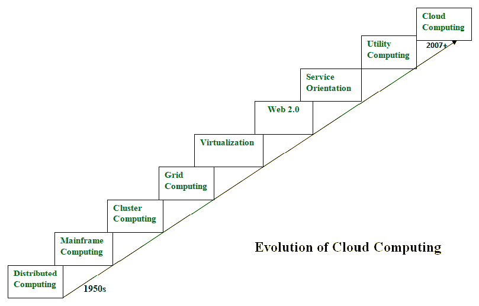

# 云计算的演进

> 原文：[https://www.geeksforgeeks.org/evolution-of-cloud-computing/](https://www.geeksforgeeks.org/evolution-of-cloud-computing/)

云计算就是出租计算服务。这个想法最早出现在 20 世纪 50 年代。在成就今天的云计算的过程中，五项技术发挥了至关重要的作用。这些是分布式系统及其外围设备、虚拟化、web 2.0、面向服务和实用计算。

## 分布式系统及其演进

分布式系统是由多个独立系统组成的复合体，但对用户而言它们被呈现为一个单一实体。分布式系统的目的是共享资源并有效且高效地使用它们。分布式系统具有可扩展性、并发性、持续可用性、异构性和故障独立性等特性。但这个系统的主要问题是所有系统都需要位于同一地理位置。因此，为了解决这个问题，分布式计算催生了三种更多的计算类型，它们是：大型机计算、集群计算和网格计算。

### 大型机计算

大型机最早出现于 1951 年，是功能强大且可靠的计算机器。它们负责处理大型数据，例如海量的输入输出操作。即使在今天，它们仍用于批量处理任务，如在线交易等。这些系统几乎无停机时间，具有高容错能力。在分布式计算之后，它们提高了系统的处理能力。但这些系统非常昂贵。为了降低成本，集群计算作为大型机技术的替代方案应运而生。

### 集群计算

在 20 世纪 80 年代，集群计算作为大型机计算的替代方案出现。集群中的每台机器都通过高带宽网络相互连接。这些系统比那些大型机系统便宜得多。它们同样具备高计算能力。此外，如果需要，可以轻松地向集群中添加新节点。因此，成本问题在一定程度上得到了解决，但与地理限制相关的问题仍然存在。为了解决这个问题，网格计算的概念被引入。

### 网格计算

在 20 世纪 90 年代，网格计算的概念被引入。它意味着不同的系统被放置在完全不同的地理位置，所有这些系统都通过互联网连接。这些系统属于不同的组织，因此网格由异构节点组成。虽然它解决了一些问题，但随着节点之间距离的增加，新的问题也出现了。遇到的主要问题是高带宽连接的可用性低，以及随之而来的其他网络相关问题。因此，云计算常被称为“网格计算的继任者”。

## 虚拟化

它大约在 40 年前被引入。它指的是在硬件上创建一个虚拟层的过程，允许用户同时在硬件上运行多个实例。它是云计算中使用的一项关键技术。它是 `Amazon EC2`、`VMware vCloud` 等主要云计算服务运行的基础。硬件虚拟化至今仍是最常见的虚拟化类型之一。

## Web 2.0

它是云计算服务与客户端交互的接口。正是因为 Web 2.0，我们才拥有了交互式和动态的网页。它还增加了网页的灵活性。`Web 2.0` 的流行例子包括 `Google Maps`、`Facebook`、`Twitter` 等。不用说，社交媒体之所以成为可能，完全归功于这项技术。它在 2004 年获得了极大的普及。

## 面向服务

它充当云计算的参考模型。它支持低成本、灵活且可演进的应用程序。在这个计算模型中引入了两个重要概念。它们是服务质量（`QoS`），这也包括服务等级协议（`SLA`），以及软件即服务（`SaaS`）。

## 效用计算

它是一种计算模型，定义了服务供应技术，如计算服务以及其他主要服务，如存储、基础架构等，这些服务是按使用付费的。

因此，上述技术促成了云计算的产生。