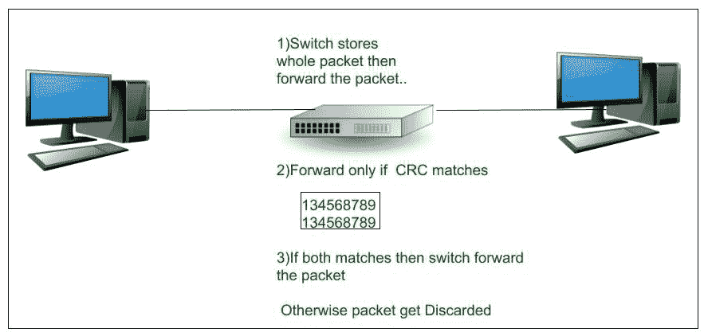
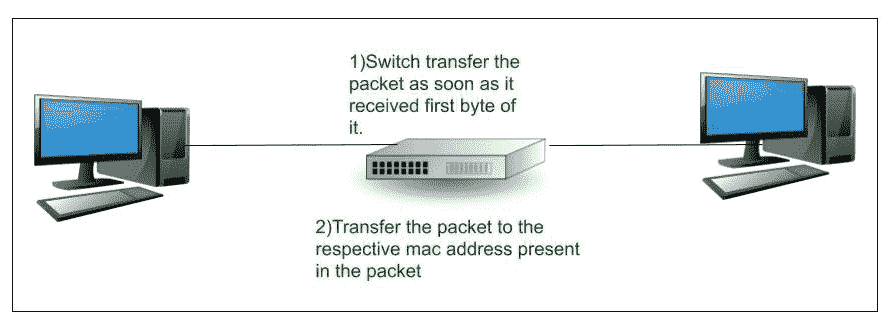

# 交换机上的帧转发方法

> 原文: [https://www.geeksforgeeks.org/frame-forwarding-methods-on-switches/](https://www.geeksforgeeks.org/frame-forwarding-methods-on-switches/)

所有[交换机](https://www.geeksforgeeks.org/network-devices-hub-repeater-bridge-switch-router-gateways/)在网络端口之间转发帧（交换数据）有两种方法：

1.  存储和转发交换
2.  直通开关

这些解释如下。

## 1. 存储和转发交换

在这种交换技术中，当交换机收到帧时，它会将帧数据存储在缓冲区中，直到收到完整的帧。在此过程中，交换机会分析当前帧以获取有关其目的地的信息。该过程还包括使用由交换机操作的`循环冗余校验`的另一个错误校验过程。

融合网络的服务质量分析需要这种交换技术，在融合网络中，需要对帧进行分类以确定流量优先级。例如，`VoIP`数据流需要比其他类型的流量具有更高的优先级。

`循环冗余校验`检查帧中的位数（1），以确定接收到的帧是否有错误。确认帧中没有错误后，该帧将从相应的端口转发到目的地。

当在帧中发现错误时，交换机会丢弃该帧。通过丢弃包含错误的帧，减少了损坏数据消耗的带宽。

Figure – Store and forward switching

## 2. 直通交换

在这种交换技术中，交换机一收到数据就对其进行操作，即使没有收到完整的帧（传输未完成）。交换机缓冲足够的帧来读取目的地媒体访问控制地址，以便找到它应该发送数据的端口。交换机从交换表中获取目的`MAC`地址，确定输出接口端口，并通过指定的交换机端口将帧转发到目的地。这种交换技术不涉及交换机的任何错误检查过程。

Figure – Cut-through switching

直通交换有两种类型：

### Fast-forward switching

这种交换技术提供了最低的延迟水平（从接收到第一个比特到发送第一个比特的时间），因为它读取目的地址后立即转发数据包。

`快速转发交换`一旦收到数据包的第一个字节就开始转发，可能会有数据包被错误转发的机会。这种情况很少发生，在这种情况下，目的网络适配器会在收到错误数据包时将其丢弃。这种切换是典型的直通式切换方法。

### Fragment-free switching

在这种交换技术中，在存储转发交换的高延迟-高完整性与快速转发交换的低延迟-降低完整性之间进行了权衡。交换机在转发前存储并执行帧的前64个字节的小错误检查。

这种交换技术包括存储和转发交换以及快速转发交换的概念。这种交换技术只存储帧的前64个字节，因为大多数网络错误和冲突都发生在前64个字节，并通过执行一个小的错误检查来确保在转发帧之前没有发生冲突，从而尝试增强快进交换。