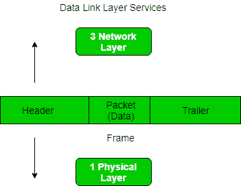
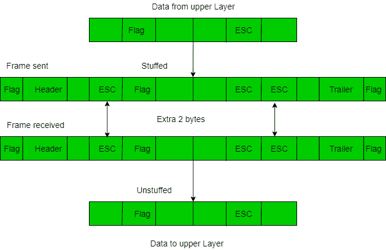
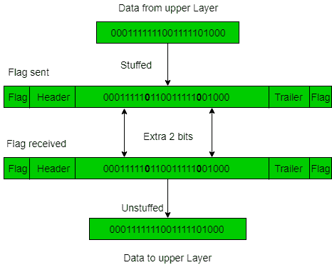

# 数据链路层成帧

> 原文：[https://www.geeksforgeeks.org/framing-in-data-link-layer/](https://www.geeksforgeeks.org/framing-in-data-link-layer/)

帧是数字传输的单位，尤其是在计算机网络和电信中。在光能的情况下，帧相当于称为光子的能量包。时分复用过程中会持续使用帧。

成帧是两台计算机或设备之间的点对点连接，由一条线路组成，数据以比特流的形式在线路中传输。然而，这些位必须被组织成可识别的信息块。成帧是数据链路层的功能。它为发送方提供了一种传输对接收方有意义的一组比特的方式。以太网、令牌环、帧中继和其他数据链路层技术都有自己的帧结构。帧的报头包含错误校验码等信息。



在数据链路层，它从发送方提取消息，并通过提供发送方和接收方的地址将其提供给接收方。使用帧的优点是数据被分解成可恢复的块，可以很容易地检查是否有损坏。

## 框架中的问题

- **检测帧的开始：** 当帧被发送时，每个站必须能够检测到它。工作站通过寻找标志帧开始的特殊位序列（即 `SFD`（起始帧定界符））来检测帧。
- **站如何检测帧：** 每个站通过时序电路监听 `SFD` 模式的链接。如果检测到 `SFD`，时序电路会提醒工作站。工作站检查目的地址以接受或拒绝帧。
- **检测帧结束：** 何时停止读帧。

## 框架类型

框架有两种类型：

### 1. 固定大小

帧的大小是固定的，不需要为帧提供边界，帧本身的长度充当定界符。

- **缺点：** 如果数据大小小于帧大小，则会出现内部碎片。
- **解决方案：** 填充。

### 2. 可变大小

在这种情况下，需要定义帧的结束和下一帧的开始来区分。这可以通过两种方式实现：

1.  **长度字段：** 我们可以在帧中引入一个长度字段来表示帧的长度。用于 `以太网(802.3)`。这样做的问题是，有时长度字段可能会损坏。
2.  **结束定界符：** 我们可以引入一个 `ED`（模式）来指示帧的结束。用于 `Token Ring`。这样做的问题是 `ED` 可能会出现在数据中。这可以通过以下方式解决：

#### 1. 字符/字节填充

当帧由字符组成时使用。如果数据包含 `ED`，那么将一个字节填充到数据中，以区别于 `ED`。

```
let ED = “{ content }” –> 如果数据包含“{内容}”；在任何地方，都可以使用“\O”字符进行转义。
–> 如果数据包含“\O{ content }”；然后，使用‘\O\O\O{ content }；（$用\O 转义，\O 用\O 转义）。
```



**缺点：** 这是一种非常昂贵且过时的方法。

#### 2. 位填充

让 `ED = 01111`，如果数据=`01111`
**–>** 发送方填充一位来打破模式，即在数据=`011101`中附加一个 `0`。
**–>** 接收器接收帧。
**–>** 如果数据中包含 `011101`，接收器将移除 `0` 并读取数据。



## 示例

- 如果数据 –> `011100011110` 且 `ED` –> `0111`，那么位填充后的数据是什么？
    –> `011010001101100`
- 如果数据 –> `110001001` 且 `ED` –> `1000`，那么位填充后的数据是什么？
    –> `11001010011`
- [cs 门 2014](https://www.geeksforgeeks.org/gate-gate-cs-2014-set-3-question-34/)
- [门 IT 2004](https://www.geeksforgeeks.org/gate-gate-it-2004-question-80/)