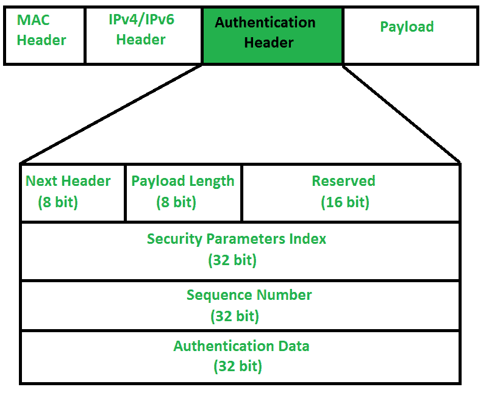

# 互联网协议认证头

> 原文：[https://www.geeksforgeeks.org/internet-protocol-authentication-header/](https://www.geeksforgeeks.org/internet-protocol-authentication-header/)

前提：[互联网协议第6版(IPv6)报头](https://www.geeksforgeeks.org/internet-protocol-version-6-ipv6-header/)

IP认证报头用于提供无连接完整性和数据来源认证。身份验证标头提供了两个主要优势：

*   **消息完整性**：表示消息来源时未被修改。
*   **来源认证**：这意味着，来源正是我们期望数据的来源。

当数据包从源A发送到目的地B时，它由我们需要发送的数据和包含数据包信息的报头组成。身份验证报头验证数据的来源和有效负载，以确认在源和目的地之间的传输过程中，其间是否进行了修改。

但是，在传输过程中，某些IP报头字段的值可能会发生变化（如跳数、选项、扩展报头）。因此，此类字段的值不能受到身份验证头的保护。身份验证报头不能保护IP报头的每个字段。它为需要保护的领域提供保护。

## 认证头

可能出现的问题是，IP头怎么会知道相邻的扩展头是认证头。嗯，在IP报头中有一个协议字段，它告诉数据包中存在的报头类型。因此，IP报头中的协议字段应该具有值`51`，以便检测认证报头。

1.  **Next Header**：`Next Header`是8位字段，用于标识认证头之后的报头类型。在TCP、UDP或目标头或其他扩展头的情况下，它将存储对应的IP协议号。例如，此字段中的数字4表示IPv4，数字41表示IPv6，数字6表示TCP。
2.  **Payload Length**：`Payload Length`是认证头的长度，这里我们使用缩放因子4。无论报头大小如何，将其除以4然后减去2。我们减去2是因为我们不计算认证头的前8个字节，即上图中的前两行。这意味着我们在计算有效载荷长度时不包括`Next Header`、`Payload Length`、`Reserved`和`Security Parameter Index`。例如，如果给定的有效载荷长度为X。那么`(X+2)*4`将是原始认证头的长度。
3.  **Reserved**：这是16位字段，由发送方设置为“零”，因为此字段保留供将来使用。
4.  **Security Parameter Index (SPI)**：它是一个任意的32位字段。这是一个非常重要的字段，用于标识属于当前连接的所有数据包。如果我们从源A向目的地B发送数据。A和B都将事先知道他们将使用的算法和密钥。因此，对于身份验证，将需要散列函数和密钥，这些只有源和目的地会知道。A和B之间的秘密密钥通过[Diffie Hellman算法](https://www.geeksforgeeks.org/implementation-diffie-hellman-algorithm/)的方法交换。因此，连接的`Security Parameter Index`的散列算法和秘密密钥将是固定的。在数据传输开始之前，需要建立安全关联。

在**安全关联**中，双方需要在数据交换之前进行沟通。安全关联告诉什么是正在使用的安全参数索引、哈希算法和密钥。

5.  **Sequence Number**：此无符号32位字段包含计数器值，对于发送的每个数据包增加1。每个数据包都需要序列号。它将从0开始，一直到`2^32 – 1`，并且不会有回绕。假设，如果所有序列号都用完了，没有剩余的了，但我们不能回绕，因为这是不允许的。因此，我们将结束连接并重新建立连接以从序列号0恢复剩余数据的传输。基本上，序列号用于阻止重放攻击。

在[重放攻击](https://www.geeksforgeeks.org/replay-attack/)中，如果同一条消息被发送两次或更多次，接收者将无法知道两条消息是否都是从单一来源发送的。比方说，我向接收者要求100美元，入侵者则要求另外100美元。接收者将无法知道中间有入侵者。

6.  **认证数据(完整性校验值)**：认证数据是可变长度字段，包含数据包的完整性校验值(`ICV`)。使用哈希算法和密钥，发送方将创建消息摘要，并将其发送给接收方。另一方面，接收者将使用相同的散列算法和密钥。如果两个消息摘要匹配，那么接收者将接受数据。否则，接收者将通过说消息已经在其间被修改来丢弃它。所以基本上，认证数据是用来验证传输的完整性。身份验证数据的长度也取决于您选择的哈希算法。

## 结论

认证头如何有用？

*   消息完整性也称为无连接完整性
*   源认证
*   重放攻击保护