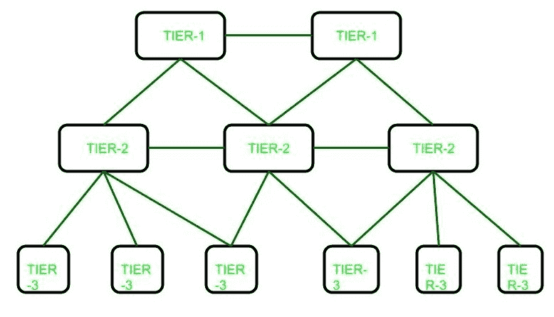

# 互联网服务提供商（ISP）层级结构

> 原文：[https://www.geeksforgeeks.org/internet-service-provider-ISP-hierarchy/](https://www.geeksforgeeks.org/internet-service-provider-isp-hierarchy/)

**互联网服务提供商（ISP）** 是为终端用户提供互联网连接的公司，但 ISP 基本上有三个级别。互联网服务提供商有三个级别：第一级互联网服务提供商、第二级互联网服务提供商和第三级互联网服务提供商。



这些解释如下。

## Tier-1 ISP

这些 ISP 位于层级结构的顶端，拥有全球覆盖范围。他们不需要为通过其网络的任何互联网流量付费，相反，较低级别的 ISP 必须为将流量从一个地理位置传递到另一个不受该 ISP 覆盖的区域支付费用。通常，同一级别的 ISP 相互连接，并允许彼此免费传递流量。这样的 ISP 被称为对等方（peers）。通过这种方式可以节省成本。他们构建基础设施，例如大西洋互联网海底电缆，为所有其他互联网服务提供商提供流量，而不是直接面向最终用户。

**示例：**
一级互联网提供商的一些示例：

```
Cogent Communications,
Hibernia Networks,
AT&T
```

## Tier-2 ISP

这些 ISP 是连接 Tier-1 和 Tier-3 ISP 的服务提供商。他们拥有区域或国家覆盖范围，并且对于 Tier-3 ISP 来说，其行为就像 Tier-1 ISP 一样。

**示例：**
二级互联网服务提供商示例：

```
Vodafone,
Easynet,
BT
```

## Tier-3 ISP

这些 ISP 最接近最终用户，并通过收取一定费用来帮助他们连接到互联网。这些 ISP 采用购买模式运营。他们必须根据产生的流量向 Tier-2 ISP 支付一定费用。

**示例：**
三级互联网服务提供商示例：

```
Comcast,
Deutsche Telekom,
Verizon Communications
```