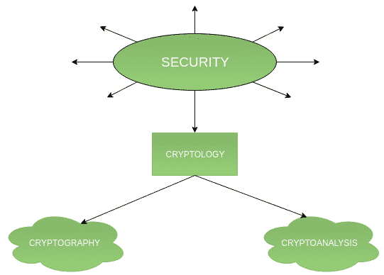
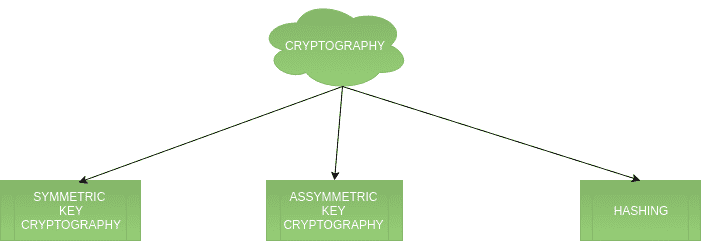
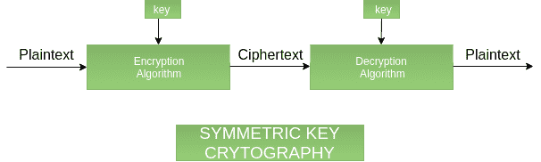
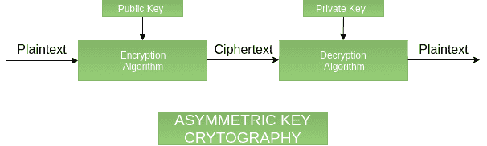
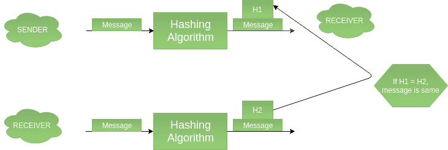
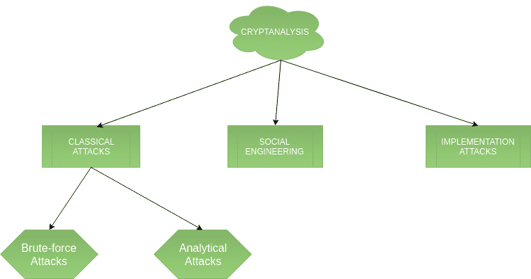

# 加密术语介绍

> 原文：[`https://www.geeksforgeeks.org/introduction-to-crypto-terminologies/`](https://www.geeksforgeeks.org/introduction-to-crypto-terminologies/)

密码学是我们处理网络安全的一个重要方面。“加密”意味着秘密或隐藏。密码学是一门秘密写作的科学，旨在对数据保密。另一方面，密码分析是打破密码系统的科学，有时是艺术。这两个术语都是所谓密码学的一个子集。

## 分类

流程图描述了密码学只是保护网络安全的因素之一。密码学是指对代码的研究，包括编写代码（密码学）和解决代码（密码分析）。下面是加密术语及其各种类型的分类。

## 1. 密码学

密码学分为对称密码、非对称密码和哈希。以下是这些类型的描述。

### `Symmetric key cryptography`

它涉及使用一个秘密密钥以及加密和解密算法，以帮助保护消息内容。对称密钥密码学的强度取决于密钥位数。它比非对称密钥密码学相对较快。由于密钥必须通过安全通道从发送方传输到接收方，因此会出现密钥分发问题。

### `Asymmetric key cryptography`

它也被称为公钥密码学，因为它涉及使用公钥和私钥。它解决了密钥分发问题，因为双方使用不同的密钥进行加密/解密。与对称密钥密码学相比，它非常慢，因此不适合用于解密大量消息。

### `Hashing`

它涉及获取明文并通过哈希函数将其转换为固定大小的哈希值。此过程确保消息的完整性，因为如果消息未被更改，发送方和接收方的哈希值应该匹配。

## 2. 密码分析

### `Classic attacks`

可以分为 a) 数学分析和 b) 蛮力攻击。暴力攻击对密钥的所有可能情况运行加密算法，直到找到匹配。加密算法被视为一个黑盒。分析攻击是指通过分析加密算法的内部结构来破坏密码系统的攻击。

### `Social engineering attacks`

这是一种依赖于人的因素的东西。诱骗某人向攻击者透露他们的密码或允许访问受限区域都会受到这种攻击。当向任何不可信的第三方透露密码时，人们应该小心谨慎。

### `Implementation attacks`

侧信道分析等实施攻击可用于获取密钥。在攻击者能够获得对密码系统的物理访问的情况下，它们是相关的。