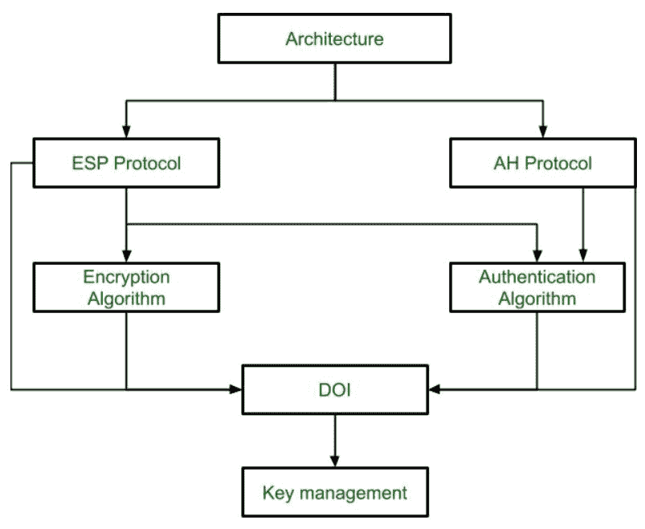
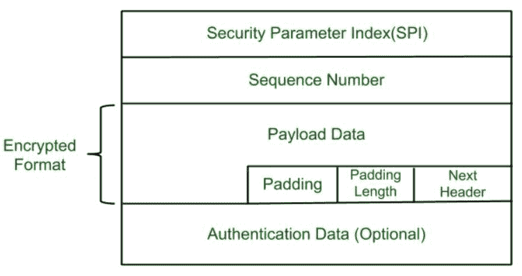
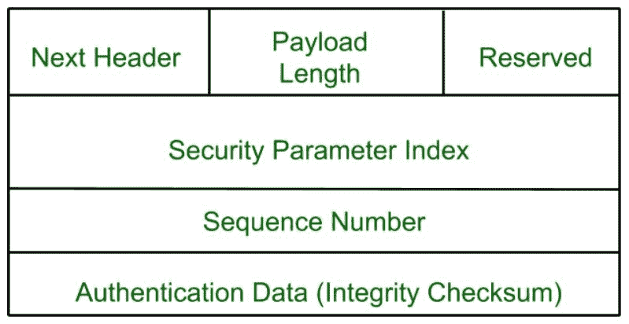

# IPSec 架构

> 原文:[https://www.geeksforgeeks.org/ipsec-architecture/](https://www.geeksforgeeks.org/ipsec-architecture/)

**IPSec (IP 安全)架构**使用两种协议来保证流量或数据流的安全。这些协议是`ESP`(封装安全负载)和`AH`(认证报头)。IPSec 体系结构包括协议、算法、DOI 和密钥管理。为了提供三种主要服务，所有这些组件都非常重要:

*   机密
*   证明
*   完整

## IP 安全架构:

### 1. 架构
架构或 IP 安全架构涵盖了 IP 安全技术的一般概念、定义、协议、算法和安全需求。

### 2. ESP 协议
`ESP`(封装安全负载)提供保密服务。封装安全负载通过两种方式实现:

*   带有可选身份验证的`ESP`。
*   带身份验证的`ESP`。

#### 数据包格式:

*   **`Security Parameter Index(SPI)`**:
    此参数用于安全关联。它用于为客户端和服务器之间建立的连接提供唯一编号。
*   **`Sequence Number`**:
    每个数据包都被分配一个唯一的序列号，以便在接收端可以正确排列数据包。
*   **`Payload Data`**:
    有效载荷数据意味着实际的数据或实际的消息。有效载荷数据采用加密格式以实现机密性。
*   **`Padding`**:
    为确保机密性而添加到原始消息的额外比特或空间。填充长度是添加到原始消息中的比特或空间的大小。
*   **`Next Header`**:
    下一个报头意味着下一个有效载荷或下一个实际数据。
*   **认证数据**
    此字段在`ESP`协议数据包格式中是可选的。

### 3. 加密算法
加密算法是描述用于封装安全负载的各种加密算法的文档。

### 4. AH 协议
`AH`(认证头)协议提供认证和完整性服务。身份验证头只有一种实现方式:身份验证和完整性。

身份验证报头包括数据包格式以及与使用`AH`进行数据包身份验证和完整性相关的一般问题。

### 5. 认证算法
认证算法包含描述用于`AH`和`ESP`认证选项的认证算法的文档集。

### 6. DOI(解释域)
`DOI`是支持`AH`和`ESP`协议的标识符。它包含相互关联的文档所需的值。

### 7. 密钥管理
密钥管理包含描述发送方和接收方之间如何交换密钥的文档。