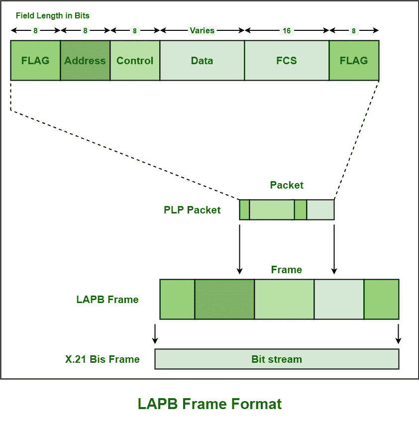

# 链路接入过程，平衡(LAPB)帧格式

> 原文：[https://www.geeksforgeeks.org/link-access-procedure-balanced-lapb-frame-format/](https://www.geeksforgeeks.org/link-access-procedure-balanced-lapb-frame-format/)

**链路接入过程，平衡(LAPB)** 基本上是像 `X.25` 这样的许多控制协议都需要的第 2 层协议，它是由 `ITU-T`，`OF` 链路接入过程(`LAP`)开发的，该过程本身来自[高级数据链路控制(`HDLC`)](https://www.geeksforgeeks.org/basic-frame-structure-of-hdlc/)。它运行在第 2 层，即[现场视察模型](https://www.geeksforgeeks.org/osi-model-full-form-in-computer-networking/)的[数据链路层](https://www.geeksforgeeks.org/framing-in-data-link-layer/)。

它通常是一种平衡协议，通常以异步平衡模式(`ABM`)运行。这是一个面向比特的协议，基本上源自 `HDLC`。它用于确保所有数据帧或数据包都没有错误，并且顺序正确与否。它还能够以正确的顺序和顺序放置帧，并且还能够检查分组或帧的错误，即错误检测，然后免除高级协议必须执行所有这些功能。`LAPB` 会话可以由数据终端设备或数据电路终端设备(`DCE`)开发和建立。

## 帧格式
`LAPB` 帧通常包含报头和尾部，基本上封装了由 [`X.25` 数据包层协议(`PLP`)](https://www.geeksforgeeks.org/plp-of-x-25-network/) 形成的数据包或帧。它还提供了通过链路传输数据帧或数据包的机制。



## 标志字段
通常需要二进制模式，即 `01111110` 来标记 `LAPB` 帧的开始。比特填充是发送器和接收器都使用的一种技术或机制，用于简单地确保和确认数据帧定界符标志的这个比特模式没有出现或出现在帧格式的数据字段中。

## 地址字段
该字段通常包含两种类型的二进制值，如下所示：

```
| 二进制值 | 传动装置ˌ[机]变速器 |
| --- | --- |
| 命令 | 反应 |
| --- | --- |
| 0000001 | `DTE`->`DCE` | `DCE`->`DTE` |
| 0000011 | `DTE` | `DCE` |
```

这两个值都不是地址。通信链路是全双工的，通常使用 `DTE` 或 `DCE` 来启动或结束通信。这是因为通信处于平衡模式。

该字段通常没有意义和用途，因为协议在点对点模式下工作，甚至 `DTE` 网络也在第 3 层数据包中出现。在本例中，值 `0*01` 仅表示来自 `DTE` 的命令以及来自 `DCE` 的响应。另一方面，值 `0*03` 表示来自 `DCE` 的命令和来自 `DTE` 的响应。

## 控制字段
控制字段通常用于表示命令和响应帧，并表示和指示所使用的帧类型，即 `I-frame`、`S-frame` 或 `U-frame`。

简单来说，就是用来确定帧的类型。在帧类型的基础上，还包含序列号、各种控制特征，甚至错误跟踪。它主要处理和控制序列号、命令和响应，以控制数据流。

## 数据字段
该字段通常以封装的 `PLP` 数据包的形式包含上层数据。该字段大小不一。

## 帧检查序列(FCS)
该字段通常控制和处理错误检查，并确认正在传输的数据的完整性。它通常支持高级别的物理错误控制。它基本上是用来识别传输过程中是否有错误发生。

## 结束标志字段
用于表示帧的结束。