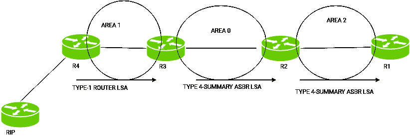

# 链接状态广告(LSA)

> 原文:[https://www.geeksforgeeks.org/link-state-advertisement-lsa/](https://www.geeksforgeeks.org/link-state-advertisement-lsa/)

[开放最短路径优先(OSPF)](https://www.geeksforgeeks.org/computer-network-open-shortest-path-first-ospf-protocol-states/) 是一种[链路状态路由协议](https://www.geeksforgeeks.org/computer-network-classes-routing-protocols/)，用于使用自己的最短路径优先(`SPF`)算法寻找源路由器和目的路由器之间的最佳路径。`OSPF` 路由器通过交换 `LSA` 来更新和维护运行 `OSPF` 的设备的拓扑 `OSPF` 数据库，但是要首先了解 `LSA` 的类型，我们首先必须了解路由器在 `OSPF` 的角色。

## 路由器角色

1.  **骨干路由器**：`0` 区称为骨干区，`0` 区的路由器称为骨干路由器。
2.  **内部路由器**：内部路由器是指所有接口都在一个区域内的路由器。
3.  **区域边界路由器(ABR)**：连接骨干区域与另一区域的路由器称为区域边界路由器。因此，`ABR` 维护多个链路状态数据库，描述主干拓扑和其他区域的拓扑。
4.  **自治系统边界路由器(ASBR)**：当 `OSPF` 路由器连接到不同的协议，如 `EIGRP`、边界网关协议或任何其他路由协议时，它被称为自治系统。连接两个不同自治系统(其中一个接口在 `0` 区运行 `OSPF`)的路由器称为自治系统边界路由器。这些路由器执行重新分发。`ASBRs` 同时运行 `OSPF` 和另一种路由协议，如 `RIP` 或 `BGP`。

## LSA 类型

根据运行 `OSPF` 的设备所在的区域，交换了不同类型的 `LSA`。

1.  **Type-1 (Router Link Advertisement)**：这是由属于同一区域的路由器交换的 `Type-1 LSA`。路由器包含链路状态、路由器 `ID`、`IP` 信息和当前接口状态。如果一个路由器连接到多个区域，则会交换单独的 `Type 1 LSA`。

如图所示，类型 `1 LSA` 由同一区域内的路由器交换，但是如果路由器的其他接口在另一个区域，则不同的类型 `1 LSA` 将被交换。

2.  **Type-2 (Network Link Advertisement)**：这是由 `DR` (指定路由器)仅发送给同一区域(广播或多路访问网络)中存在的所有其他路由器的 `Type-2 LSA`。这些包含 `DR` 和 `BDR` 的 `IP` 信息，以及作为同一网络一部分的其他路由器的状态。记住 `DR` 负责向同一广播区域的所有其他路由器分发路由信息。

如图所示，在广播网络中，只有 `DR` 会将路由信息分发给同一区域的其他路由器。

3.  **Type-3 (Summary LSA)**：这是由 `ABR` 生成并发送到其所在区域之外的区域的 `Type-3 LSA`。`ABR` 从其他区域接收到的拓扑数据库被注入到骨干区域。这包括 `ABR` 的 `IP` 信息和路由器 `ID`，该 `ABR` 正在通告这些 `LSA`。

如图所示，`R3 (ABR)`通过生成类型 `3 LSA` 将区域 `1` 的路由信息泛洪到其他区域。

4.  **Type-4 (Summary ASBR LSA)**：`ABR` 向其生成区域之外的区域发送这些 `Type 4 LSA`。这些 `LSA` 由 `ABR` 生成，以告知其他路由器通往 `ASBR` 的路由。

如图所示，`R4` 是一个 `ASBR`，因此为了通告自己通往 `R3` 的路由，`R4` 将生成一个类型 `1` 的 `LSA`，然后生成一个类型 `4` 的 `LSA`，并将 `LSA` 泛洪到所有其他外部区域，以告知 `ASBR` 通往其他区域路由器的路由。

5.  **Type-5 AS external link advertisement**：这些 `LSA` 由 `ASBR` 生成，用于通告 `OSPF` 自治系统之外的其他自治系统的路由。

如上图所示，`R4` 将成为 `ASBR`(作为 `OSPF` 和 `RIP` 的连接区域)，路由 `1.1.1.0/24` 将在 `OSPF` 地区发布广告。这是 `ASBR` 向 `OSPF` 地区通告其他路由协议路由的责任，因此 `R4` 现在将创建一个 `5` 类 `LSA`，向所有其他 `OSPF` 地区通告这些路由。