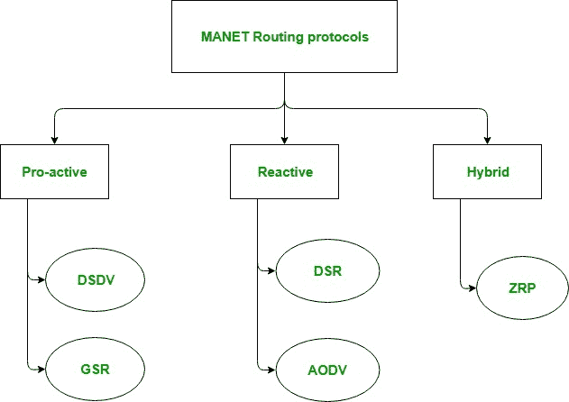
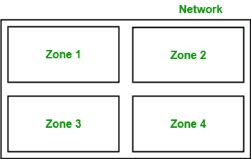

# 移动自组网路由协议

> 原文: [https://www.geeksforgeeks.org/manet-routing-protocols/](https://www.geeksforgeeks.org/manet-routing-protocols/)

在[移动自组织网络(MANET)](https://www.geeksforgeeks.org/introduction-of-mobile-ad-hoc-network-manet/)中，节点不知道自己网络的拓扑，而是必须自己发现，因为自组织网络中的拓扑是动态拓扑。基本规则是，新节点无论何时进入自组织网络，都必须通知其到达和存在，并且还应该收听由其他移动节点做出的类似通知广播。

## 主动路由协议

这些也称为表驱动路由协议。每个移动节点维护一个单独的路由表，其中包含到所有可能的目的移动节点的路由信息。

由于移动自组网络中的拓扑是动态的，因此这些路由表会随着网络拓扑的变化而定期更新。它有一个限制，就是不能很好地为大型网络工作，因为路由表中的条目变得太大，因为它们需要维护到所有可能节点的路由信息。

### Destination Sequenced Distance Vector Routing Protocol (DSDV)

它是一个主动/表驱动路由协议。它实际上扩展了有线网络的距离矢量路由协议，正如其名称所示。它基于`Bellman-ford routing algorithm`。距离矢量路由协议由于计数到无穷问题而不适用于移动自组织网络。因此，作为一种解决方案，目的序列距离矢量路由协议（`DSDV`）应运而生。

目的序列号与每个节点维护的路由表中的每个路由条目相加。只有当条目包含到具有更高序列号的目的地的新更新路由时，节点才会在表中包含新更新。

### Global State Routing (GSR)

它是一个主动/表驱动路由协议。它实际上扩展了有线网络的链路状态路由。它基于`Dijkstra’s routing algorithm`。链路状态路由协议不适用于移动自组织网络，因为在该协议中，每个节点将链路状态路由信息直接泛洪到整个网络中，即全局泛洪，这可能导致网络中控制包的拥塞。

因此，作为一种解决方案，全局状态路由协议应运而生。全局状态路由不会将链路状态路由数据包全局泛洪到网络中。在`GSR`中，每个移动节点维护一个列表和三个表，即邻接表、拓扑表、下一跳表和距离表。

## 反应式路由协议

这些也称为按需路由协议。在这种类型的路由中，只有在需要时才会发现路由。路由发现过程是通过在整个移动网络中泛洪路由请求数据包来实现的。它包括两个主要阶段，即路由发现和路由维护。

### Dynamic Source Routing protocol (DSR)

它是一个反应式/按需路由协议。在这种类型的路由中，路由仅在需要时才被发现。路由发现的过程是通过在整个移动网络中泛洪路由请求数据包来实现的。
它由两个阶段组成：
*   **路由发现:**
    此阶段确定源移动节点和目的移动节点之间数据分组传输的最佳路径。
*   **路由维护:**
    该阶段执行路由的维护工作，因为移动自组织网络中的拓扑本质上是动态的，因此存在许多链路断开导致移动节点之间网络故障的情况。

### Ad-Hoc On Demand Vector Routing protocol (AODV)

它是一个反应式/按需路由协议。它是动态源路由协议（`DSR`）的扩展，有助于消除动态源路由协议的缺点。在`DSR`中，路由发现后，当源移动节点向目的移动节点发送数据包时，其报头中也包含完整的路径。因此，随着网络规模的增大，完整路径的长度也会增加，数据包的报头大小也会增加，这使得整个网络变慢。

因此，自组织按需矢量路由协议应运而生。主要区别在于存储路径的方式，`AODV`将路径存储在路由表中，而`DSR`将路径存储在数据包的报头中。它也以类似的方式分两个阶段运行:路由发现和路由维护。

## 混合路由协议

它基本上结合了反应式和主动式路由协议的优点。这些协议本质上是自适应的，并且根据源和目的地移动节点的区域和位置进行调整。最流行的混合路由协议之一是**区域路由协议(ZRP)**。

将整个网络分成不同的区域，然后观察源和目的移动节点的位置。如果源移动节点和目的移动节点位于同一区域，则使用主动路由在它们之间传输数据包。如果源移动节点和目的移动节点位于不同的区域，则使用反应路由在它们之间传输数据分组。

