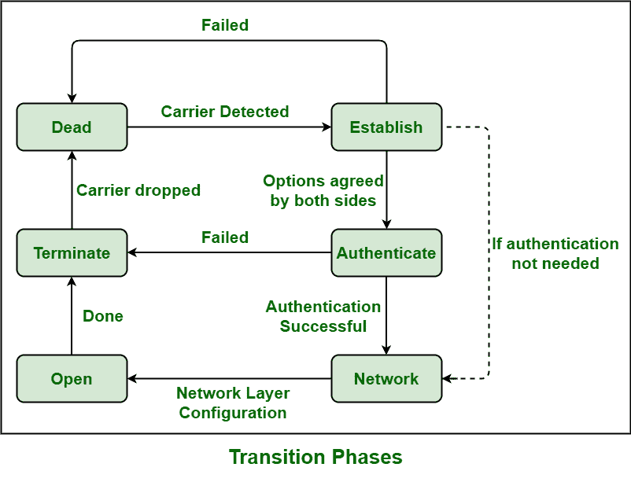

# 点对点协议(PPP)相图

> 原文:[https://www . geesforgeks . org/点对点协议-PPP-相图/](https://www.geeksforgeeks.org/point-to-point-protocol-ppp-phase-diagram/)

[点对点协议(PPP)](https://www.geeksforgeeks.org/ppp-full-form/) 一般是由互联网工程任务组(`IETF`)发明的，只是为了创建和开发点对点线路的数据链路协议，这有助于解决 `SLIP` 中存在的许多问题。

`PPP` 可以在不同的 `DTE/DCE`(数据终端设备/数据电路终端设备)物理接口上运行，以及异步串行、同步串行、`ISDN` 等。它也可以运行在各种网络层协议上，如 `IPX`、苹果对话，而另一方面，`SLIP` 只运行在基于[的 `TCP/IP`](https://www.geeksforgeeks.org/tcp-ip-in-computer-networking/) 协议上。所有利用 `PPP` 协议的点对点链路都需要能够支持全双工通信。

## PPP 阶段图

`PPP` 连接一般会经历不同的阶段，可以在过渡阶段图中看到，如下图所示:



### 1. Dead –
在此阶段，链路基本上启动和停止。载波检测是一个事件，用于指示物理层已就绪，现在 `PPP` 将进入建立阶段。从调制解调器线路断开必须将线路或连接带回到此阶段。`LCP` 自动化通常在此阶段处于初始或启动阶段。

### 2. 建立 –
链路，然后在检测到对等体存在后进入该阶段。当其中一个节点开始通信时，连接进入这个阶段。通过交换 `LCP` 帧或包，所有的配置参数都被协商。如果协商在某一点上相遇，链路被开发，然后系统进入认证协议或网络层协议。这个阶段的结束简单地表示 `LCP` 的打开状态。

### 3. 认证 –
在 `PPP` 中，认证是可选的。一个或两个端点可以请求对等身份验证。如果配置了密码认证协议或挑战握手认证协议，`PPP` 将进入认证阶段。

### 4. Network –
`PPP` 基本上发送或传输 `NCP` 包来选择和配置一个或多个网络层协议，如 `IP`、`IPX` 等，一旦 `LCP` 状态打开且链路或连接建立。这尤其需要配置适当的网络层。

在此阶段，每个网络控制协议都可能随时打开和关闭，并且这些协议的协商也在进行。在网络层，`PPP` 还支持各种协议，因此 `PPP` 指定两个节点在网络层交换数据之前建立或发展网络层协议。

### 5. Open –
通常在这个阶段进行数据传输。一旦端点想要结束连接，连接就被转移到终止阶段，直到连接保持在这个阶段。

### 6. 终止 –
根据任一端点的请求，可以在任何时间点终止连接。`LCP` 基本上需要通过交换终止包来关闭或终止链路。

```
if (condVar > someVal) {console.log("xxx")}
```