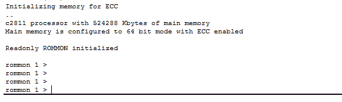
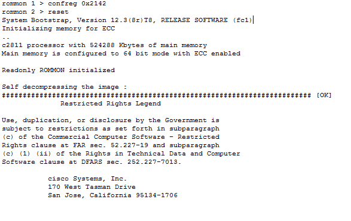
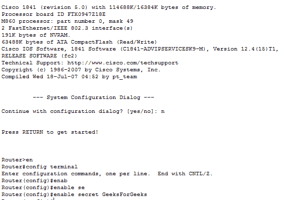
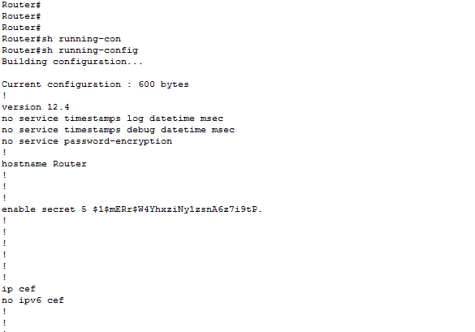

# 在思科路由器中恢复密码

> 原文: [https://www.geeksforgeeks.org/recovering-password-in-cisco-routers/](https://www.geeksforgeeks.org/recovering-password-in-cisco-routers/)

有时候，管理员不记得设备的密码，被锁在设备之外。同样的事情也会发生在思科路由器上。无论如何，如果管理员忘记了*启用密码*或*秘密密码*，那么基本上他/她将无法从用户模式进入思科路由器的特权模式。让我们了解一下如何在思科路由器中处理这些情况并恢复密码。

## 恢复密码

有不同的配置值，告诉路由器从哪个地方加载 IOS，即 NVRAM、flash、rom。默认配置寄存器值为`0x2102`，意味着第 6 位关闭。路由器将使用默认设置并加载存储在 NVRAM 中的配置（存储在 NVRAM 中的配置称为启动配置）。通过打开第 6 位，即将配置寄存器值更改为`0x2142`，它将忽略非易失性随机存取存储器的内容。

## 恢复密码的基本步骤

1.  **启动路由器并通过按 `Ctrl + Break` 键组合来中断启动序列。**
    
    通过按下此组合键，将看到 ROM 监视器模式，如图所示。因为我们不希望旧的启动配置加载，因为启用或秘密密码不可用。

    **注意:** 只有通过 COM1 连接到路由器时，`Ctrl+break`组合键才会起作用。

2.  **现在，将配置寄存器值更改为 `0x2142`。**
    
    正如已经了解到的，通过打开第 6 位，我们可以忽略启动配置内容。因此，将该值更改为`0x2142`，启动配置将被旁路，并将进入设置模式。

3.  **只需在 ROMMON 模式下键入 `reset` 来重新加载路由器。**
    重新加载路由器后，路由器将询问是否使用设置模式。回答“否”后，我们将进入用户模式，在用户模式下键入`enable`，我们将进入特权模式。

4.  **现在，将运行配置（RAM）复制到启动配置（NVRAM）。**
    这意味着现在配置运行在内存中。现在，通过在特权模式和全局配置模式下键入`config terminal`进入全局配置模式，我们可以根据需要更改密码。
    
    进入全局配置模式后，将启用密码更改为 GeeksforGeeks，如图所示。

5.  **将配置寄存器重置为默认值，即 `0x2102`。**
    这很重要，因为下次我们加载路由器时，配置将从 NVRAM 加载。`0x2102`（表示 IOS）将从闪存加载，使用速度为 9600 波特（默认配置寄存器值）。

6.  **将配置保存到 NVRAM。**
    更改后的密码当前存储在运行配置（内存）中，因此，将配置移至启动配置（非易失性内存）。通过键入命令`copy running-config startup-config`，将内容移动到 NVRAM。
    

管理员可以通过在用户执行模式下输入`show running-config`来验证密码，如图所示。请记住，密码将是加密形式的（如图所示）。