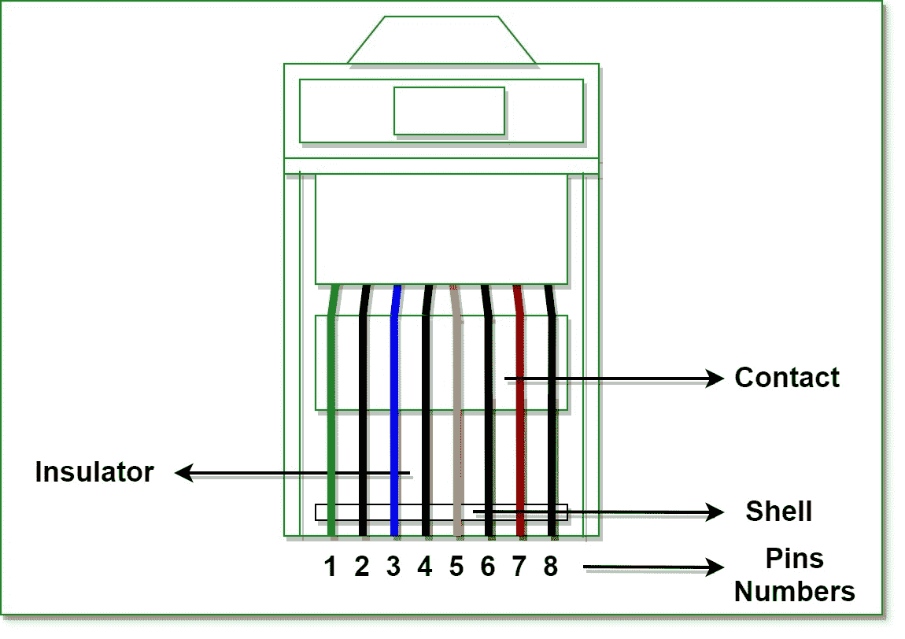

# RJ（注册插孔）完整指南

> 原文：[https://www.geeksforgeeks.org/rj-full-form/](https://www.geeksforgeeks.org/rj-full-form/)

`RJ` 代表 `注册杰克`。
是用于连接语音和数据设备的电信网络接口的标准格式。注册插孔的主要功能之一是将不同的数据设备和电信设备与电话交换机（如长短交换运营商）提供的服务连接起来。

## 历史

注册接口是由贝尔系统公司发明的，该公司受 1976 年联邦通信委员会的监管，负责为客户和电话交换公司订购标准接口。模块化插孔的标准格式仅为综合业务数字网（`ISDN`）系统而设计。但是后来，模块化插孔由于其特点和能力在 1990 年的 `IEEE 802.3i` 中实现了国际标准化。

## RJ（注册杰克）类型

*   **`RJ-11`：**
    这是一个 4 线或 6 线的电话型连接器（注册插孔），用于将电话线连接到墙板。主要位于家庭和办公室中，旧的电话线路系统与 `ISP`（互联网服务提供商）的线路相连。
*   **`RJ-11w`：**
    这里的 ‘w’ 代表壁挂式。这是 `RJ-11` 的扩展版本，通过为一条电话线建立桥接连接来实现壁挂功能。
*   **`RJ-14`：**
    这个类似于 `RJ-11`，但分别用于两条线和四条线。
*   **`RJ-21`：**
    这个注册插孔设计有 50 个导体，可同时实现 25 条线路。用于具有多个交换机和设备的网络区域。
*   **`RJ-25`：**
    这个注册插孔的兼容性非常高，通常用于三条电话线路。
*   **`RJ-45`：**
    这是最合适的注册插孔，能够为以太网网络的星型拓扑中的非屏蔽双绞线（`UTP`）和屏蔽双绞线（`STP`）布线建立连接。它是一个主要的注册插孔，具有 8 线电话型连接器，用于双绞线布线以连接计算机及其线路、墙板、配线架和其他类型的网络组件。
*   **`RJ-48`：**
    这个插孔是最好的注册插孔之一，它使用与 `RJ-45` 相同的插孔，但使用不同类型的引脚排列，其中一对线用于发送信号，一对用于接收信号，一对用于泄放信号，一对未使用。它有三种不同的类型，如用于表面安装的 `RJ-48C`、用于复杂插孔的 `RJ-48X` 和用于壁挂的 `RJ-48S`。主要用于 `LAN`（局域网）。
*   **`RJ-61`：**
    这个也类似于 `RJ-11`，但用于双绞线电缆的端接，并使用八针模块化连接器。

## 特征

*   通过使用配置接口安装表面，能够处理表面。
*   它们包含许多潜在的触点位置和安装在这些位置的实际触点数量。
*   具有模块化接口的特征，用于一、二和三线服务的电话连接。
*   可以对两个系统进行交叉连接。

## 优势

*   注册插孔非常容易安装。
*   它们的可靠性水平很高。
*   接口模块化，连接速度更快。

## 缺点

*   它们仅用于最短网络。
*   它们提供有限的移动性。
*   它们总是需要必要的线路和设备。

要知道 `RJ45` 和 `RJ11` 的区别，请参考。