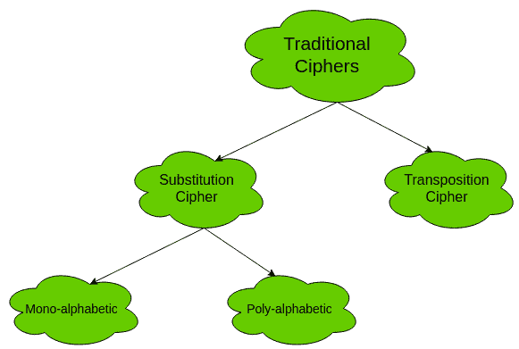
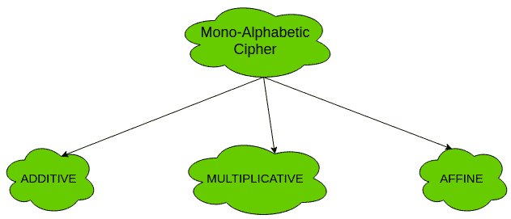
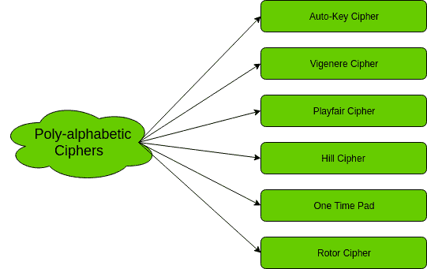
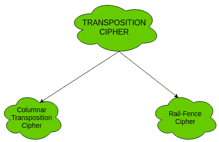

# 传统对称密码

> 原文：[https://www.geeksforgeeks.org/traditional-symmetric-ciphers/](https://www.geeksforgeeks.org/traditional-symmetric-ciphers/)

传统对称密码的两种类型是`替换密码`和`换位密码`。以下流程图对传统密码进行了分类：



## 替换密码

替换密码又分为`单字母密码`和`多字母密码`。

首先，我们来研究一下单字母密码。

### 单字母密码

在单字母密码中，明文中的每个符号（例如，‘follow’中的‘o’）都被映射到一个密文符号。无论一个符号在明文中出现多少次，它都对应于相同的密文符号。例如，如果明文是‘follow’，映射关系如下：

*   f -> g
*   o -> p
*   l -> m
*   w -> x

密文是“gpmmpx”。

单字母密码的类型有：



#### 加法密码（移位密码/凯撒密码）

最简单的单字母密码是加法密码。它也被称为“移位密码”或“凯撒密码”。顾名思义，对明文执行“加法模 26”运算以获得密文。

```
c = (m + k) mod n
m = (c - k) mod n
```

其中，
`C` -> 密文
`M` -> 消息/纯文本
`k` -> 密钥

密钥空间是 26。因此，它不是很安全。可以用暴力攻击破解。
更多信息和实现见[凯撒密码](https://www.geeksforgeeks.org/caesar-cipher/)。

#### 乘法密码

乘法密码类似于加法密码，除了在加密过程中密钥被乘以明文符号。同样，密文乘以解密密钥的乘法逆元来获得明文。

```
c = (m * k) mod n
m = (c * k<sup>-1</sup>) mod n
```

其中，
`k<sup>-1</sup>` -> `k` 的乘法逆元（密钥）

乘法密码的密钥空间是 12。因此，它也不是很安全。

#### 仿射密码

仿射密码是加法密码和乘法密码的组合。密钥空间是 26 * 12（加法的密钥空间 * 乘法的密钥空间）即 312。由于密钥空间较大，比以上两种相对安全。
这里使用两个密钥 `k<sub>1</sub>` 和 `k<sub>2</sub>`。

```
c = [(m * k<sub>1</sub>) + k<sub>2</sub>] mod n
m = [(c - k<sub>2</sub>) * k<sub>1</sub><sup>-1</sup>] mod n
```

更多信息和实现，参见[仿射密码](https://www.geeksforgeeks.org/implementation-affine-cipher/)。

现在，让我们研究一下多字母密码。

### 多字母密码

在多字母密码中，明文中的每个符号都被映射到一个不同的密文符号，而不管其出现次数如何。符号的每一次不同出现都映射到不同的密文。例如，在明文‘follow’中，映射关系如下：

f -> q
o -> w
l -> e
l -> r
o -> t
w -> y

因此，密文是“qwerty”。

多字母密码的类型有：



## 转置密码

转置密码不处理一个符号与另一个符号的替换。它着重于改变符号在明文中的位置。明文中第一个位置的符号可能出现在密文的第五个位置。

两个换位密码是：



1.  **柱状换位密码** – 详见[柱状换位密码](https://www.geeksforgeeks.org/columnar-transposition-cipher/)。
2.  **围栏密码** – 详见[围栏密码](https://www.geeksforgeeks.org/rail-fence-cipher-encryption-decryption/)。