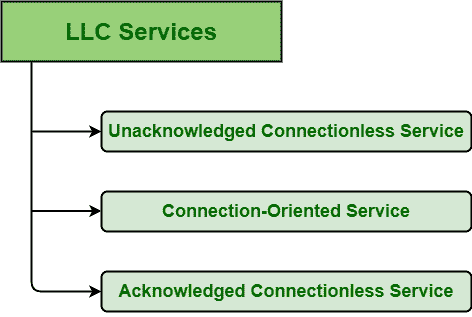

# 有限责任公司提供的服务类型

> 原文: [https://www.geeksforgeeks.org/types-of-services-provided-by-llc/](https://www.geeksforgeeks.org/types-of-services-provided-by-llc/)

**先决条件–** [数据链路层提供的服务](https://www.geeksforgeeks.org/services-provided-by-data-link-layer/)

[逻辑链路控制(LLC)](https://practice.geeksforgeeks.org/problems/what-is-logical-link-control) 是 IEEE 802 协议参考模型的最上层之一。LLC 基本上提供数据链路的寻址和控制。可选地，它可以提供流量控制、确认或错误恢复。LLC 位于媒体访问控制层和第 3 层协议之间的数据链路层，也是 802.2 规范的重要组成部分。LLC 通常负责网络上计算机或设备之间的数据传输。

## LLC 提供的服务

LLC 基本上使用 `lsap`（LLC 服务接入点）向用户提供各种服务。这些服务通常根据服务原语来指定。LLC 标准通常规定和定义三种不同形式的服务，如下所示。

### `LLC 1`：无确认的无连接服务

无确认的无连接服务，顾名思义，是一种数据帧从源机器发送到目标机器而无需任何确认，且在源和目标机器之间未建立连接的服务。其中，“无确认的无连接服务”包含两个词，即“无确认”和“无连接服务”。

源机器向目标机器发送或传输数据帧。但是作为回报，目标机器不向源机器提供任何确认，因此这种服务被称为未确认服务。与此同时，源机器和目标机器之间没有建立连接，因此称为无连接服务。所以，组合起来就是所谓的未确认无连接服务。

它还负责在下一个更高层和 LLC 之间的接口上只提供两个服务原语。该服务提供以下功能：

1.  无确认的数据报服务。
2.  错误控制。
3.  流控制。

### `LLC 2`：面向连接的服务

面向连接的服务，顾名思义，是一种在数据传输之前，数据帧从源机器发送到目标机器时带有确认，并且在源和目标机器之间已建立连接的服务。其中，“面向连接服务”包含两个词，即“确认”和“连接服务”。

源机器向目标机器发送或传输数据帧，作为回报，目标机器向源机器提供确认，因此这种服务称为确认服务。与此同时，在任何数据传输之前，源机器和目标机器之间都会建立一个连接，因此它被称为面向连接的服务。所以，结合起来就是面向连接的服务。

它不支持任何多播或广播寻址。它只支持单独寻址。它还在 `LSAP`（链路服务接入点）之间提供点对点链路连接。该服务提供以下功能：

1.  流控制。
2.  数据排序。
3.  错误指示和恢复。

### `LLC 3`：确认的无连接服务

确认的无连接服务，顾名思义，是一种数据帧从源机器发送到目标机器时带有确认，但在源和目标机器之间未建立连接的服务。其中，“确认的无连接服务”包含两个词，即“确认”和“无连接服务”。

源机器向目标机器发送或传输数据帧，作为回报，目标机器向源机器提供确认，因此这种服务称为确认服务。与此同时，源机器和目标机器之间没有建立连接，因此称为无连接服务。所以，结合起来就是确认的无连接服务。它不支持任何多播或广播寻址。这是一项很少使用的服务。