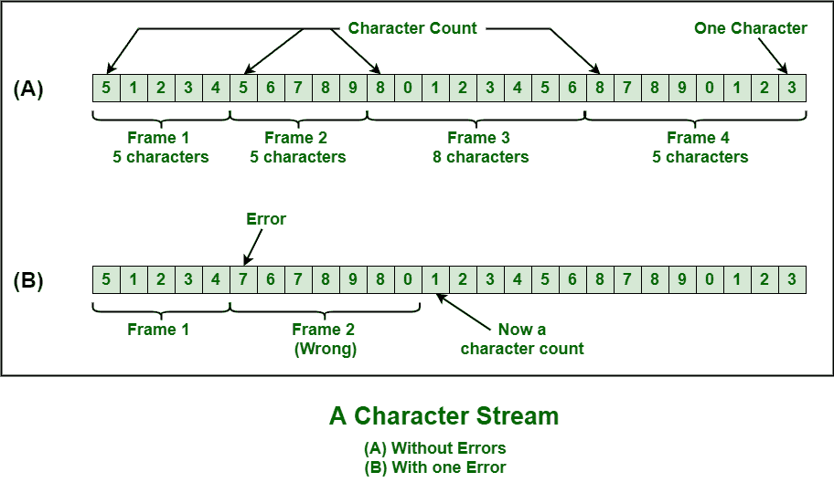

# 数据链路层的各种成帧方式

> 原文：[https://www.geeksforgeeks.org/various-kind-of-framing-in-data-link-layer/](https://www.geeksforgeeks.org/various-kind-of-framing-in-data-link-layer/)

[成帧](https://www.geeksforgeeks.org/framing-in-data-link-layer/)是数据链路层的功能，用于将消息从源或发送者分离到目的地或接收者，或者仅通过添加发送者地址和目的地地址，将消息从所有其他消息分离到所有其他目的地。目的地或接收方地址仅用于表示消息或数据包的去向，发送方或源地址仅用于帮助接收方确认收到。

帧通常是数据链路层的数据单元，在不同的网络点之间传输。它包括完整的寻址、必要的协议和受控的信息。物理层只接受和传输比特流，不考虑任何意义或结构。因此，简单地开发和识别帧边界取决于数据链路层。

这可以通过在帧的开头和结尾附加特殊类型的位模式来实现。如果所有这些位模式都可能意外出现在数据中，则需要特别小心，以确保这些位模式不会被错误地解释为帧分隔符。

成帧只是两台计算机或设备之间的点对点连接，包括以比特流形式传输数据的线路。然而，所有这些位都应该被组织成可识别的信息块。

## `取景方法`

基本上有以下四种取景方法：

```
1. Character Count
2. Flag Byte with Character Stuffing
3. Starting and Ending Flags, with Bit Stuffing
4. Encoding Violations
```

这些解释如下。

### `Character Count`

这种方法很少使用，通常用于计算帧中存在的字符总数。这是通过使用头部中的字段来完成的。字符计数方法确保接收方或目的地的数据链路层了解后续字符的总数以及帧的结束位置。

使用这种方法也有缺点，即如果字符计数由于传输过程中出现的错误而受到干扰或失真，那么目的地或接收器可能会失去同步。目的地或接收器也可能无法定位或识别下一帧的开始。



### `Character Stuffing`

`Character stuffing`也称为`byte stuffing`或面向字符的成帧，与`bit stuffing`类似，但`byte stuffing`实际上在字节上操作，而`bit stuffing`在比特上操作。在`byte stuffing`中，当消息或字符具有与标志字节相同的模式时，通常会在数据流或帧的数据部分添加一个特殊的字节，即`ESC`（转义字符）。

但是接收器删除了这个`ESC`，保留了导致一些问题的数据部分。简而言之，如果文本中存在`ESC`或标志，我们可以说字符填充是增加1个额外的字节。


### `Bit Stuffing`

`Bit stuffing`也称为面向比特的成帧或面向比特的方法。在`bit stuffing`中，网络协议设计者向数据流中添加额外的比特。它通常是在传输单元或要传输的消息中插入或添加额外的比特，作为一种简单的方式向接收方提供信令信息和数据，并避免或忽略出现非预期或不必要的控制序列。

这是一种简单的协议管理，用于分解导致传输不同步的位模式。比特填充是网络和通信协议传输过程中非常重要的一部分。`USB`中也需要。

### 物理层编码违规

编码违规是仅用于网络的方法，其中物理介质上的编码包括某种冗余，即使用一个以上的图形或视觉结构来简单编码或表示数据的一个变量。