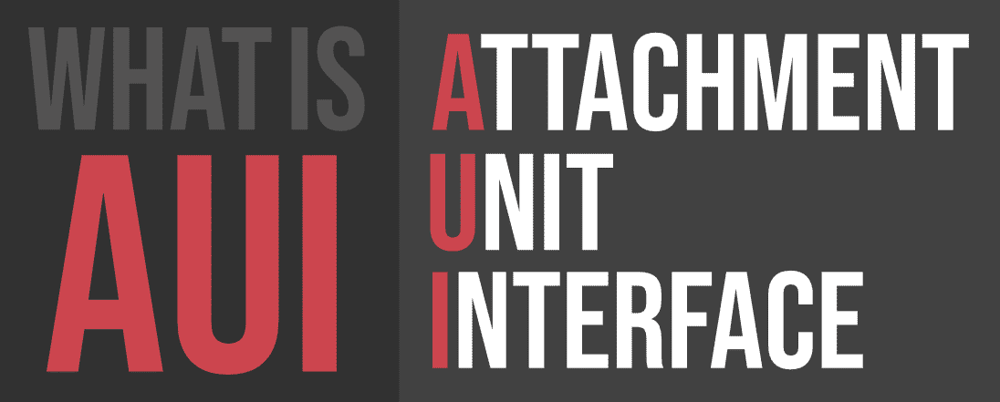

# 什么是 AUI(附件单元接口)？

> 原文：[https://www.geeksforgeeks.org/what-is-auiattachment-unit-interface/](https://www.geeksforgeeks.org/what-is-auiattachment-unit-interface/)

**AUI** 代表**附件单元接口**。AUI 是以太网标准的一部分，它规定了电缆如何连接到以太网卡。AUI 是一个物理和逻辑接口。IEEE 802.3 标准为 10BASE5 以太网定义了 AUI。AUI 连接器是一个 15 端口连接器，在以太网节点的物理信令和媒体附加单元(MAU)之间提供路径。

| 编号 | 信号 | 描述 |
| --- | --- | --- |
| 1 | `CI-S` | 控制电路屏蔽 |
| 2 | `CI-A` | 电路甲中的控制 |
| 3 | `DO-A` | 数据输出电路 |
| 4 | `DI-A` | 电路屏蔽中的数据 |
| 5 | `DI-A` | 电路甲中的数据 |
| 6 | `VP` | 公共电压(0 V) |
| 7 | `CA` | 控制输出电路 A(未使用) |
| 8 | `CO` | 控制输出电路屏蔽(未使用) |
| 9 | `CI-B` | 电路 B 中的控制 |
| 10 | `DO-B` | 数据输出电路 B |
| 11 | `DO-S` | 数据输出电路屏蔽(未使用) |
| 12 | `DI-B` | 电路 B 中的数据 |
| 13 | `VP` | 电压加(+12 V) |
| 14 | `VS` | 电压屏蔽(未使用) |
| 15 | `CO` | 控制输出电路 B(未使用) |
| 壳 | `PG` | 保护地 |