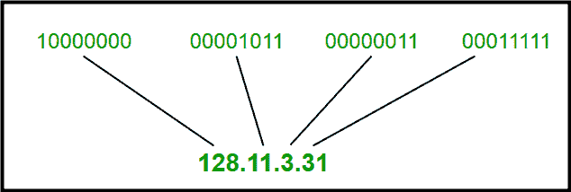
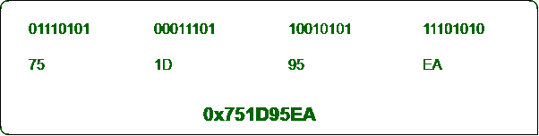
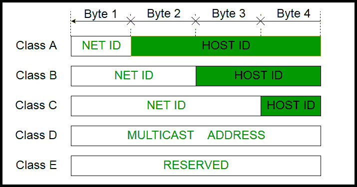
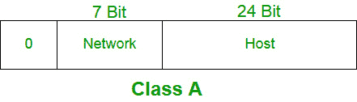

# 甲类网络地址的有效范围是多少？

> 原文：[https://www.geeksforgeeks.org/what-is-the-valid-range-of-a-class-a-network-address/](https://www.geeksforgeeks.org/what-is-the-valid-range-of-a-class-a-network-address/)

首先让我们知道什么是 `IP` 地址，如果你已经知道，跳过这一节。

## `IP`（互联网协议）：
在互联网上进行通信是最基本的协议之一。`IP` 描述了网络设备如何寻址和路由信息。`IP` 地址是识别互联网上的计算机或其他设备的号码。一个简单的例子可能是邮寄地址。

```
There are 2 types of IP
1. IPv4 : 32 bit long, Ex: 35.244.11.196
2. IPv6 : 128 bit long, it is so much longer than IPv4
```

`IPv4` 示例：

1. 点分十进制符号



`IPv4`：32 位长（点分十进制）

2. 十六进制表示法



`IPv4`：32 位长（Hexadecimal）

## 类寻址：
- 因此，在 `IPv4` 寻址中，有 5 个类别来划分 `IP` 值：`A类`、`B类`、`C类`、`D类` 和 `E类`。
- 第一个八位字节中的比特顺序决定了 `IP` 地址的类别。
- `IPv4` 地址分为两部分：
    1. `网络ID`
    2. `主机标识`
- 该类可以确定用于 `网络标识` 和 `主机标识` 的位。
- 可以计算出该特定类别中可能的网络和主机总数。
- 常用的只有 `A类`、`B类` 和 `C类`。`D类` 和 `E类` 是保留类，`D类` 用于多播组，`E类` 用于将来的目的。



## A类：
- 属于 `A类` 的 `IP` 地址被分配给包含大量主机的网络。在这里，`A类` 可以支持 127 个网络上的 1600 万台主机。
- 这里，`网络标识` 长 8 位，`主机标识` 长 24 位。
- 属于 `A类` 的 `IP` 地址范围从 `1.x.x.x`–`126.x.x.x`。
- 默认子网掩码：`255.x.x.x`。



```
Number Of Hosts and Networks:

Number of Hosts: (2^24)-2= 16,777,214 i.e 16 million hosts
Number of Networks: (2^7)-2=126 
Note: Reducing 2 because, 0.0.0.0 and 127.a.b.c are different addresses
```

**A类的范围是 `1.0.0.1` 到 `126.255.255.254`。**

## 其他类别：
- `B类`：`128.1.0.1` 至 `191.255.255.254`
- `C类`：`192.0.1.1` 至 `223.255.254.254`
- `D类`：`244.0.0.0` 至 `239.255.255.255`
- `E类`：`244.0.0.0` 至 `254.255.255.254`

参考文献：[https://www.geeksforgeeks.org/introduction-of-classful-ip-addressing/](https://www.geeksforgeeks.org/introduction-of-classful-ip-addressing/)