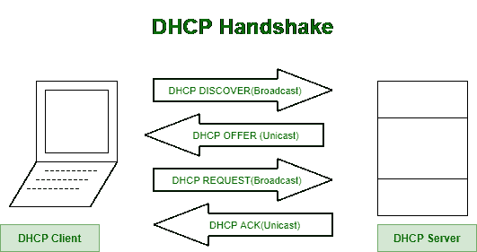

# 网络请求的工作

> 原文:[https://www.geeksforgeeks.org/working-of-web-request/](https://www.geeksforgeeks.org/working-of-web-request/)

要连接到互联网上的网页，以下步骤和协议起着至关重要的作用:

## 1. 获取IP地址与网络配置

计算机连接到网络后，没有IP地址就无法执行任何操作。因此，客户端计算机会运行`DHCP`（动态主机配置协议）来获取IP地址、第一跳路由器的地址以及`DNS`服务器的地址。

*   **步骤 1:** `DHCP`服务器发现。
    新到达的主机需要找到`DHCP`服务器。客户端在`UDP`段中发送`DHCP`发现消息，目标端口为`67`。`UDP`数据包被封装在一个`IP`数据报中，其广播`IP`目标地址为`255.255.255.255`，源`IP`地址为`0.0.0.0`（因为客户端还没有`IP`地址）。
    `DHCP`客户端将`IP`数据报传递给链路层，然后链路层将此帧广播给子网中的所有节点。

*   **步骤 2:** `DHCP`服务器响应。
    `DHCP`服务器在收到`DHCP`发现消息时响应客户端。服务器提供的消息包含接收到的发现消息的事务标识、客户端的建议`IP`地址、网络掩码和`IP`地址租用时间（即`IP`地址将有效的时间）。

*   **步骤 3:** `DHCP`请求。
    客户端响应其`DHCP`请求消息，回显配置参数。

*   **步骤 4:** `DHCP`确认。
    `DHCP`服务器创建包含客户端`IP`地址的`DHCP`确认。客户端的第一跳路由器的`IP`地址、域名系统服务器的名称和`IP`地址。

## 2. 接收配置并记录信息

客户端接收包含`DHCP ACK`的以太网帧，从以太网帧中提取`IP`数据报，从`IP`数据报中提取`UDP`段，最后从`UDP`段中提取`DHCP ACK`消息。客户端记录其`IP`地址，域名服务器的`IP`地址。它还会在转发表中添加一个默认网关地址的条目。

## 3. DNS查询

客户端操作系统创建包含网页域名的`DNS`查询消息。该域名系统查询消息被封装在`UDP`段中，该段被进一步放入带有源`IP`地址和在`DHCP`确认中返回的`域名系统服务器`的`IP`地址的`IP`数据报中。最后，封装到以太网帧中。

## 4. 使用ARP获取MAC地址

客户端不知道网关路由器的媒体访问控制地址。为了获取第一跳路由器和本地`DNS`服务器的`MAC`地址，客户端使用`ARP协议`。

*   **步骤 1:** `ARP`查询消息。
    客户端在以太网帧内创建此消息，广播目的地址为`FF:FF:FF:FF:FF`，并将其发送到交换机，交换机再广播到所有连接的设备。

*   **步骤 2:** `ARP`回复消息。
    路由器在收到`ARP`查询消息后，会回复`ARP`回复消息，提供路由器接口的`MAC地址`。

现在，客户端在以太网帧中有地址，并将该帧发送到交换机，交换机将该帧传送到网关路由器。

## 5. 路由到DNS服务器

从校园网转发到康卡斯特网络的`IP`数据报，使用`RIP`、`OSPF`、`IS-IS`和/或`BGP`路由协议创建的转发表路由到`DNS`服务器。

## 6. DNS服务器响应

接收`IP`数据报的域名系统服务器提取域名系统查询消息并查找网页。域名系统服务器创建包含主机名到`IP`地址映射的`域名系统回复消息`，并将域名系统回复消息封装在`UDP`段中，并进一步封装在带有客户端`IP`地址的`IP`数据报中。`IP`数据报被转发回客户端。

## 7. 建立TCP连接并发送HTTP请求

由于客户端已经收到网页的`IP`地址，现在它将发送`HTTP请求`，尽管“第一跳路由器”网页不在本地`DNS`服务器中。要发送`HTTP`请求，客户端首先打开`到网络服务器的TCP套接字`，通过三方握手`建立TCP连接(SYN ->确认-> SYNACK)`。

## 8. 转发HTTP请求

`HTTP`请求消息被分段并封装成`IP`数据报，再进一步封装成以太网帧，最后发送到第一跳路由器。收到帧后，路由器将它们向上传送到`IP`层，检查路由表，并通过正确的接口转发数据包。

## 9. 服务器响应

当接收到`IP`数据包时，托管网页的服务器将通过`HTTP`响应消息将网页发送回客户端。

## 10. HTTP响应返回客户端

`HTTP`响应消息将被封装到`TCP`数据包中，并进一步封装到`IP`数据包中，通过跟随`IP`路由器，消息将到达我们的第一跳路由器，然后该路由器通过将数据包封装到以太网帧中将数据包转发给客户端。