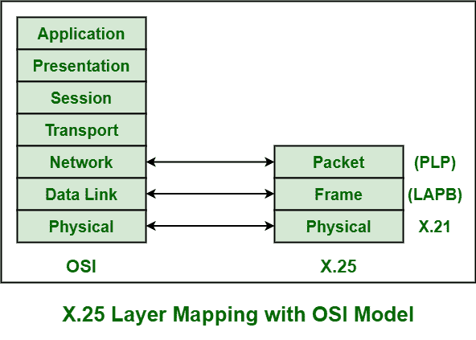
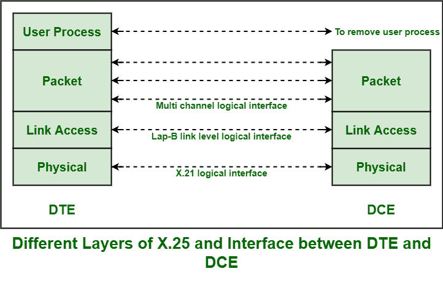

# X.25 结构

> 原文:[https://www.geeksforgeeks.org/x-25-structure/](https://www.geeksforgeeks.org/x-25-structure/)

X.25 通常是由国际电信联盟(国际电联)开发的协议。它通常允许各种逻辑通道使用同一条物理线路。它基本上定义了一系列特别是由国际电联发布的文件。这些文件也被称为 X.25 建议。X.25 还支持通过 `multFiplexing` 数据包以及借助虚拟通信通道进行各种对话。X.25 基本上包含或适合于网络的[开放系统互连(OSI)](https://www.geeksforgeeks.org/osi-full-form/) 参考模型的下三层。

这三个协议层是:

1.  物理层
2.  框架层
3.  数据包层

这些解释如下。

## 物理层

这一层基本上是关于电气或信令的。X.25 的物理层接口，也称为 `X.21 bis`，基本上源自用于串行传输的 `RS-232` 接口。

这一层提供了各种传输或传送一些电信号的通信线路。链接通常需要 `X.21` 实现者。

## 数据链路层

数据链路层也称为框架层。这一层是 ISO [高级数据链路层(HDLC)](https://www.geeksforgeeks.org/basic-frame-structure-of-hdlc/) 标准的实现或开发，该标准被称为 `LAPB`（链路接入过程平衡）。它还在任何两个物理连接的节点或 X.25 节点之间提供通信链路和无差错传输。

`LAPB` 还允许 `DTE`（数据终端设备）或 `DCE`（数据电路终端设备）简单地开始或结束通信会话或开始数据传输。这一层是 X.25 协议最重要和最基本的部分之一。该层还提供了一种机制，用于在传输过程中检查每一跳。这项服务还确保了面向比特的、无差错的、有序的数据帧或数据包传送。

有许多协议可用于帧级，如下所示:

*   **链路接入过程平衡(LAPB)–**
        由 ITU-T 建议 X 指定，通常源自 `HDLC`。它是最常用的允许建立逻辑连接的协议。
    *   **链路接入协议(LAP)–**
        这个协议很少使用。这通常用于在点对点链路上成帧和传输数据包。
    *   **链路接入程序 D 信道(LAPD)–**
        它用于通过 D 信道传送或传输数据。它还允许通过数据通道在数据终端设备之间传输数据，尤其是在数据终端设备和综合业务数字网节点之间。
    *   **逻辑链路控制(LLC)–**
        用于管理和确保数据传输的完整性。它还允许通过局域网通道传输 `x25` 数据包或帧。

## 数据包层

数据包层也称为 X.25 的网络层协议。这一层通常管理各种 `DTE` 设备之间的端到端通信。它还定义了如何借助 `PVCs`（永久虚拟电路）或 `SVCs`（交换虚拟电路）在网络上的终端节点和交换机之间寻址和传递 X.25 数据包。该层还管理 `DTE` 设备之间的建立、拆除以及流量控制，以及各种路由功能，包括多路复用多个逻辑或虚拟连接。

该层还定义和解释数据包的格式，以及数据帧的控制和传输过程。该层还负责建立连接、传输数据帧或数据包、结束或终止连接、错误和流量控制、通过外部虚拟电路传输数据包。

