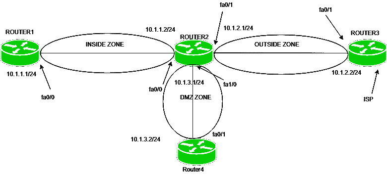

# 基于区域的防火墙配置

> 原文: [https://www.geeksforgeeks.org/zone-based-firewall-configuration/](https://www.geeksforgeeks.org/zone-based-firewall-configuration/)

先决条件 – [基于区域的防火墙](https://www.geeksforgeeks.org/computer-network-zone-based-firewall/)

基于区域的防火墙是状态防火墙的一种高级方法。在有状态防火墙中，包含源 IP 地址、目标 IP 地址、源端口号和目标端口号的条目是为有状态数据库中受信任(私有)网络生成的流量维护的。这将只包括使用状态数据库的私有(受信任)网络的响应流量。

## 基于区域的防火墙程序

1.  **创建区域并为其分配接口**
    在基于区域的防火墙中，会创建逻辑区域。一个区域被分配给一个接口。默认情况下，不允许从一个区域到另一个区域的流量。
2.  **创建类别映射**
    创建区域后，会创建一个类别映射策略，该策略将识别应用策略的流量类型，如 ICMP。
3.  **创建策略地图并将类别地图分配给策略地图**
    在类别地图中识别流量类型后，我们必须定义必须对流量采取的操作。该操作可以是:
    *   **检查:** 与 CBAC 检查相同，即只允许来自被检查的外部网络的流量(内部(可信)网络的返回流量)。
    *   **丢弃:** 这是所有流量的默认操作。策略映射中配置的类别映射可以配置为丢弃不需要的流量。
    *   **通行:** 这将允许从一个区域到另一个区域的交通。与检查操作不同，它不会为流量创建会话状态。如果我们想允许来自相反方向的流量，应该创建相应的策略。
4.  **配置区域对并分配策略**
    区域对仅针对一个方向进行配置。策略定义了识别哪些流量(什么类型的流量)，然后应采取什么措施(拒绝检查、允许)。然后，我们必须将此策略应用于区域对。

## 配置



如图所示，4 台路由器相互连接，即路由器 1 的 `fa0/0` 接口上有 IP 地址 `10.1.1.1/24`，路由器 2 的 `fa0/0` 接口上有 IP 地址 `10.1.1.2/24`，`fa0/1` 接口上有 `10.1.3.1/24`，路由器 3 的 `fa0/1` 接口上有 IP 地址 `10.1.2.2/24`，路由器 4 有 `10.1.3.1/24`。

首先，我们必须执行路由，以便路由器可以相互连接。
在路由器 2 上配置 RIP:

```
Router2(config)#router rip
Router2(config-router)#network 10.1.1.0
Router2(config-router)#network 10.1.2.0
Router2(config-router)#network 10.1.3.0
Router2(config-router)#no auto-summary
```

现在，给出路由器 1 上的默认路由:

```
Router1(config)#ip route 0.0.0.0 0.0.0.0 10.1.1.2
```

给出路由器 2 上的默认路由

```
Router3(config)#ip route 0.0.0.0 0.0.0.0 10.1.2.1
```

在路由器 4 上给出默认路由

```
Router4(config)#ip route 0.0.0.0 0.0.0.0 10.1.3.1
```

现在，我们必须在 RIP 中重新分发默认路由:

```
Router2(config)#router rip
Router2(config-router)#default-information originate
```

这些路由器将能够相互 ping 通。
现在，配置基于区域的防火墙。
在这种情况下，我们将只允许从内部区域到外部区域的 ICMP 流量和 telnet 流量。

为了完成这项任务，将采取以下步骤:

1.  **创建区域并将接口分配给区域**
    首先，我们必须为区域配置一个名称，然后将其应用到接口(此处为 `Router2`)。配置区域并将其命名为 `inside`、`outside` 和 `dmz`。

    ```
    Router2(config)#zone security inside
    Router2(config-sec-zone)#exit
    Router2(config)#zone security outside
    Router2(config-sec-zone)#exit
    Router2(config)#zone security dmz
    Router2(config-sec-zone)#exit
    ```

    现在，将区域应用于接口。

    ```
    Router2(config)#interface fa0/0
    Router2(config-if)#zone-member security inside
    Router2(config)#interface fa0/1
    Router2(config-if)#zone-member security outside
    Router2(config)#interface fa1/0
    Router2(config-if)#zone-member security dmz
    ```

    将区域应用到接口后，路由器将无法相互 ping 通，因为默认情况下，从一个区域到另一个区域的流量将被丢弃(根据默认策略)。

2.  **创建类别映射**
    将创建类别映射以识别我们要对其执行操作的流量类型。
    配置类别映射，说明将对其执行检查的流量类型。

    ```
    Router2(config)#class-map type inspect match-any in-out
    Router2(config-cmap)#match protocol icmp
    Router2(config-cmap)#match protocol telnet
    ```

    `match-any` 表示类映射中的任何语句匹配，例如，对于 `telnet` 或 `ICMP`。我们已经给班级地图命名了。

3.  **创建策略映射并将类别映射应用于策略映射**
    将配置策略映射以提及将执行什么操作(检查、丢弃或通过)。在我们的场景中，我们将使用 `inspect`，即只有当流量在状态数据库中有条目时(内部区域发起的流量的回复)，才会允许从外部区域进入内部区域。

    ```
    Router2(config)#policy-map type inspect in-out
    Router2(config-pmap)#class in-out
    Router2(config-pmap-c)#inspect
    ```

    在这里，我们已经配置了一个名为 `input` 的策略映射，并为它分配了一个类映射(名为 `in-out`)，将要采取的操作是 `inspect`。
    这里我们取了类图和策略图的同名。可以取不同的名字，但那样会很复杂。

4.  **创建区域对并将策略映射应用于区域对**
    创建区域对，指定源区域和目标区域，并将策略映射应用于区域对。

    ```
    Router2(config)#zone-pair security in-outpair source inside destination outside
    Router2(config-sec-zone-pair)#service-policy type inspect in-out
    ```

    这里，在第一个命令中，请注意 `in-outbir` 是区域对的名称，其中 `inside` 区域将是源，`outside` 区域将是目标。
    这意味着已经在从 `inside` 区域到 `outside` 区域的方向上定义了区域对。在第二个命令中，`in-out` 是策略映射的名称。
    现在，`inside` 区域将对 `outside` 区域设备进行 `ping` 和 `telnet`，但反之亦然，我们必须定义单独的区域对。此外，请注意，`inside` 区域设备将能够到达 `outside` 区域设备，但不能到达 `DMZ` 区域，因为没有为其定义区域对。