# 每个 Node.js 开发者都应该知道的 15 个 npm 命令

> 原文：[https://www.geeksforgeeks.org/15-npm-commands-that-every-node-js-developer-should-know/](https://www.geeksforgeeks.org/15-npm-commands-that-every-node-js-developer-should-know/)

`NPM` 代表节点包管理器，是节点 JavaScript 平台的包管理器。它将模块放在适当的位置，以便节点可以找到它们，并智能地管理依赖关系冲突。最常见的是，它用于发布、发现、安装和开发节点程序。

每个开发人员都应该知道的一些重要 `npm` 命令有：

## NPM Install Command
在本地 `node_modules` 文件夹中安装 `package.json` 文件里的一个包。

```js
npm install
```

示例：

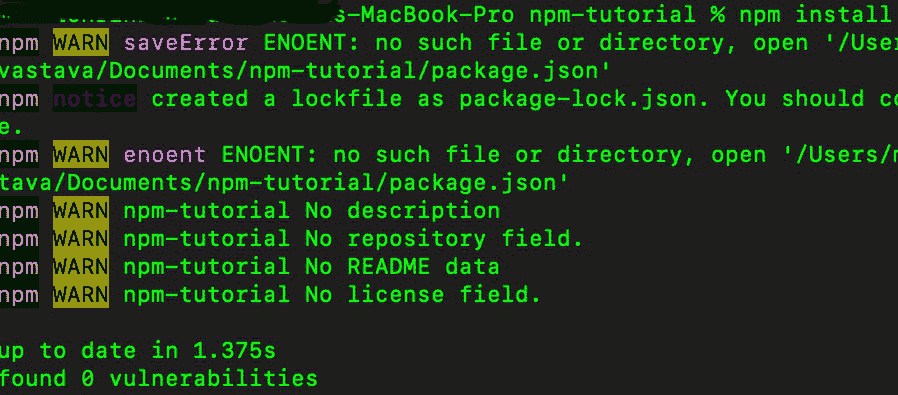

图中显示了“`npm install`”的用法，即安装 `package.json` 和 `package-lock.json`。

## NPM Uninstall Command
从 `package.json` 文件中移除一个包，并从本地 `node_modules` 文件夹中删除该模块。

```js
npm uninstall
```

示例：

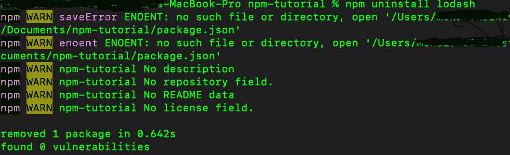

图中显示了一个程序包“`lodash`”，它是一个正在使用 `npm uninstall` 命令卸载的 `npm` 程序包。

## NPM Update Command
此命令更新指定的包。如果未指定包，则更新指定位置的所有包。

```js
npm update
```

示例：

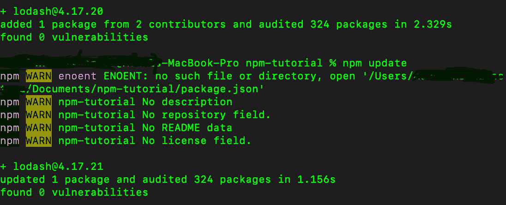

最初的 `lodash` 版本 `4.17.20` -> 使用 `npm update` 命令更新到 `4.17.21`。

## NPM Global Update Command
此命令将更新操作应用于每个全局安装的包。

```js
npm update -g
```

示例：

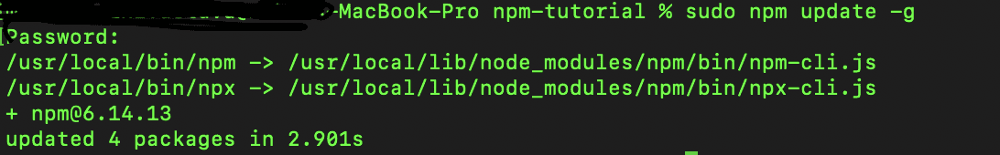

`npm update -g` 会更新所有可用的软件包。

## NPM Deprecate Command
该命令将在 `npm` 注册表中弃用包，向所有试图安装它的人提供弃用警告。

```js
npm deprecate
```

## NPM Outdated Command
检查注册表中是否有任何（或指定的）包已过时。它会打印出所有已过时包的列表。

```js
npm outdated
```

示例：

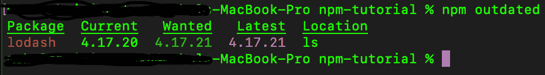

终端中显示的 `lodash` 包已经过时，可以更新。

## NPM Doctor Command
检查我们的环境，以确保我们的 `npm` 安装具备管理 `JavaScript` 包所需的一切。

```js
npm doctor
```

示例：

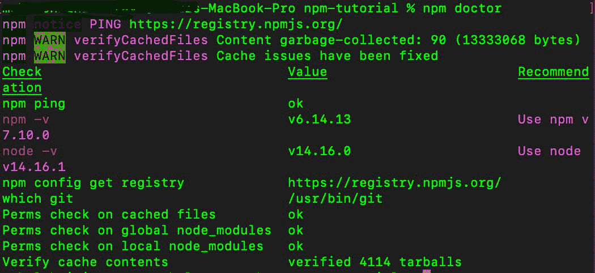

## NPM Initialize Command
在我们的目录中创建一个 `package.json` 文件。它基本上会询问一些问题，并最终在当前项目目录中创建一个 `package.json` 文件。

```js
npm init
```

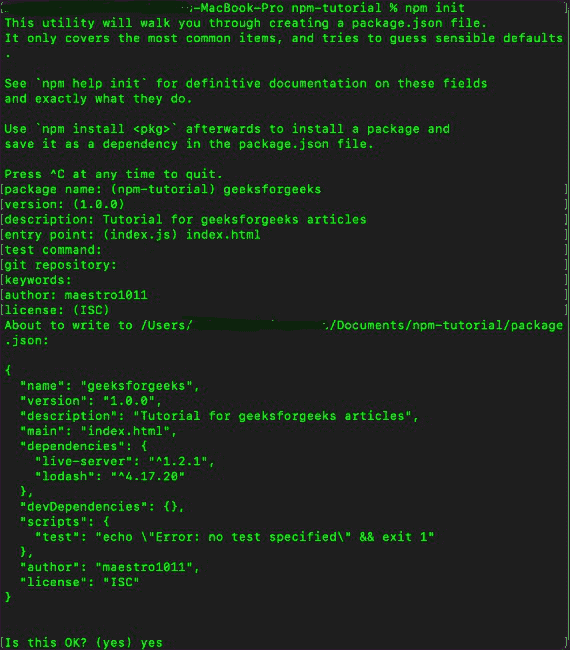

图显示了 `npm init` 命令中涉及的步骤。

## NPM Start Command
运行脚本中 `start` 属性中定义的命令。如果没有定义，它将运行 `node server.js` 命令。

```js
npm start
```

## NPM Build Command
用于构建一个包。

```js
npm build
```

示例：

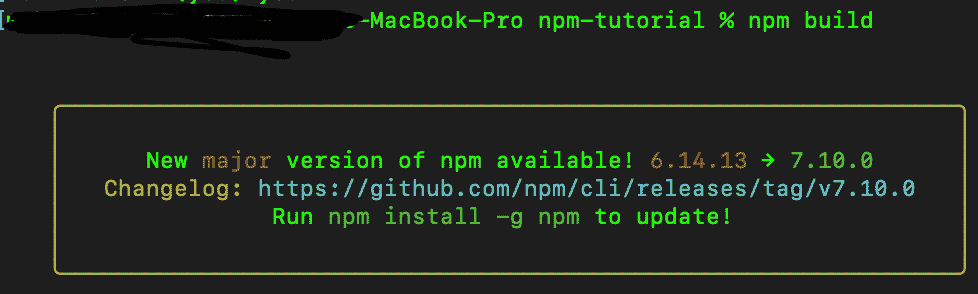

显示有一个主要更新可用，可以使用 `changelog` 之后给出的命令进行更新。

## NPM List Command
列出所有已安装的包及其依赖项。

```js
npm ls
```

示例：

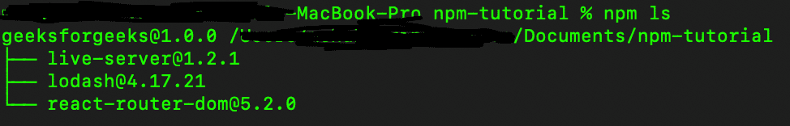

`npm ls` 列出了 `package.json` 文件中安装的所有 `npm` 包。

## NPM Version Command
提升一个包的版本。

```js
npm version
```

示例：

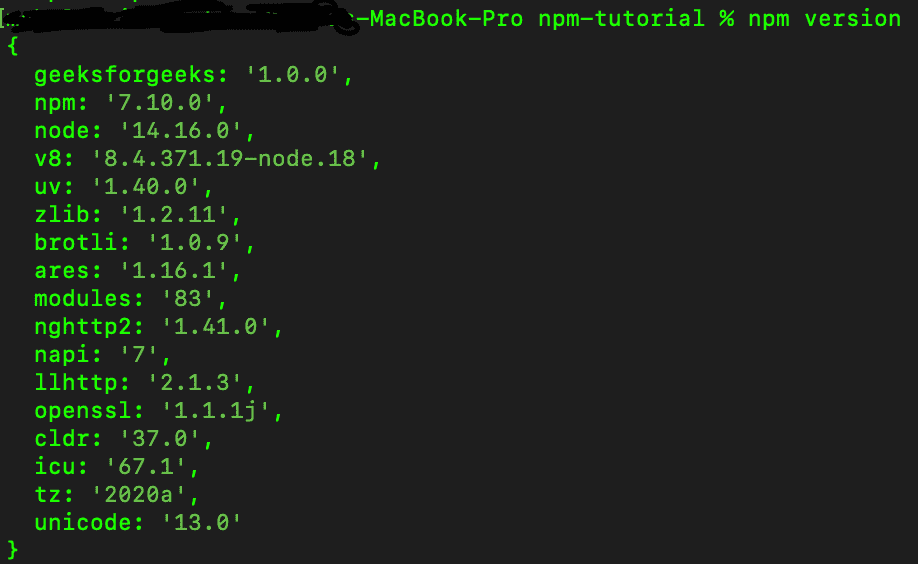

列出项目中安装或使用的所有软件包版本。

## NPM Search Command
在 `npm` 注册表中搜索匹配搜索词的包。

```js
npm search
```

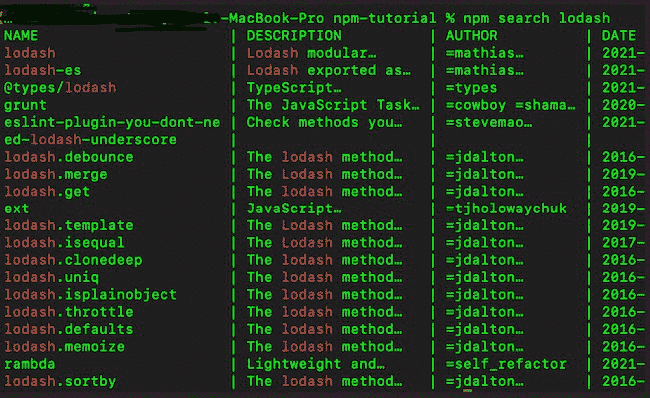

显示包 `lodash` 和所有提交的描述以及进行更改的作者。

## NPM Help Command
在 `npm` 帮助文档中搜索指定的主题。每当用户需要帮助获取一些参考资料时使用。

```js
npm help
```

示例：

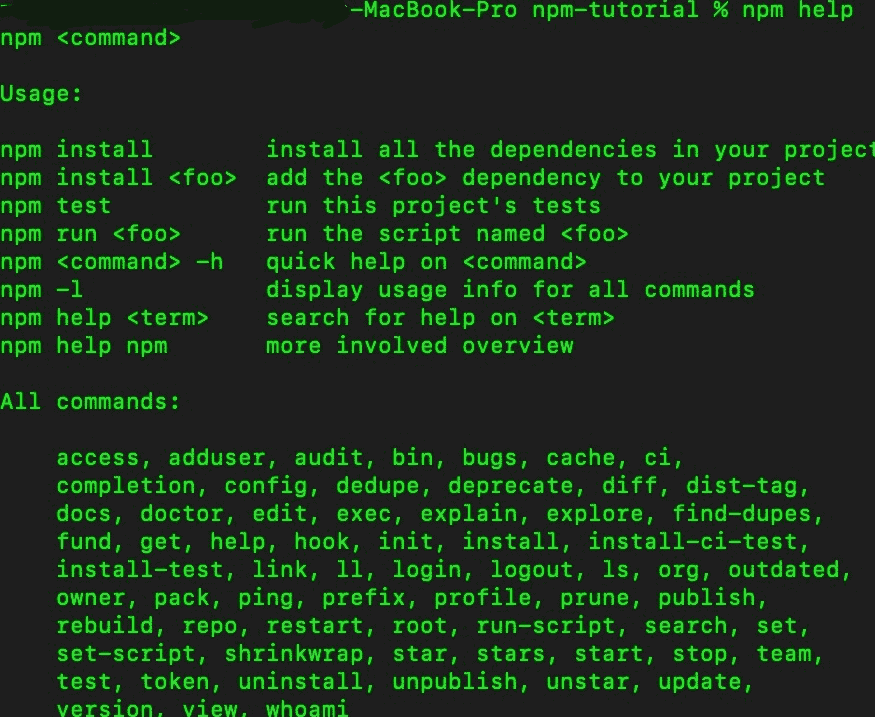

## NPM Owner Command
管理发布包的所有权。它用于管理包所有者。

```js
npm owner
```