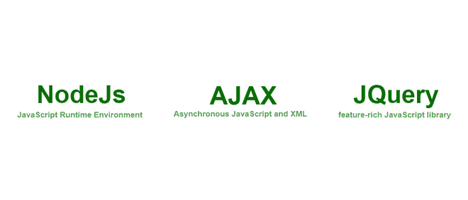

# Node.js、AJAX 和 jQuery 的区别

> 原文：[https://www.geeksforgeeks.org/difference-between-nodejs-ajax-and-jquery/](https://www.geeksforgeeks.org/difference-between-nodejs-ajax-and-jquery/)

在本文中，我们将讨论 `NodeJs`、`AJAX` 和 `JQuery` 之间的区别。首先，让我们讨论一下 `JavaScript`，`JavaScript` 是技术领域发展最快的编程语言之一。因为它是一种非常灵活的编程语言，具有一些非常有用的优势，比如托管、动态原型等等。由于它的一些重要框架和库，所有这些都是可能的。

如果你想了解更多关于 [JavaScript 教程](https://www.geeksforgeeks.org/javascript-tutorial/)的内容，请查看这篇文章

## 定义

### Node.js
[`NodeJs`](https://www.geeksforgeeks.org/nodejs-tutorials/) 是一个 `JavaScript` 的运行时环境，工作在非常强大的 `v8` 引擎上，所以 `NodeJs` 就利用了这一点，允许 `JavaScript` 在 `NodeJs` 的帮助下作为服务器端语言运行。

### AJAX
[`AJAX`](https://www.geeksforgeeks.org/ajax-introduction/) 代表异步 `javascript` 和 `XML`，用户向服务器请求数据而无需任何重载和阻塞，任何其他请求也因此提供了一种将数据提取到服务器并显示到页面的流畅性能。

### jQuery
[`JQuery`](https://www.geeksforgeeks.org/jquery-tutorials/) 这个 `javascript` 库让一切变得简单，为在前端做一些事情提供了一个非常有效的方法，并提供了许多基本的功能，如浏览器事件处理、`DOM` 动画、`Ajax` 交互和跨浏览器 `JavaScript` 开发。

## Node.js、AJAX 和 jQuery 的区别

| **Nodejs** | **AJAX** | **jQuery** |
| --- | --- | --- |
| `Nodejs` 是一个基于 `JavaScript` `v8` 引擎的开源框架。 | `AJAX` 是一种 Web 开发技术，用于向服务器发起异步调用。 | `JQuery` 是一个 `JavaScript` 库，用于设计和简化一些 Web 开发任务。 |
| 它使得在浏览器外运行 `javascript` 成为可能。 | 在浏览器内或浏览器外工作。 | 它使得在你的项目中使用 `AJAX` 变得容易。 |
| 它使用非阻塞 `I/O` 模式。 | 它处理非阻塞的异步请求。 | 如果当前事件正在运行，会阻塞其他事件。 |
| 它只适用于 `JavaScript`。因为它是 `JavaScript` 的运行时环境。 | 它与各种技术结合使用。 | 它也适用于不同的技术。 |
| 它是用 `C`、`C++`、`JavaScript` 和 `CoffeeScript` 写的。 | 这是用 `JavaScript` 写的。 | 这也是用 `JavaScript` 写的。 |
| 在包方面支持依赖注入。 | 不支持依赖注入。 | 它支持，但非常有限于前端依赖注入。 |
| 它在服务器端工作。 | 只在客户端工作。 | 它也在客户端工作。 |
| 用于在互联网上创建服务器或提供静态或动态文件。 | 从 `API` 端点获取数据。 | 仅用于构建丰富的前端用户界面。 |