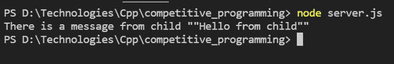

# Node.js 中 `spawn()` 和 `fork()` 方法的区别

> 原文: [https://www.geeksforgeeks.org/difference-between-spawn-and-fork-methods-in-node-js/](https://www.geeksforgeeks.org/difference-between-spawn-and-fork-methods-in-node-js/)

在本文中，我们将讨论 Node.js 中的 `spawn()` 和 `fork()` 方法之间的区别。这两种方法都是在 Node.js 中创建子进程的方法，以便处理不断增加的工作负载。

## `spawn()` 方法

`spawn()` 方法在新的进程中发起命令。我们可以将命令作为参数传递给它。`spawn()` 函数的结果是一个实现 `EventEmitter` API 的子进程实例。事件处理程序可以附加或注册到创建的子实例上。可以在该子实例上附加或注册的一些事件是 `disconnect`、`error`、`close` 和 `message` 等。

### 参数

该方法接受以下参数。

*   `command`: 它接受以字符串形式运行的命令。
*   `args`: 是字符串参数的列表。默认值为空数组。
*   `options`: 这个选项对象可以有各种属性，比如 `stdio`、`uid`、`gid`、`shell` 等。
    *   `shell`: 接受布尔值。如果为真，则在 shell 内部运行命令。不同的 shell 可以指定为字符串。默认值为 `false`，这意味着没有 shell。

### 返回值

返回子进程的一个实例。

### 示例

这是一个非常简单且通用的使用 `spawn` 的示例。我们首先需要通过解构来导入 `spawn`，然后通过传递参数来创建一个子进程。然后在该子进程上注册一个 `stdout` 事件。

```js
const { spawn } = require('child_process');
const child = spawn('dir', ['D:\\empty'], { shell: true });

child.stdout.on('data', (data) => {
  console.log(`stdout ${data}`);
});
```

### 输出



由于使用了 `fork` 子进程，从 `child.js` 发送的消息正在 `file-server.js` 中打印。

## `spawn` 和 `fork` 子进程的区别

| Spawn | Fork |
| --- | --- |
| 子进程开始执行后，会开始将数据从子进程发送到父进程。 | 这不会自动发送数据，但我们可以使用全局模块 `process` 从子进程发送数据，并在父模块中，以子进程的名称将 `process` 发送给子进程。 |
| 它通过命令创建一个新进程，而不是在同一个 Node 进程上运行。 | 它允许多个独立的进程（子进程），但所有进程都与父进程在同一个 Node 进程上运行。 |
| 在这种情况下，不会创建新的 V8 实例。 | 在这种情况下，会创建一个新的 V8 实例。 |
| 当我们希望子进程向父进程返回大量数据时使用。 | 用于将计算密集型任务与主事件循环分离。 |