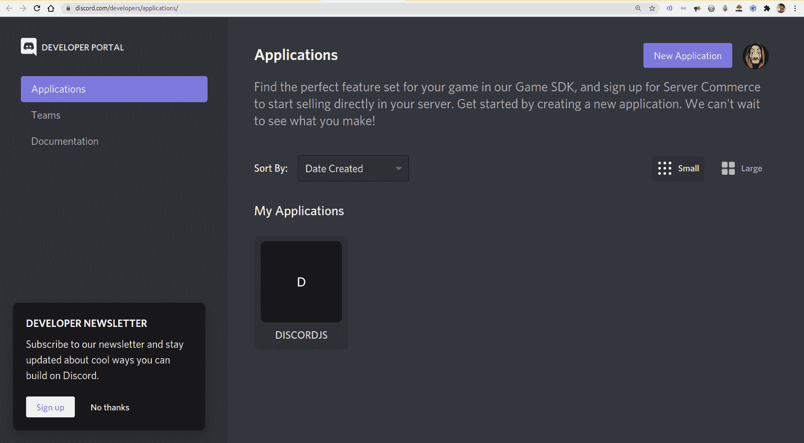
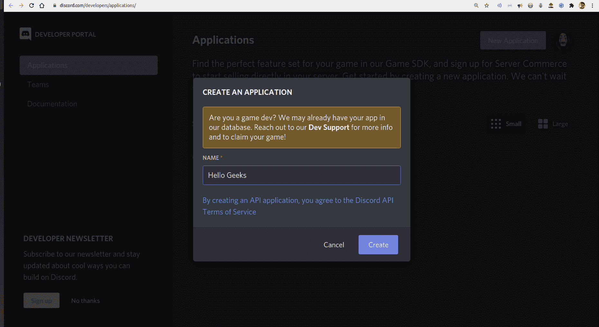
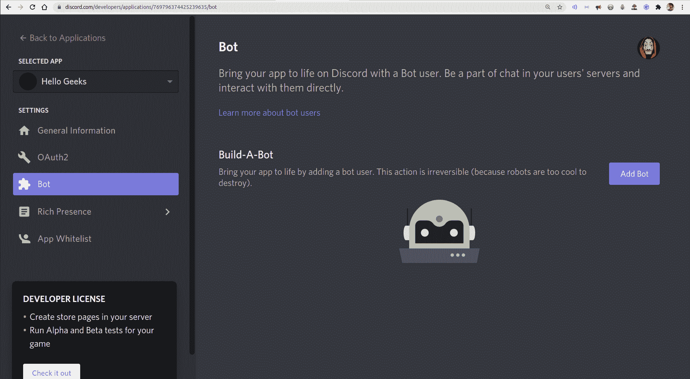
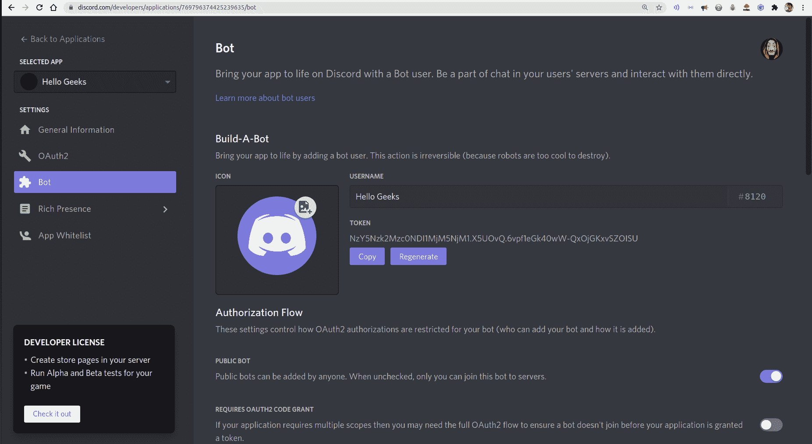
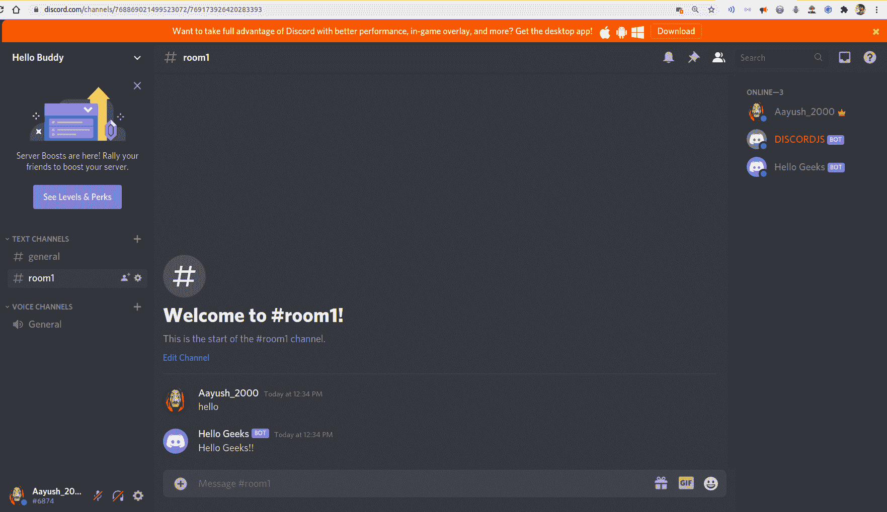

# 如何用 Node.js 搭建一个简单的 Discord 机器人？

> 原文：[https://www.geeksforgeeks.org/how-to-build-a-simple-discord-bot-using-node-js/](https://www.geeksforgeeks.org/how-to-build-a-simple-discord-bot-using-node-js/)

Discord 是一个即时消息应用程序，主要由开发者和游戏社区使用。许多 Discord 服务器使用机器人来自动完成任务。机器人是允许我们自动完成一些任务的程序，比如消息传递、维护我们的服务器等。Discord 为我们提供了许多内置的机器人，也让我们建立自己的机器人。

对于 JavaScript 开发人员来说，Discord 提供了 `discord.js` 包，可以帮助他们为自己的服务器开发 bot。

## 先决条件

*   Discord 帐户与您自己的 Discord 服务器。
*   安装了 `npm` 的 Node.js。
*   JavaScript 基础知识。

## 建造 Discord 机器人的步骤

### 1. 创建您的机器人

要注册您的机器人，请访问 [https://discord.com/developers/applications/](https://discord.com/developers/applications/) 并使用您的帐户登录。

单击“新建应用程序”按钮，并为您的应用程序命名。然后，点击“创建”按钮，创建一个使用 Discord API 的应用程序。

 

单击机器人选项卡，然后单击“添加机器人”按钮创建新的机器人。



给你选择的机器人一个名字和头像。

### 2. 添加机器人到你的服务器

要添加机器人到你的服务器，你应该使用以下网址：
`https://discord.com/oauth2/authorize?client_id=CLIENT_ID&scope=bot`

在网址中，您应该用自己的客户端 ID 替换 `CLIENT_ID`，您可以在“一般信息”选项卡上找到该标识。访问该网址，选择要添加的服务器，然后点击“授权”按钮，这将把你的机器人放入你的服务器。

### 3. 项目设置

要开始构建项目，创建一个新文件夹，然后创建一个名为 `index.js` 的新文件，然后使用以下命令安装 `discord.js` 包：

```bash
npm i discord.js
```

然后使用以下代码在项目中导入 `discord.js` 包：

```javascript
const discord = require('discord.js');
```

现在，我们希望我们的机器人发送一条信息“你好，极客们！！”每当服务器上有人发“hello”的时候。因此，要做到这一点，我们需要一个能够处理事件的 Discord 客户端。Discord 客户端允许您监听消息事件。这意味着机器人可以读取发送到通道的任何消息。

**文件名：`index.js`**

```javascript
// Creates a discord client
const client = new discord.Client();

// Runs whenever a message is sent
client.on("message", message => {

    // Checks if the message says "hello"
    if (message.content === "hello") {

        // Sending custom message to the channel
        message.channel.send("Hello Geeks!!");
    }
});
```

要启动 bot，我们必须在 `index.js` 文件中添加 `client.login(YOUR_BOT_TOKEN)` 调用。

```javascript
client.login("YOUR_BOT_TOKEN"); // Starts the bot up
```

用你能在机器人标签中找到的机器人令牌替换 `YOUR_BOT_TOKEN`。



因此，在完成上述步骤后，我们的最终 `index.js` 文件将如下所示：

**文件名：`index.js`**

```javascript
// Requiring module
const discord = require('discord.js');

// Creates a discord client
const client = new discord.Client();

// Runs whenever a message is sent
client.on("message", message => {

    // Checks if the message says "hello"
    if (message.content === "hello") {

        // Sending custom message to the channel
        message.channel.send("Hello Geeks!!");
    }
});

client.login("YOUR_BOT_TOKEN");
```

### 4. 运行你的 index.js 文件来运行你的 bot

要运行 `index.js` 文件，在你的终端中使用以下命令：

```bash
node index.js
```



**注意：** 每当我们的 `index.js` 停止运行时，我们的 bot 也会停止工作。如果你想让你的机器人全天候工作，你必须把它部署到某个服务器上。