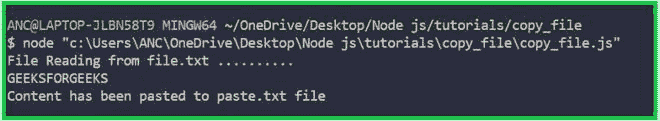

# 如何在 Node.js 中复制文件？

> 原文：[https://www.geeksforgeeks.org/how-to-copy-a-file-in-node-js/](https://www.geeksforgeeks.org/how-to-copy-a-file-in-node-js/)

[Node.js](https://www.geeksforgeeks.org/introduction-to-nodejs/) 是一个开源的跨平台运行时环境，用于在浏览器外执行 [JavaScript](https://www.geeksforgeeks.org/JavaScript-tutorial/) 代码。Node.js 运行的平台有 Windows、Linux、Mac OS 等多种。

Node.js 中使用了各种方法，比如 `readFile()` 和 `writeFile()` 方法。`readFile()` 和 `writeFile()` 方法用于将文件内容复制到另一个文件。

## 解释

> *   [`Readfile (file [,option], callback)`](https://www.geeksforgeeks.org/node-js-fs-readfile-method/)
>     1.  `File`：源文件名的路径。
>     2.  `Option`：必须是编码格式，例如 `utf8`。
>     3.  `Callback`：回调函数接收两个参数。
> *   [`Write file (file name, data, code, callback)`](https://www.geeksforgeeks.org/node-js-fs-writefile-method/)
>     1.  `File name`：要写入的文件路径。
>     2.  `Data`：我们要写入的数据。
>     3.  `Code`：数据的编码。
>     4.  `Callback`：错误信息将被显示或为空。

## 执行

### JavaScript 描述语言

```js
var fs=require('fs'); // Import the filesystem module

console.log('File Reading from file.txt ..........');

// ReadFile method is used to read the content from file.txt
fs.readFile('file.txt','utf8',readingFile);

function readingFile(error,data)
{
    if(error){
        console.log(error);
    } else
    {
        console.log(data); // Printing the file.txt file's content

         // Creating new file - paste.txt with file.txt's content
        fs.writeFile('paste.txt',data,'utf8',writeFile);
    } 
}

function writeFile(error)
{
    if(error){
        console.log(error)
    } else {
        console.log('Content has been pasted to paste.txt file');
    }
}
```

### 输出



输出