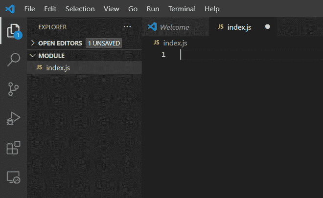

# 如何使用 Node.js 创建目录？

> 原文：[https://www.geeksforgeeks.org/how-to-create-a-directory-using-node-js/](https://www.geeksforgeeks.org/how-to-create-a-directory-using-node-js/)

在本文中，我们将使用 Node.js 创建一个目录。

## Node.js 文件系统模块

Node.js 有 `Filesystem(fs)` 核心模块，用于实现与文件系统的交互。可以通过 `Node.js fs.mkdir()` 方法或 `Node.js fs.mkdirSync()` 方法来创建新目录或父目录。

## fs.mkdir() 方法

我们使用 `fs.mkdir()` 方法新建一个目录。最初，我们只有一个单独的文件 `index.js`，正如我们在给定图像中看到的。



`index.js`

### 示例

编辑 `index.js` 文件。

```js
const fs = require("fs");

const path = "./new-Directory";

fs.access(path, (error) => {

  // To check if the given directory 
  // already exists or not
  if (error) {
    // If current directory does not exist
    // then create it
    fs.mkdir(path, (error) => {
      if (error) {
        console.log(error);
      } else {
        console.log("New Directory created successfully !!");
      }
    });
  } else {
    console.log("Given Directory already exists !!");
  }
});
```