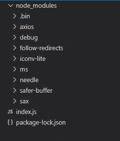
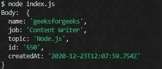
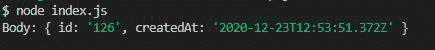

# 如何使用 Node.js 创建不同的 POST 请求？

> 原文：[https://www.geeksforgeeks.org/how-to-create-different-post-request-using-node-js/](https://www.geeksforgeeks.org/how-to-create-different-post-request-using-node-js/)

一个 `POST` 请求是所有 HTTP 请求中重要的请求之一。该请求用于将数据存储在网络服务器上。例如，文件上传是一个常见的 `POST` 请求的例子。有许多方法可以在 [Node.js](https://www.geeksforgeeks.org/introduction-to-nodejs/) 中执行 HTTP `POST` 请求。各种开源库也可用于执行任何类型的 HTTP 请求。

下面讨论创建不同 `POST` 请求的三种方法。

1.  使用 `needle` 模块
2.  使用 `axios` 模块
3.  使用 `https` 模块

## 下面详细讨论三种方法：

### 方法 1: 使用 Needle 模块

在 Node.js 中发出 HTTP `POST` 请求的方法之一是使用 `needle` 库。`Needle` 是一个 HTTP 客户端，用于在 Node.js 中发出 HTTP 请求、多部分表单数据（如文件上传）、自动 XML & JSON 解析等。

**项目结构:**



**安装模块:**

```js
npm install needle
```

**`index.js`**

```js
//Importing needle module
const needle = require('needle');

// Data to be sent
const data = {
    name: 'geeksforgeeks',
    job: 'Content Writer',
    topic:'Node.js'
};

// Making post request
needle('post', 'https://reqres.in/api/usersdata', 
    data, {json: true})
    .then((res) => {
        // Printing the response after request
        console.log('Body: ', res.body);
    }).catch((err) => {
        // Printing the err
        console.error(err.message);
    }
);
```

**执行命令:**

```js
node index.js
```

**控制台输出:**



### 方法 2: 使用 Axios 模块

另一个可以使用的库是 `axios`。这是一个流行的 Node.js 模块，用于执行 HTTP 请求，支持所有最新的浏览器。它还支持 `async/await` 语法来执行 `POST` 请求。

**安装模块:**

```js
npm install axios
```

**`index.js`**

```js
// Importing the axios module
const axios = require('axios');

// Data to be sent
const data = {
    name: 'geeksforgeeks',
    job: 'Content Writer',
    topic: 'Node.js'
};

const addUser = async () => {
    try {
        // Making post request 
        const res = await axios.post(
            'https://reqres.in/api/usersdata', data);

        // Printing the response data   
        console.log('Body: ', res.data);
    } catch (err) {
        // Printing the error
        console.error(err.message);
    }
};
```

**执行命令:**

```js
node index.js
```

**控制台输出:**


### 方法 3: 使用 HTTPS 模块

也可以使用 Node.js 内置的 `https` 模块执行 `POST` 请求。该模块用于发送加密格式的数据。

**`index.js`**

```js
// Importing https module
const https = require('https');

// Converting data in JSON format
const data = JSON.stringify({
    name: 'geeksforgeeks',
    job: 'Content Writer',
    topic:'Node.js'
});

// Setting the configuration for the request
const options = {
    hostname: 'reqres.in',
    path: '/api/users',
    method: 'POST'
};

// Sending the request
const req = https.request(options, (res) => {
    let data = '';

    res.on('data', (chunk) => {
        data += chunk;
    });

    // Ending the response 
    res.on('end', () => {
        console.log('Body:', JSON.parse(data));
    });

}).on("error", (err) => {
    console.log("Error: ", err.message);
});

// Write data to request body
req.write(data);
req.end();
```

**执行命令:**

```js
node index.js
```

**控制台输出:**

