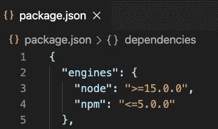
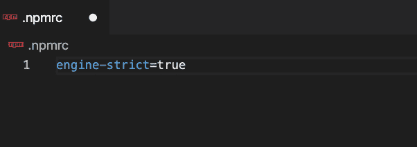
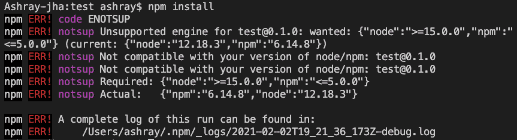

# 如何在 package.json 中定义需要的 Node.js 版本？

> 原文：[https://www.geeksforgeeks.org/how-to-define-the-required-node-js-version-in-package-json/](https://www.geeksforgeeks.org/how-to-define-the-required-node-js-version-in-package-json/)

要在 `package.json` 文件中定义所需的 Node.js 版本，我们必须经历几个简单的步骤。

## 第一步：选择项目并准备 package.json 文件

我们的第一步也是最重要的一步应该是选择一个我们将要工作的项目。例如，我将选择一个简单的 JavaScript 项目。在这个项目中，我们将有一个 `package.json` 文件。如果没有，我们将不得不在同一个目录中创建一个 `package.json` 文件。

## 第二步：使用 engines 字段指定版本

在创建我们的 `package.json` 文件后，我们将使用 `engines` 字段来指定项目运行所需的 Node.js 版本。因此，我们将在 `package.json` 文件中添加几行，遵循相同的语法来指定项目所需的 Node.js 版本。

**语法：**

```json
"engines": {
  "node": ">=或<=version_number",
  "npm": ">=或<=version_number"
}
```

**输出：**



在上面的输出图像中，我们可以看到，我们已经将所需的 Node 版本定义为大于或等于 `15.0.0`，npm 版本定义为小于或等于 `5.0.0`。因此，当我们尝试使用 Node 运行任何操作时，它将首先检查所需的版本是否与当前版本匹配。如果不匹配，它将显示错误。

## 第三步：创建 .npmrc 文件以强制显示错误

当 Node.js 版本不匹配时，为了在命令提示符或终端显示错误，我们需要创建一个 `.npmrc` 文件，位于 `package.json` 所在的目录中。

### 什么是 .npmrc 文件？

简单来说，`.npmrc` 文件可以定义为 NPM 的配置文件，它定义了 NPM 在运行命令时应该如何表现的设置。

现在创建一个 `.npmrc` 文件并在其中添加以下代码 `engine-strict=true`。因此，如果 Node 和 npm 版本不匹配，它将强制显示错误。



## 第四步：测试版本不匹配时的错误

现在，我们的最后一步应该是在 Node.js 和 npm 版本不匹配的情况下测试我们是否得到错误。为了测试它，我将使用一个简单的命令 `npm install`，我们得到以下错误。

**输出：**



## 参考

- 如何创建 `package.json` 文件：[https://www.geeksforgeeks.org/node-js-package-json/](https://www.geeksforgeeks.org/node-js-package-json/)