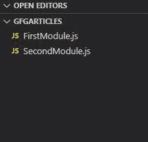

# 如何在Node.js中将Promise从一个模块导出到另一个模块？

> 原文：[https://www.geeksforgeeks.org/how-to-export-promises-from-one-module-to-another-module-node-js/](https://www.geeksforgeeks.org/how-to-export-promises-from-one-module-to-another-module-node-js/)

JavaScript 是一种异步单线程编程语言。异步意味着同时处理多个进程。`回调函数`因 JavaScript 语言的异步特性而异。一个`回调`是一个任务完成时调用的函数，因此有助于防止任何类型的阻塞，一个`回调函数`允许其他代码在此期间运行，但是`回调函数`的主要问题是`回调地狱`问题。`回调地狱`的解决方案是使用本文中的承诺，我们将讨论如何从一个模块导出到另一个模块。

**项目结构:** 会是这样的。



## 第一个模块.js

```js
function check(number) {
  return new Promise((Resolve, reject) => {
    if (number % 2 == 0) {
      Resolve("The number is even")
    }
    else {
      reject("The number is odd")
    }
  })
}

// Exporting check function
module.exports = {
  check: check
};
```

## 第二个模块.js

```js
// Importing check function
const promise = require("./FirstModule.js")

// Promise handling
promise.check(8).then((msg) => {
  console.log(msg)
}).catch((msg) => {
  console.log(msg)
})
```

使用以下命令运行`SecondModule.js`文件：

```js
node SecondModule.js
```

**输出：**

```js
The number is even
```