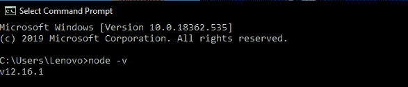
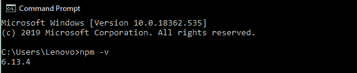
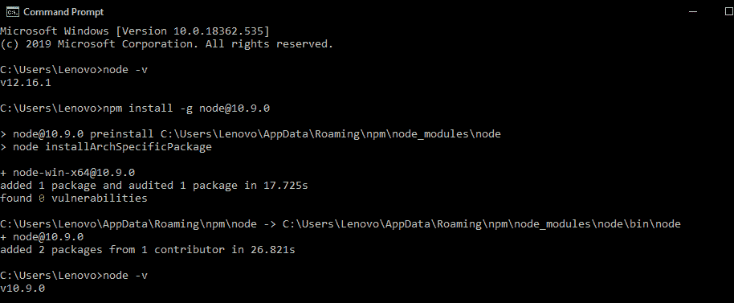
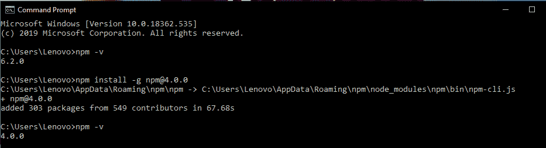

# 如何安装Node.js和npm的旧版？

> 原文：[https://www.geeksforgeeks.org/how-to-install-the-previous-version-of-node-js-and-npm/](https://www.geeksforgeeks.org/how-to-install-the-previous-version-of-node-js-and-npm/)

## 简介

**Node.js：** 它是一个建立在谷歌Chrome V8 JavaScript引擎上的JavaScript运行时（服务器端）。它是由瑞安·达尔在2009年开发的。Node.js使用一个事件驱动的、非阻塞的输入/输出模型，这使得它轻量级且高效。它非常适合数据密集型实时应用。Node就像是V8的包装器，内置模块提供了许多在异步API中易于使用的特性。

**NPM：** NPM（Node Package Manager）为Node.js安装并管理包的版本和依赖关系，NPM随Node一起安装。NPM的目标是自动化的依赖和包管理，任何时候或任何人需要开始这个项目，他们可以简单地安装NPM和所有的依赖，他们将立即拥有。可以指定项目所依赖的版本，以避免项目因更新而中断。

## 安装以前版本的Node.js和NPM

要从最新版本安装以前的版本，应该在你的电脑上安装最新版本的Node.js，或者你可以从Node.js的官方网站安装。

### 步骤1：检查当前版本

分别使用以下命令检查计算机上已安装的Node和NPM版本。

**在Windows中：**

```
node -v
```



```
npm -v
```



**在Linux中：**

```
node --version
```

```
npm --version
```

### 步骤2：安装旧版Node.js

要安装早期版本的Node，请使用以下命令。

**在Windows中：**

```
npm install -g node@version
```

**示例：**

```
npm install -g node@10.9.0
```



**在Linux中：**

```
sudo apt-get install nodejs=version-1chl1~precise1
```

**示例：**

```
sudo apt-get install nodejs=10.9.0-1chl1~precise1
```

### 步骤3：安装旧版NPM

要安装NPM的早期版本，请使用以下命令。

**在Windows中：**

```
npm install -g npm@version
```

**示例：**

```
npm install -g npm@4.0.0
```



**在Linux中：**

```
sudo apt-get install npm=version-1chl1~precise1
```

**示例：**

```
sudo apt-get install npm=4.0.0-1chl1~precise1
```