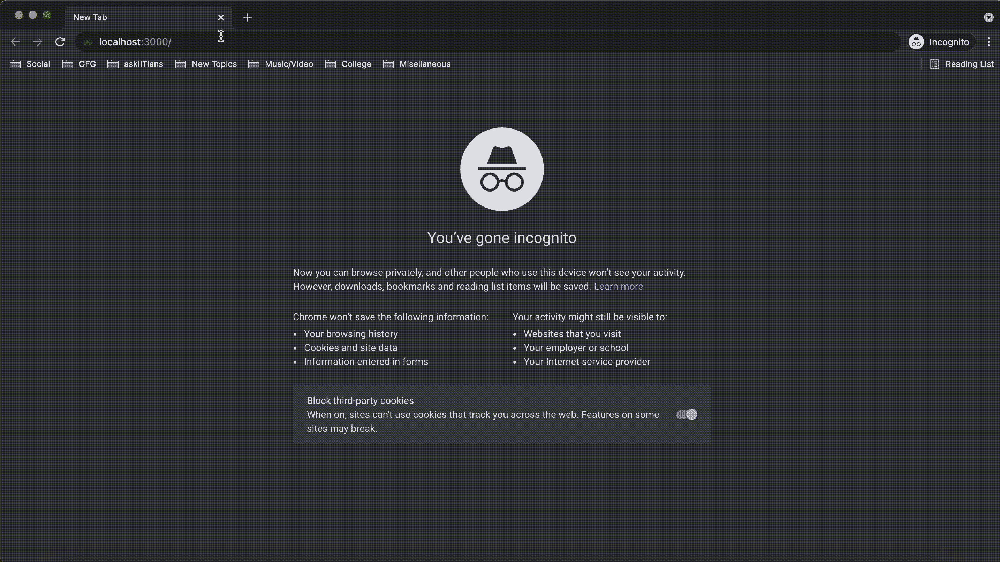
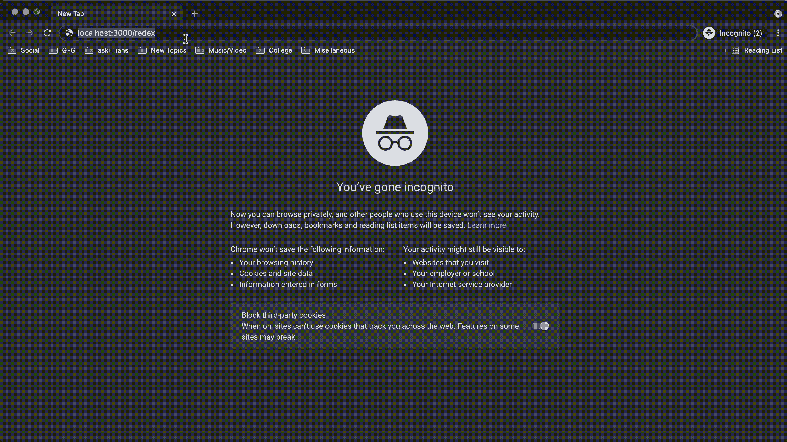

# 如何在 Node.js 中重定向回原 URL？

> 原文: [https://www.geeksforgeeks.org/how-to-redirect-back-to-original-url-in-node-js/](https://www.geeksforgeeks.org/how-to-redirect-back-to-original-url-in-node-js/)

[Node.js](https://www.geeksforgeeks.org/introduction-to-nodejs/) 借助 [Express](https://www.geeksforgeeks.org/introduction-to-express/)，支持网页路由。这意味着当客户端发出不同的请求时，应用程序将根据发出的请求和定义的路由方法被路由到不同的网页。要了解更多关于 Node.js 路由和实现的信息，请参考 [这篇](https://www.geeksforgeeks.org/routing-in-node-js/) 文章。

在本文中，我们将讨论如何在 Node.js 中重定向回原始 URL。

[`res.redirect()`](https://www.geeksforgeeks.org/express-js-res-redirect-function/) 是一个帮助根据指定路径重定向网页的网址实用程序功能。

### 语法

```js
return res.redirect([status], path)
```

对于第一个示例，我们将用户重定向到具有不同域的指定 URL。在运行代码之前，确保在您的项目中安装 [Express](https://www.geeksforgeeks.org/introduction-to-express/)。

## JavaScript 代码示例

```js
const express = require('express');

var app = express();

app.get('/', function(req, res){
  // On getting the home route request,
  // the user will be redirected to GFG website
  res.redirect('https://www.geeksforgeeks.org');
});

app.listen(3000, function(req, res){
  console.log("Server is running at port 3000");
});
```

当使用 `node` 执行上述代码时，当我们在端口 3000 上请求归属路由时，我们将被重定向到 [GeeksforGeeks](https://www.geeksforgeeks.org) 网站。

### 输出



### 其他方法

除了重定向到不同的域，我们还有一些其他方法可以重定向，如下所示。

**域相对重定向：** 我们可以用这个方法重定向到同一个域下的不同页面。例如，如果用户在 [http://example.com/gfg/post1](http://example.com/gfg/post1)，那么我们可以使用下面一行代码重定向到 [http://example.com/article](http://example.com/article)。

```js
res.redirect('/article');
```

**路径名相对重定向：** 我们可以用这个方法重定向到网站上的上一个路径。例如，如果用户在 [http://example.com/gfg/post1](http://example.com/gfg/post1)，那么我们可以使用下面一行代码重定向到 [http://example.com/gfg](http://example.com/gfg)。

```js
res.redirect('..');
```

### 重定向回原网址

了解了 `res.redirect()` 函数后，我们现在可以讨论如何在 NodeJS 中重定向回原始 URL。

**反向重定向：**

我们可以使用这种方法将请求重定向回 [引用者](https://en.wikipedia.org/wiki/HTTP_referer)。如果没有 `Referer` 出现，默认情况下，请求被重定向到 `"/"` 路由。

```js
res.redirect('back');
```

**示例：**

假设我们走的是 `"/example"` 路线。请求 `"/redex"` 路由时，我们将被自动重定向到下面代码中定义的 `"/"` 路由。

## JavaScript 代码示例

```js
const express = require('express');

var app = express();

//Defining '/' route
app.get('/', function(req, res){
  res.redirect('https://www.geeksforgeeks.org');
});

//Defining '/example' route
app.get('/example', function(req, res){
  res.redirect('https://www.geeksforgeeks.org/array-data-structure/');
});

//Defining '/redex' route
app.get('/redex', function(req, res){
  res.redirect('back');
})

app.listen(3000, function(req, res){
  console.log("Server is running at port 3000");
});
```

### 输出



### 参考

[https://expressjs.com/en/5x/api.html#res.redirect](https://expressjs.com/en/5x/api.html#res.redirect)