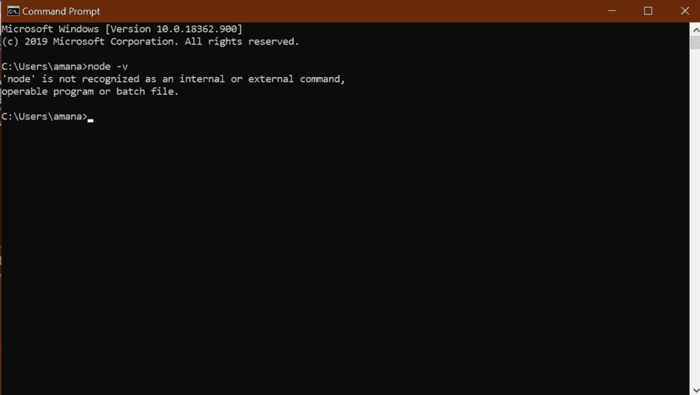
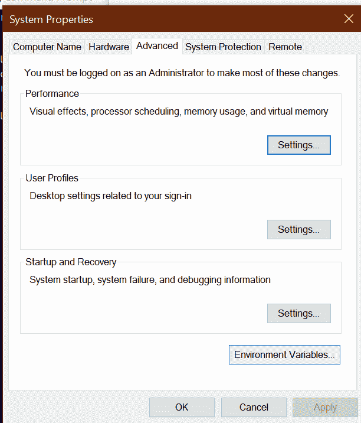
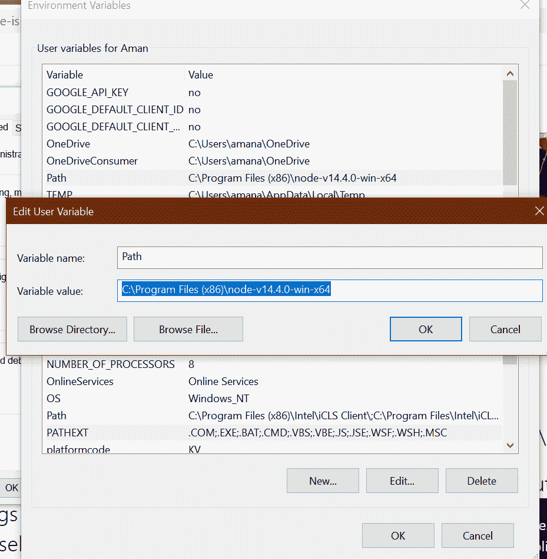
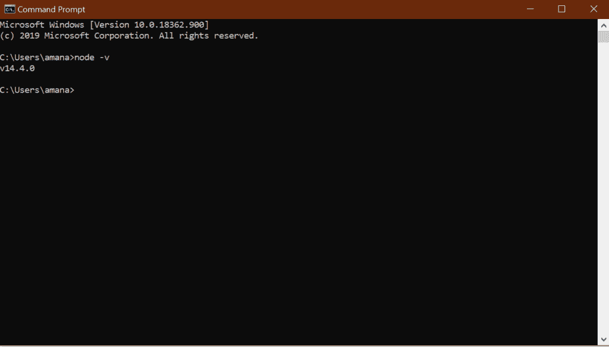

# 如何解决安装 Node.js 后‘node’不被识别为内部或外部命令错误？

> 原文: [https://www.geeksforgeeks.org/how-to-resolve-node-is-not-recognized-as-an-internal-or-external-command-error-after-installing-node-js/](https://www.geeksforgeeks.org/how-to-resolve-node-is-not-recognized-as-an-internal-or-external-command-error-after-installing-node-js/)

[在电脑上安装 node.js](https://www.geeksforgeeks.org/installation-of-node-js-on-windows/) 有很多不同的方法。验证 node.js 是否已正确安装在计算机中的最简单方法是在命令提示符或 Windows PowerShell 中键入 `node -v`。

但是很多时候，这种情况会发生，最常见的情况是，如果您是初学者，命令提示符会打印如下输出:

```
'node' is not recognized as an internal or external command,
operable program or batch file.
```



这是最常见的错误，解决这个问题非常简单。这可能是一种用户可能已经从官方节点网站正确安装了节点的情况。但有时，原因是路径变量没有在您的系统中定义。因此，要正确定义路径变量并解决此错误，请执行以下简单步骤:

## 1. 打开环境变量选项

在您的控制面板中打开环境变量选项。（转到 `控制面板 -> 系统和安全 -> 系统 -> 高级系统设置 -> 环境变量 -> 用户变量或系统变量`。）



## 2. 编辑 Path 变量

选择名为 `Path` 的变量。一个名为 `Edit user variable` 的对话框将会出现。在该对话框内的变量值选项中，粘贴 node.js 在您的系统中安装位置的完整路径。然后点击确定。



## 3. 验证安装

重新启动命令提示符，然后通过在命令提示符中键入 `node -v` 来进行验证。它现在将显示您从互联网上安装的 node 的版本。

