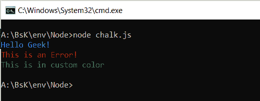
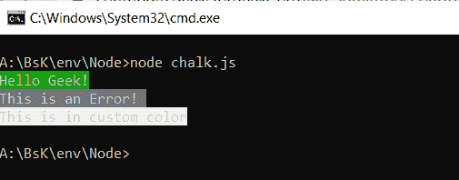
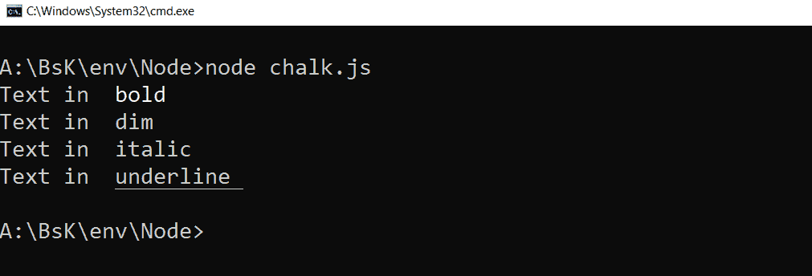

# 如何设置 Node.js 控制台字体颜色？

> 原文：[https://www.geeksforgeeks.org/how-to-set-node-js-console-font-color/](https://www.geeksforgeeks.org/how-to-set-node-js-console-font-color/)

`chalk`模块是可以用彩色文字自定义节点控制台的。通过使用它，人们可以使用它的一些特性来改变控制台的外观，如加粗文本、加下划线、突出文本的背景颜色等。

## 命令安装 `chalk`

```js
npm install chalk
```

## 用 `chalk` 给控制台文字上色 (`.color`)

文字颜色可以通过使用`chalk`的`.color`方法如`chalk.black`，`chalk.red`等来改变。

```js
const chalk = require('chalk');

// Printing the text in blue color
console.log(chalk.blue('Hello Geek!'));

// Printing the text in red color
console.log(chalk.red('This is an Error! '));

// Printing the text in green color
console.log(chalk.rgb(100, 150, 70)
        ('This is in custom color'));
```

**输出：**


## 用 `chalk` 给控制台文字背景上色 (`.bgcolor`)

文字背景颜色可以用`chalk`的`.bgcolor`的方法如`chalk.bgBlack`，`chalk.bgRed`等来改变。

```js
const chalk = require('chalk');

// Set background color to red
console.log(chalk.bgGreen('Hello Geek!'));

// Set background color to BlackBright
console.log(chalk.bgBlackBright('This is an Error! '));

// Set background color to WhiteBright
console.log(chalk.bgWhiteBright('This is in custom color'));
```

**输出：**


## 修改控制台文本外观

可以使用`chalk`的`.bold`、`.dim`、`.italic`、`.underline`等方法修改文本样式。

```js
const chalk = require('chalk');
console.log("Text in ", chalk.bold('bold'));
console.log("Text in ", chalk.dim('dim '));

// Not widely supported
console.log("Text in ", chalk.italic('italic'));
console.log("Text in ", chalk.underline('underline '));
```

**输出：**
