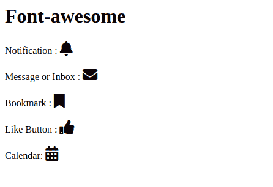

# 如何在 Node.js 中使用 Font Awesome 图标

> 原文：[https://www.geeksforgeeks.org/how-to-use-font-awesome-icons-from-node-js-modules/](https://www.geeksforgeeks.org/how-to-use-font-awesome-icons-from-node-js-modules/)

Font Awesome 是一个网络图标库，它为你提供了可缩放的矢量图标，可以根据颜色、大小和其他方面进行定制。许多公司在他们的网站上集成了这个图标库。它有 600 多个图标，无论屏幕分辨率大小如何，每个图标在移动端和桌面端都是响应式的。它还让我们不用 JavaScript 就能使用动画。

## 安装库的语法

```js
npm install font-awesome --save
```

## 实现步骤

*   首先，我们需要在终端输入上面的命令来安装软件包。
*   安装完成后，您可以在 `node_modules` 文件夹中找到该包。
*   然后需要在 `style.css` 文件中导入该文件。
*   导入文件后，您就可以开始使用 Font Awesome 图标了。

## 代码实现

在 `style.css` 文件中，使用以下语法导入 Font Awesome。

```js
@import url('../node_modules/font-awesome/css/font-awesome.min.css');
```

**app.component.html:**

```js
<h1>Font-awesome</h1>
Notification :
<i class='fas fa-bell' style='font-size:24px'></i>
<br><br>
Message or Inbox :
<i class='fas fa-envelope' style='font-size:24px'></i>
<br><br>
Bookmark :
<i class='fas fa-bookmark' style='font-size:24px'></i>
<br><br>
Like Button :
<i class='fas fa-thumbs-up' style='font-size:24px'></i>
<br><br>
Calendar:
<i class='fas fa-calendar-alt' style='font-size:24px'></i>
```

## 输出

