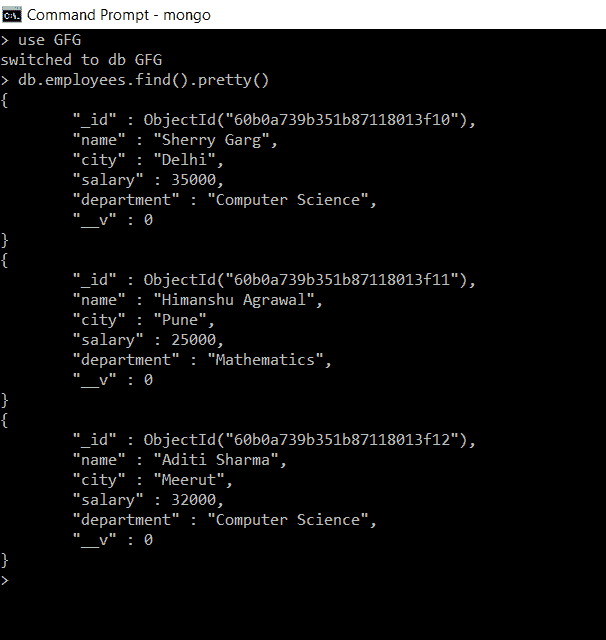
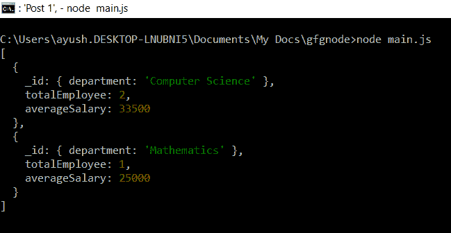

# 如何在 Node.js 中对 MongoDB 查询使用`$group`？

> 原文: [https://www.geeksforgeeks.org/how-to-use-group-for-a-mongodb-query-in-node-js/](https://www.geeksforgeeks.org/how-to-use-group-for-a-mongodb-query-in-node-js/)

`$group`运算符是一个聚合运算符或聚合阶段，它通过某种指定的表达式对多个数据或文档进行分组，并将它们组合成一个文档。

MongoDB中的聚合是将多个文档中的值组合在一起的操作，可以对组合后的数据进行多种操作，返回单个结果。而`$group`就是聚合执行的操作之一。

## 语法：`$group`运算符

```js
{
    $group:
    {
        _id: <expression>,
        <field>: { <accumulator> : <expression> }
    }
}
```

*   `_id`：是要对文档进行分组的字段。
*   `<field>`：为可选参数，是对分组数据进行一定的累加器运算后的计算字段。

## 安装 Mongoose

### 第一步
可以访问 [安装 Mongoose](https://www.npmjs.com/package/mongoose) 链接安装 Mongoose 模块。您可以使用此命令安装此软件包。

```bash
npm install mongoose
```

### 步骤 2
现在，您可以使用以下命令导入文件中的 Mongoose 模块：

```js
const mongoose = require('mongoose');
```

## 数据库
我们已经在 GFG 的数据库中创建了一个名为`employee`的集合，如下图所示：



收集 GFG 数据库中的员工

## 创建节点应用程序

### 步骤 1
使用以下命令创建`package.json`。

```bash
npm init
```

### 第二步
用以下代码创建文件`main.js`。

**文件名：`main.js`**

```js
// Requiring module
const mongoose = require('mongoose');

// Connecting to database
mongoose.connect('mongodb://localhost:27017/GFG',
    {
        useNewUrlParser: true,
        useUnifiedTopology: true,
        useFindAndModify: false
    });

// Schema of employee collection
const employeeSchema = new mongoose.Schema({
    name: String,
    city: String,
    salary: Number,
    department: String
})

// Model of employees collection
const Employee = mongoose.model(
        'employee', employeeSchema)

// Group employees by department field
// and computing total no. of employees
// and average salary in each department
Employee.aggregate([
    {
        $group:
        {
            _id: { department: "$department" },
            totalEmployee: { $sum: 1 },
            averageSalary: { $avg: "$salary" }
        }
    }
])
    .then(result => {
        console.log(result)
    })
    .catch(error => {
        console.log(error)
    })
```

使用以下命令运行`main.js`：

```bash
node main.js
```

## 输出
在控制台中，我们获得按`department`分组的文档，以及每组中的计算字段`totalEmployee`和`averageSalary`。



执行`main.js`后的输出

## 说明
这里我们按照`department`字段对员工进行分组，计算单独的字段`totalEmployee`包含每个组中的员工总数，`averageSalary`给出每个组中员工的平均工资，使用累加运算符`$sum`和`$avg`。