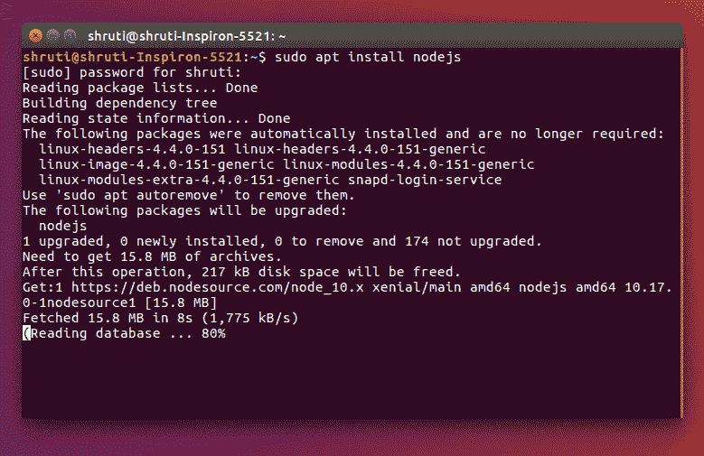
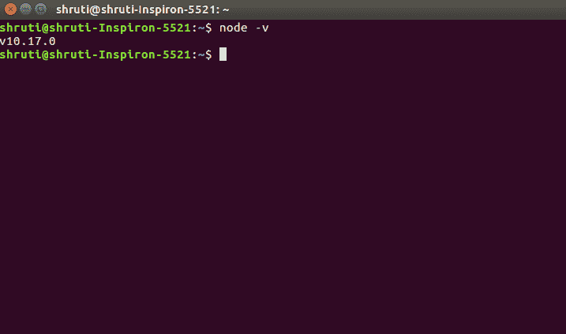
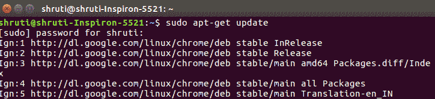
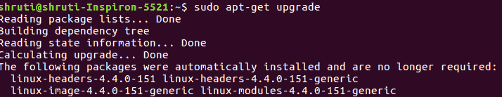
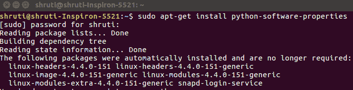
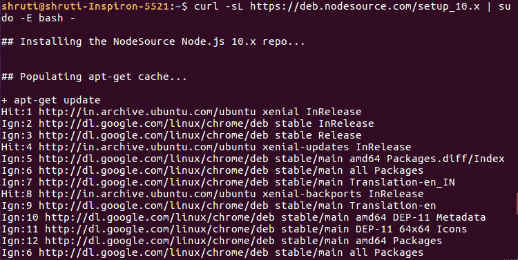
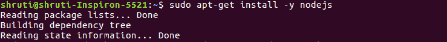
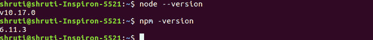

# 在 Linux 上安装 Node.js

> 原文: [https://www.geeksforgeeks.org/installation-of-node-js-on-linux/](https://www.geeksforgeeks.org/installation-of-node-js-on-linux/)

**Node.js** 是一个建立在 Chrome 的 V8 JavaScript 引擎上的 JavaScript 运行时。Node.js 可以通过多种方式安装在你的 Ubuntu Linux 机器上。你可以使用 **Ubuntu 的官方库**来安装 Node.js 或者用另外一种方式来使用 **NodeSource 库**。通过节点源存储库安装将允许您选择最新版本的节点。

## 在 Ubuntu 18.04 和 16.04 上安装 Node

在 Ubuntu 上安装 Node.js 有 Ubuntu 官方资源库和 NodeSource 资源库两种方法。

### 使用 Ubuntu 官方资源库安装 Node.js

Node.js 可以在 Ubuntu 的资源库中获得，只需使用几个命令就可以轻松安装。按照以下步骤在 Ubuntu 操作系统上安装 Node.js。

1.  **第一步:** 打开你的终端或者按 `Ctrl+Alt+t`。
2.  **第二步:** 要安装 Node.js，请使用以下命令：
    ```
    sudo apt install nodejs
    ```
    
3.  **第三步:** 安装完成后，通过检查已安装的版本进行验证：
    ```
    node -v
    ```
    或
    ```
    node --version
    ```
    

**注意:** 建议同时安装 Node Package Manager (`npm`)，它是 Node.js 包的开源库。要安装 `npm`，请使用以下命令：
```
sudo apt install npm
npm -v
```
或
```
npm --version
```
节点和 `npm` 将成功安装在你的 Ubuntu 机器上。

### 使用 NodeSource 库安装 Node.js

最新版本的 Node.js 可以从 [NodeSource 库](https://github.com/nodesource/distributions)安装。按照下面的步骤在你的 Ubuntu 上安装 Node.js。

1.  **第一步:** 打开你的终端或按 `Ctrl + Alt + T`，并使用以下命令更新和升级包管理器：
    ```
    sudo apt-get update
    sudo apt-get upgrade
    ```
    
    
2.  **第二步:** 使用以下命令安装 Python 软件库：
    ```
    sudo apt-get install python-software-properties
    ```
    
3.  **第三步:** 添加 Node.js PPA 到系统。
    ```
    curl -sl https://deb.nodesource.com/setup_10.x | sudo -E bash -
    ```
    **注意:** 这里我们安装的是 Node.js 版本 10，如果要安装版本 11，可以用 `setup_11.x` 替换 `setup_10.x`。
    
4.  **第四步:** 要在你的 Ubuntu 机器上安装 Node.js 和 `npm`，请使用下面的命令：
    ```
    sudo apt-get install nodejs
    ```
    
5.  **第五步:** 安装完成后，通过检查已安装的版本进行验证：
    ```
    node -v
    ```
    或
    ```
    node --version
    ```
    ```
    npm -v
    ```
    或
    ```
    npm --version
    ```
    

最后，您已经成功地在您的 Ubuntu 机器上安装了 Node.js 和 `npm`。