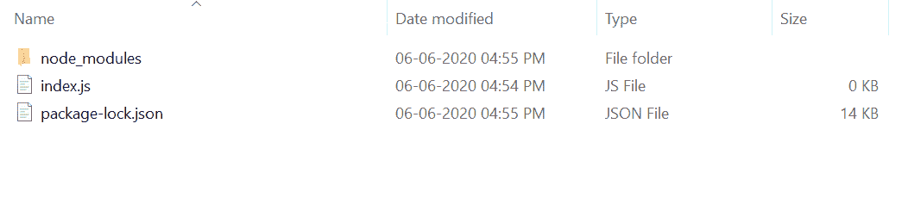

# Node.js assert.fail()函数

> 原文: [https://www.geeksforgeeks.org/node-js-assert-fail-function/](https://www.geeksforgeeks.org/node-js-assert-fail-function/)

`assert`模块提供了一组用于验证不变量的断言函数。`assert.fail()`函数使用提供的错误消息或默认错误消息抛出一个`AssertionError`。

## 语法:
```js
assert.fail([message])
```

## 参数:
该功能接受如下参数，如上所述，如下所述:
* `message`：该参数保存字符串或错误类型的错误消息。这是一个可选参数。

## 返回值:
该函数返回对象类型的断言错误。

## 安装 assert 模块:
1.  您可以访问链接 [Install assert module](https://www.npmjs.com/package/assert)。您可以使用此命令安装此包。
    ```js
    npm install assert
    ```
    **注意:** 安装是可选步骤，因为它内置了 Node.js 模块。

2.  安装断言模块后，您可以使用命令在命令提示符下检查您的`assert`版本。
    ```js
    npm version assert
    ```

3.  之后，您可以创建一个文件夹并添加一个文件，例如`index.js`，如下所示。

## 示例 1:
**文件名:** `index.js`
```js
// Requiring the module
const assert = require('assert').strict;

// Function call
try {
    assert.fail();
} catch(error) {
    console.log("Error:", error)
}
```

**运行程序的步骤:**
1.  项目结构会是这样的:
    
2.  运行`index.js`文件，使用以下命令:
    ```js
    node index.js
    ```

**输出:**
> Error: AssertionError [ERR_ASSERTION]: The expression evaluated to a falsy value
>     at Object.<anonymous> (C:\Users\Lenovo\Downloads\index.js:6:12)
>     at Module._compile (internal/modules/cjs/loader.js:1138:30)
>     at Object.Module._extensions..js (internal/modules/cjs/loader.js:1158:10)
>     at Module.load (internal/modules/cjs/loader.js:986:32)
>     at Function.Module._load (internal/modules/cjs/loader.js:879:14)
>     at Function.executeUserEntryPoint [as runMain] (internal/modules/run_main.js:71:12)
>     at internal/main/run_main.js:15:47

## 示例 2:
**文件名:** `index.js`
```js
// Requiring the module
const assert = require('assert').strict;

// Function call
try {
    assert.fail(new TypeError('My custom defined error'));
} catch(error) {
    console.log("Error:", error)
}
```

**运行程序的步骤:**
1.  项目结构会是这样的:
    
2.  运行`index.js`文件，使用以下命令:
    ```js
    node index.js
    ```

**输出:**
> Error: TypeError: My custom defined error
>     at Object.<anonymous> (C:\Users\Lenovo\Downloads\index.js:6:17)
>     at Module._compile (internal/modules/cjs/loader.js:1138:30)
>     at Object.Module._extensions..js (internal/modules/cjs/loader.js:1158:10)
>     at Module.load (internal/modules/cjs/loader.js:986:32)
>     at Function.Module._load (internal/modules/cjs/loader.js:879:14)
>     at Function.executeUserEntryPoint [as runMain] (internal/modules/run_main.js:71:12)
>     at internal/main/run_main.js:15:47

**参考:** [https://nodejs.org/dist/latest-v12.x/docs/api/assert.html#assert_assert_fail_message](https://nodejs.org/dist/latest-v12.x/docs/api/assert.html#assert_assert_fail_message)