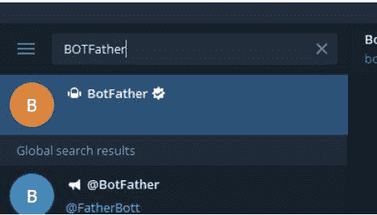
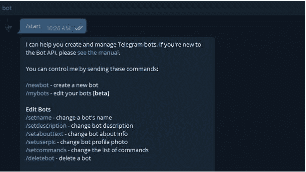
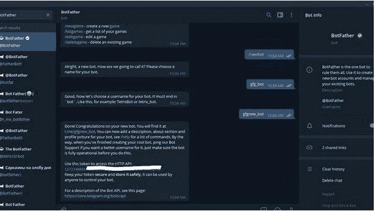
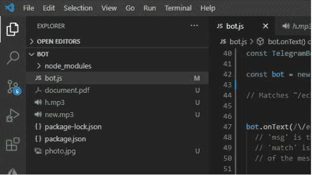
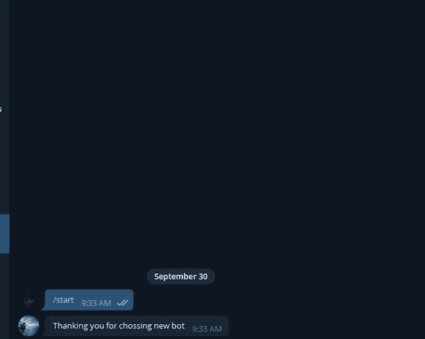

# Node.js Bot.start()方法

> 原文:[https://www.geeksforgeeks.org/node-js-bot-start-method/](https://www.geeksforgeeks.org/node-js-bot-start-method/)

节点js `Telegraf`机器人模块采用`Bot.start()`方法。该模块提供各种功能与官方电报机器人应用编程接口进行交互。当新用户第一次启动bot或键入预留模块关键字`/start`时，该方法执行。

**语法:**

```js
TelegrafBot.start(callback function(Context function))
```

**参数:** 该方法接受一个参数，如上所述，如下所述:

*   `callback function`: 它只接受一个保存来自Telegram API的Update对象的参数。

**返回类型:** 函数的返回类型为空。

**安装模块:** 使用以下命令安装该模块:

```js
npm install telegraf
```

**获取钥匙的步骤:**

**1.** 首先，从电报中的BOTFATHER处获取`BOT_TOKEN`。只需在Telegram中搜索`@BotFather`，然后选择如下所示的已验证的那个:



**2.** 键入`/start`，然后点击`/newbot`，如下图:



**3.** 现在输入机器人的名称，并且必须是唯一的。



**4.** 现在只需从机器人父亲那里复制令牌。要删除令牌，只需在BotFather中搜索`/deletebot`。

**项目结构:**



**文件名: bot.js**

## JavaScript 示例代码

```js
// Requiring module
const telegraf = require("telegraf");

// Set your token
var token = 'YOUR_TOKEN';

// Creating a new object of Telegraf
const bot = new telegraf(token);

// The ctx object holds the update
// object from Telegram API
bot.start( ctx => {

// Sending the message
  ctx.reply("Thanking you for choosing new bot");
});

// Calling the launch function
bot.launch()
```

使用以下命令运行`bot.js`文件:

```js
node bot.js
```

**输出:**

