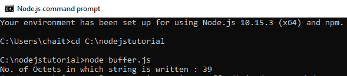
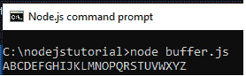
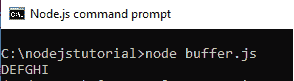

# Node.js 缓冲区

> 原文: [https://www.geeksforgeeks.org/node-js-buffers/](https://www.geeksforgeeks.org/node-js-buffers/)

`Buffer`类是 Node.js 中的一个全局类，其实例被称为**缓冲区**，专为处理二进制原始数据而设计。缓冲区在 V8 堆之外分配原始内存。

## 创建缓冲区

以下是在 Node.js 中创建缓冲区的不同方法：

*   **创建未初始化的缓冲区：** 创建指定大小的未初始化缓冲区。

**语法：**

```js
var ubuf = new Buffer(5);
```

上面的语法用于创建一个 5 个八位字节的未初始化缓冲区。

*   **从数组创建缓冲区：** 从给定的数组创建缓冲区。

**语法：**

```js
var abuf = new Buffer([16, 32, 48, 64]);
```

上面的语法用于从给定的数组创建缓冲区。

*   **从字符串创建缓冲区：** 从给定的字符串创建缓冲区，可选择指定编码。

**语法：**

```js
var sbuf = new Buffer("GeeksforGeeks", "ascii");
```

上述语法用于从字符串创建缓冲区，也可以选择指定编码类型。

## 写入 Node.js 中的缓冲区

使用 `buf.write()` 方法将数据写入节点缓冲区。

**语法：**

```js
buf.write( string, offset, length, encoding )
```

`buf.write()` 方法用于返回写入字符串的八位字节数。如果缓冲区没有足够的空间来容纳整个字符串，它将写入字符串的一部分。

`buf.write()` 方法接受以下参数：

*   `string`：指定要写入缓冲区的字符串数据。
*   `offset`：指定缓冲区开始写入的索引。其默认值为 0。
*   `length`：指定写入的字节数。它的默认值是 `buffer.length`。
*   `encoding`：指定编码机制。它的默认值是 `"utf-8"`。

**示例：** 创建一个包含以下代码的 `buffer.js` 文件。

```js
// Write JavaScript code here
cbuf = new Buffer(256);
bufferlen = cbuf.write("Learn Programming with GeeksforGeeks!!!");
console.log("No. of Octets in which string is written : "+  bufferlen);
```

**输出：**



## 从缓冲区读取

使用 `buf.toString()` 方法从节点缓冲区读取数据。

**语法：**

```js
buf.toString( encoding, start, end )
```

`buf.toString()` 方法接受以下参数：

*   `encoding`：指定编码机制。它的默认值是 `"utf-8"`。
*   `start`：指定开始读取的索引。其默认值为 0。
*   `end`：指定结束读取的索引。它的默认值是缓冲区末尾。

**示例 1：** 创建一个包含以下代码的 `buffer.js` 文件。

```js
// Write JavaScript code here
rbuf = new Buffer(26); 
var j;

for (var i = 65, j = 0; i < 90, j < 26; i++, j++) {  
    rbuf[j] = i ;  
}

console.log( rbuf.toString('ascii'));  
```

**输出：**



**示例 2：** 从 Node.js 缓冲区读取数据，指定读取的起点和终点。创建一个包含以下代码的 `buffer.js` 文件。

```js
// Write JavaScript code here
rbuf = new Buffer(26);  
var j;

for (var i = 65, j = 0; i < 90, j < 26; i++, j++) {  
    rbuf[j] = i ;  
}

console.log( rbuf.toString('utf-8', 3, 9));  
```

**输出：**

