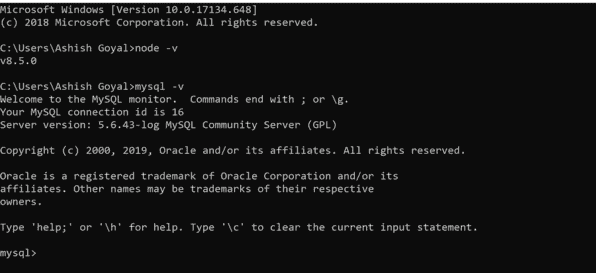
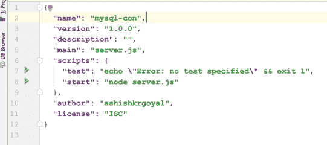
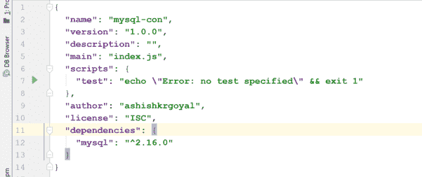
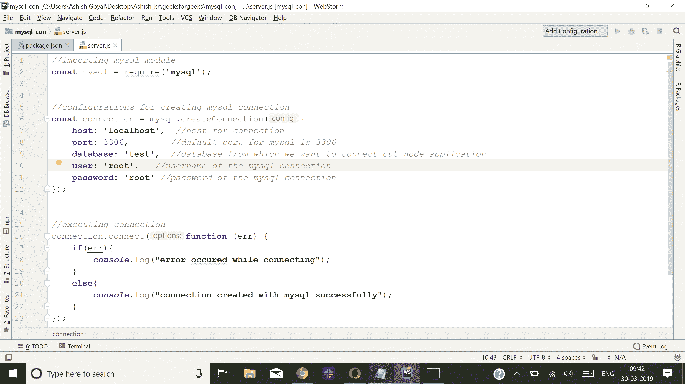
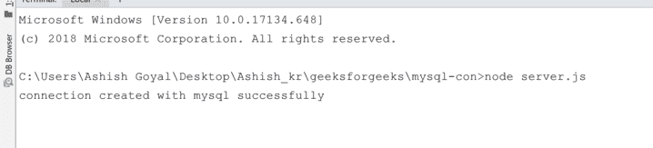

# Node.js 连接 MySQL 与 Node app

> 原文: [https://www.geeksforgeeks.org/node-js-connect-mysql-with-node-app/](https://www.geeksforgeeks.org/node-js-connect-mysql-with-node-app/)

在本文中，我们将学习如何将 MySQL 数据库连接到 NodeJs 应用程序。在深入编码部分之前，让我们简单介绍一下这些技术:

*   **NodeJs:** 在服务器端执行 javascript 代码的开源平台。也是一个建立在 Chrome V8 javascript 引擎上的 JavaScript 运行时。可以从[这里](https://nodejs.org/en/)下载。
*   **MySQL:** 使用结构化查询语言（sql）的开源关系数据库管理系统（RDBMS）。它是在数据库中添加、访问和管理内容的最流行的语言。这里我们将使用 MySQL 作为节点应用程序的数据库。可以从[这里下载。](https://dev.mysql.com/downloads/mysql/5.6.html)

## 成功安装后，让我们通过以下命令验证它们：

*   `node -v`: 它将显示我们系统中的 node 版本。
*   `mysql -v`: 它将显示我们系统中的 MySQL 版本。



到目前为止，我们已经成功地在系统中安装了 Node 和 MySQL。将节点应用程序连接到 MySQL 需要安装模块/包:

```js
mysql: NodeJs driver for mysql
```

## 现在让我们进入编码部分：

### 步骤 1
为这个任务创建一个单独的文件夹，并使用终端或命令提示符进入此文件夹。

### 步骤 2
现在，我们将生成一个 `package.json` 文件，以便将所有依赖项列在那里供将来参考。
要了解更多关于 `package.json` 的信息，请[点击这里](https://www.geeksforgeeks.org/node-js-package-json/)。

要生成 `package.json`，请在项目文件夹的终端中运行以下命令:

```bash
npm init -y
```

现在我们的项目文件夹中有了我们的 `package.json`，如下图所示:


### 步骤 3
使用以下命令在我们的项目中安装 MySQL 模块:

```bash
npm install mysql
```

成功安装模块后，我们的 `package.json` 将具有如下结构:


### 步骤 4
在项目文件夹的根目录中创建一个名为 `server.js` 的 javascript 文件。创建连接的代码如下所示:


## 我们来了解一下项目文件夹中 `server.js` 文件的代码流程:

**第 2 行:** 通过使用这一行代码，我们正在导入 `mysql` 模块。

```js
const mysql = require('mysql')
```

**第 6 行 - 第 12 行:** 在本节中，我们将创建连接变量，并设置 MySQL 数据库的所有配置，如主机、端口、用户、密码和数据库。
**注意:** MySQL 数据库在一个系统中有默认端口 3306。

```js
const connection = mysql.createConnection({
    host: 'localhost', // host for connection
    port: 3306, // MySQL 的默认端口是 3306
    database: 'test', // 我们要从中连接出节点应用程序的数据库
    user: 'root', // MySQL 连接的用户名
    password: 'root' // MySQL 的密码
});
```

**第 16 行 - 第 23 行:** 现在在本节中，我们将建立应用程序与 MySQL 的连接。
我们在这里对已经创建的连接变量调用 `connect` 函数。

```js
connection.connect(function (err) {
   if(err){
       console.log("error occured while connecting");
   }
   else{
       console.log("connection created with Mysql successfully");
   }
});
```

使用以下命令运行文件 `server.js`:

```bash
node server.js
```

现在，我们将在终端上看到如下输出，如屏幕截图所示:



通过这种方式，NodeJs 应用程序可以与 MySQL 数据库连接。