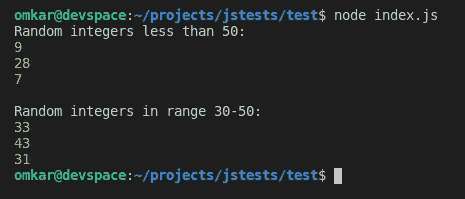
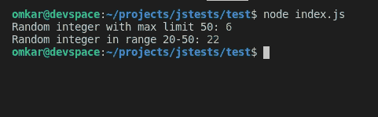

# Node.js `crypto.randomInt()` 方法

> 原文: [https://www.geeksforgeeks.org/node-js-crypto-randomint-method/](https://www.geeksforgeeks.org/node-js-crypto-randomint-method/)

Node.js 中的 `crypto.randomInt` 方法是加密模块的内置 API，用于根据我们的使用同步或异步创建随机整数。

## 语法

```js
crypto.randomInt([min, ] max [, callback])
```

## 参数

该方法接受三个参数，如下所述。

*   `min`: 要生成的随机整数的可选最小值（包括在内）。默认值：0。
*   `max`: 生成随机整数所需的最大值（不包括）。
*   `callback`: 生成随机整数后执行的可选回调函数。如果指定了回调，默认情况下，方法异步工作，否则同步工作。

## 返回值

`crypto.randomInt` 方法返回一个随机整数 `n`，这样 `min <= n < max`。

## 注意事项

范围 `(max - min)` 必须小于 `2**48`，且 `min` 和 `max` 必须是[安全整数](https://www.geeksforgeeks.org/javascript-number-issafeinteger/)。

以下示例说明了 Node.js 中 `crypto.randomInt` 方法的使用。

## 示例 1：同步

```js
const crypto = require("crypto");

// Only max value provided
console.log("Random integers less than 50:");
console.log(crypto.randomInt(50));
console.log(crypto.randomInt(50));
console.log(crypto.randomInt(50));
console.log();

// Min value also provided
console.log("Random integers in range 30-50:");
console.log(crypto.randomInt(30, 50));
console.log(crypto.randomInt(30, 50));
console.log(crypto.randomInt(30, 50));
```

**输出：**


## 示例 2：异步

```js
const crypto = require("crypto");

// Asynchronous
crypto.randomInt(50, (err, result) => {
  if (err) console.log("Some error occured while"+
                       " generating random integer !");
  else console.log("Random integer with max limit 50:", result);
});

// Asynchronous with both min & max
crypto.randomInt(20, 50, (err, result) => {
  if (err) console.log("Some error occured while "+
                       "generating random integer !");
  else console.log("Random integer in range 20-50:", result);
});
```

**输出：**


## 参考

[https://nodejs.org/api/crypto.html#crypto_crypto_randomint_min_max_callback](https://nodejs.org/api/crypto.html#crypto_crypto_randomint_min_max_callback)