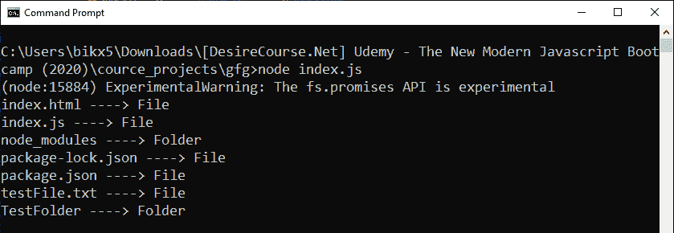
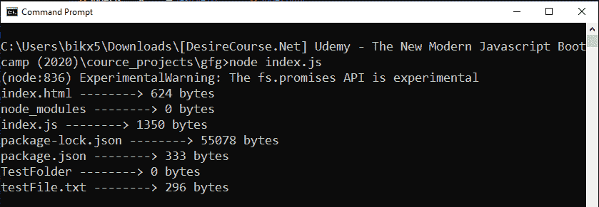

# Node.js FileHandle 类中的 filehandle.stat() 方法

> 原文: [https://www.geeksforgeeks.org/node-js-filehandle-stat-method-from-class-filehandle/](https://www.geeksforgeeks.org/node-js-filehandle-stat-method-from-class-filehandle/)

## 方法描述

`filehandle.stat()` 方法是在 Node.js 的 File System 模块中定义的，该模块主要用于与用户电脑的硬盘进行交互。`filehandle.stat()` 方法利用 `stats` 对象（由 `stat` 方法返回）上定义的方法，提供了一些特定于文件和文件夹的信息。该方法返回一个已解决（resolved）或已拒绝（rejected）的 Promise。

## 语法

```js
filehandle.stat(options);
```

## 参数

该方法接受一个可选的参数，描述如下：

*   `options`: 一个可选参数。其中 `bigint` 是一个布尔值，用于指定 `filehandle.stat()` 返回的 `stats` 对象中的数值是否为 `BigInt` 类型（默认值为 `false`）。

## 返回值

返回一个已解析或已拒绝的 Promise。如果成功读取目录，则使用 `stats` 对象解析 Promise；否则，如果出现任何错误（例如，指定的目录不存在或无权读取文件等），则使用 `error` 对象拒绝 Promise。

从解析的 Promise 返回的 `stats` 对象中定义了一些属性和方法，有助于获取目标文件或文件夹的具体细节。

*   `stats.isDirectory()`: 如果 `stats` 对象描述的是文件系统目录，则返回 `true`。
*   `stats.isFile()`: 如果 `stats` 对象描述的是一个常规文件，则返回 `true`。
*   `stats.isSocket()`: 如果 `stats` 对象描述的是一个套接字，则返回 `true`。
*   `stats.isSymbolicLink()`: 如果 `stats` 对象描述的是一个符号链接，则返回 `true`。
*   `stats.isFIFO()`: 如果 `stats` 对象描述的是先进先出（FIFO）管道，则返回 `true`。
*   `stats.size`: 以字节为单位指定文件的大小。
*   `stats.blocks`: 指定为文件分配的块数。

## 示例

### 示例 1

该示例使用每个子目录的统计信息来区分文件和文件夹。

```js
// Node.js program to demonstrate the
// filehandle.stat() Method

// Importing File System and Utilities module
const fs = require('fs')

const fileOrFolder = async (dir) => {
    let filehandle, stats = null

    try {
        filehandle = await fs
            .promises.open(dir, mode = 'r+')

        // Stats of directory
        stats = await filehandle.stat()
    } finally {
        if (filehandle) {
            // Close the file if it is opened.
            await filehandle.close();
        }
    }
    // File or Folder
    if (stats.isFile()) {
        console.log(`${dir} ----> File`)
    } else {
        console.log(`${dir} ----> Folder`)
    }
}

const allDir = fs.readdirSync(process.cwd())
allDir.forEach(dir => {
    fileOrFolder(dir)
        .catch(err => {
            console.log(`Error Occurs, Error code ->
                ${err.code}, Error NO -> ${err.errno}`)
        })
})
```

**输出:**


### 示例 2

本示例使用每个子目录的统计信息来统计其大小。

```js
// Node.js program to demonstrate the
// filehandle.stat() Method

// Importing File System and Utilities module
const fs = require('fs')

const sizeOfSubDirectory = async (dir) => {
    let filehandle, stats = null

    try {
        filehandle = await fs
            .promises.open(dir, mode = 'r+')
        //Stats of directory
        stats = await filehandle.stat()
    } finally {
        if (filehandle) {
            // Close the file if it is opened.
            await filehandle.close();
        }
    }
    //size of sub-directory
    console.log(`${dir} --------> ${stats.size} bytes`)
}

const allDir = fs.readdirSync(process.cwd())
allDir.forEach(dir => {
    sizeOfSubDirectory(dir)
        .catch(err => {
            console.log(`Error Occurs, Error code ->
                ${err.code}, Error NO -> ${err.errno}`)
        })
})
```

**输出:**


## 参考

[https://nodejs.org/api/fs.html#fs_filehandle_stat_options](https://nodejs.org/api/fs.html#fs_filehandle_stat_options)