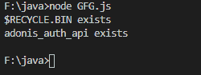
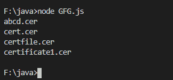

# Node.js `fs.Dir.read()` 方法

> 原文: [https://www.geeksforgeeks.org/node-js-fs-dir-read-method/](https://www.geeksforgeeks.org/node-js-fs-dir-read-method/)

`fs.Dir.read()` 方法是 `fs` 类（`fs` 文件系统模块内的 `Dir` 目录）的内置应用编程接口，用于异步逐个读取下一个目录项（directory entry）。

## 语法

```js
const fs.Dir.read(callback)
```

## 参数

该方法将回调函数作为参数，参数如下：

*   `err`: 如果出现任何错误，则出现错误。
*   `dirent`: 读取后的目录项（`dirent`）。

## 返回值

此方法不返回值。

下面的程序说明了 `fs.Dir.read()` 方法在 Node.js 中的使用：

## 示例 1

**文件名:** `GFG.js`

```js
// Node program to demonstrate the
// dir.read() API
const fs = require('fs');

// Initiating async function
async function stop(path) {

  // Creating and initiating directory's
  // underlying resource handle
  const dir = await fs.promises
    .opendir(new URL('file:///F:/'));

  // Getting all the dirent of the directory
  for (var i = 1 ; i<=2 ; i++) {

    // Reading each dirent one by one
    // by using read() method
    dir.read( (err, dirent) => {

      // Display each dirent one by one
      console.log(`${dirent.name}
      ${err ? 'does not exist' : 'exists'}`);
    });
  }
}

// Catching error
stop('./').catch(console.error);
```

使用以下命令运行 `GFG.js` 文件：

```bash
node GFG.js
```

**输出:**



## 示例 2

**文件名:** `GFG.js`

```js
// Node program to demonstrate the
// dir.read() API
const fs = require('fs');

// Initiating async function
async function stop(path) {

  // Creating and initiating directory's
  // underlying resource handle
  const dir = await fs.promises.opendir(path);

  // Getting all the dirent of the directory
  for (var i = 1 ; i<=4 ; i++) {

    // Reading each dirent one by one
    // by using read() method
    dir.read( (err, dirent) => {

      // Throwing error
      if(err) throw err

      // Display each dirent one by one
      console.log(dirent.name);
    });
  }
}

// Catching error
stop('./').catch(console.error);
```

使用以下命令运行 `GFG.js` 文件：

```bash
node GFG.js
```

**输出:**



**注意:** 以上程序不会在在线 JavaScript 和脚本编辑器上运行。

**参考:** [https://nodejs.org/dist/latest-v12.x/docs/api/fs.html#fs_dir_read_callback](https://nodejs.org/dist/latest-v12.x/docs/api/fs.html#fs_dir_read_callback)